# Programación Didáctica · Sostenibilidad Aplicada al Sistema Productivo

**Módulo Profesional:** Sostenibilidad aplicada al sistema productivo  
**Código oficial:** 1708 (Real Decreto 659/2023 y Real Decreto 500/2024)  
**Ciclos Formativos de Grado Superior:**  
- **Técnico Superior en Desarrollo de Aplicaciones Web (DAW)**  
- **Técnico Superior en Desarrollo de Aplicaciones Multiplataforma (DAM)**  
**Familia Profesional:** Informática y Comunicaciones  
**Carga Lectiva:** 30 horas totales (1 hora semanal en 1º curso) · 3 créditos ECTS  
**Ámbito Territorial:** Comunidad Autónoma de Andalucía  
**Curso Académico:** 2025 / 2026 (y 2026 / 2027)  
**Departamento:** Informática y Comunicaciones  

---

## 1. Ficha Técnica del Módulo

| Elemento | Especificación y Datos del Módulo |
|---|---|
| **Denominación oficial** | Sostenibilidad aplicada al sistema productivo |
| **Código del módulo** | 1708 (RD 659/2023 y RD 500/2024) |
| **Ciclos formativos de aplicación** | 1º curso de TS en Desarrollo de Aplicaciones Web (DAW) y 1º curso de TS en Desarrollo de Aplicaciones Multiplataforma (DAM) |
| **Carga horaria total** | 30 horas lectivas presenciales (1 hora semanal a lo largo del curso académico) |
| **Equivalencia crediticia** | 3 créditos ECTS (Grado Superior) |
| **Régimen de impartición** | Formación Profesional Grado D - Régimen Dual General (incorporando estancia en empresa) |
| **Departamento didáctico** | Departamento de Informática y Comunicaciones |
| **Materiales de aula** | Repositorio digital del módulo: apuntes (`docs/01` a `docs/10`), proyectos trimestrales y casos reales en `docs/` |

---

## 2. Introducción y Justificación Pedagógica

La presente Programación Didáctica organiza e instrumenta la docencia del módulo profesional de **Sostenibilidad aplicada al sistema productivo (Código 1708)**, común a los ciclos formativos de Grado Superior de **Desarrollo de Aplicaciones Web (DAW)** y **Desarrollo de Aplicaciones Multiplataforma (DAM)**, pertenecientes a la familia profesional de Informática y Comunicaciones en la Comunidad Autónoma de Andalucía.

La promulgación de la **Ley Orgánica 3/2022, de 31 de marzo**, de ordenación e integración de la Formación Profesional, desarrollada por el **Real Decreto 659/2023, de 18 de julio**, y el **Real Decreto 500/2024, de 21 de mayo**, ha establecido una transformación estructural en los currículos para dotar al alumnado de las competencias necesarias ante los dos grandes motores del tejido productivo: la digitalización y la transición ecológica justa.

> [!IMPORTANT]
> **Finalidad del Módulo 1708 (Artículo 100 del Real Decreto 659/2023):**  
> *«El módulo de Sostenibilidad aplicada al sistema productivo tendrá como finalidad el desarrollo de conocimiento y competencias básicas en economía verde, sostenibilidad e impacto ambiental de la actividad, así como las condiciones en que las exigencias de la transición ecológica modifican los procesos productivos del sector correspondiente.»*

En el sector del desarrollo de software y las tecnologías de la información (TIC), la sostenibilidad constituye una competencia crítica:
1. **Eficiencia de código y arquitecturas verdes (*Green Coding*):** Diseño de software con baja complejidad computacional, optimización del uso de CPU y memoria, reducción del tráfico de datos y selección de regiones *cloud* con suministro 100% renovable.
2. **Impacto de infraestructuras y centros de datos:** Consumo energético masivo, huella de carbono digital (*Scope 1, 2 y 3*), consumo de agua para refrigeración (*WUE*) y métricas de eficiencia (*PUE*).
3. **Economía circular y hardware:** Gestión de residuos electrónicos (**RAEE**), alargamiento del ciclo de vida de los equipos, ecodiseño y servitización (*Device-as-a-Service*).
4. **Gobernanza ética y reporte ASG:** Cumplimiento de normativas europeas como la Directiva **CSRD** (informes de sostenibilidad corporativa), estándares **GRI**, normas **ESRS**, Taxonomía Verde Europea y principios éticos en el entrenamiento y despliegue de modelos de Inteligencia Artificial.

---

## 3. Marco Normativo Vigente

La programación se fundamenta en la siguiente normativa estatal, autonómica andaluza y sectorial:

### 3.1 Normativa General del Sistema Educativo y Formación Profesional
- **Constitución Española de 1978** (Artículo 27): Derecho a la educación y principios formativos.
- **Ley Orgánica 2/2006, de 3 de mayo, de Educación (LOE)**, modificada por la **Ley Orgánica 3/2020, de 29 de diciembre (LOMLOE)**.
- **Ley Orgánica 3/2022, de 31 de marzo**, de ordenación e integración de la Formación Profesional.
- **Real Decreto 659/2023, de 18 de julio**, por el que se desarrolla la ordenación del Sistema de Formación Profesional (Artículo 100 y **Anexo VIII**: currículo básico del módulo 1708).
- **Real Decreto 500/2024, de 21 de mayo**, por el que se modifican determinados reales decretos de títulos de FP para la incorporación de los módulos de Digitalización y Sostenibilidad.
- **Reales Decretos de Título:**
  - **Real Decreto 686/2010, de 20 de mayo** (Título de Técnico Superior en DAM) y sus actualizaciones por RD 405/2023 y RD 500/2024.
  - **Real Decreto 687/2010, de 20 de mayo** (Título de Técnico Superior en DAW) y sus actualizaciones por RD 405/2023 y RD 500/2024.

### 3.2 Normativa Autonómica de la Comunidad Autónoma de Andalucía
- **Estatuto de Autonomía para Andalucía (Ley Orgánica 2/2007, de 19 de marzo):** Artículos 21 y 52.
- **Ley 17/2007, de 10 de diciembre, de Educación de Andalucía (LEA).**
- **Decreto 104/2024, de 28 de mayo**, por el que se establece la ordenación del Sistema de Formación Profesional en la Comunidad Autónoma de Andalucía (*deroga expresamente el antiguo Decreto 436/2008*).
- **Orden de 18 de septiembre de 2025**, por la que se regula la evaluación, certificación, acreditación y titulación académica del alumnado que cursa enseñanzas de los grados D y E del Sistema de FP en Andalucía.
- **Órdenes de Currículo en Andalucía:**
  - **Orden de 16 de junio de 2011** (Currículo de Técnico Superior en DAM en Andalucía).
  - **Orden de 16 de junio de 2011** (Currículo de Técnico Superior en DAW en Andalucía).
- **Decreto 327/2010, de 13 de julio** (Reglamento Orgánico de IES) y **Orden de 20 de agosto de 2010** (Organización y funcionamiento de IES).

### 3.3 Normativa de Protección de Datos y Derechos Digitales
- **Reglamento (UE) 2016/679 (RGPD)** del Parlamento Europeo y del Consejo.
- **Ley Orgánica 3/2018, de 5 de diciembre (LOPDGDD)** de Protección de Datos Personales y garantía de los derechos digitales (*sustituye a la derogada LOPD 15/1999*).

### 3.4 Normativa de Sostenibilidad, Cambio Climático y Economía Circular (ASG)
- **Directiva (UE) 2022/2464 (CSRD):** Información corporativa sobre sostenibilidad y normas europeas **ESRS**.
- **Directiva (UE) 2024/1760 (CSDDD):** Diligencia debida de las empresas en materia de sostenibilidad.
- **Reglamento (UE) 2020/852:** Taxonomía Verde Europea de actividades sostenibles.
- **Reglamento (UE) 2024/1781 (ESPR):** Marco de diseño ecológico para productos sostenibles.
- **Directiva 2012/19/UE y Real Decreto 110/2015:** Residuos de aparatos eléctricos y electrónicos (**RAEE**).
- **Ley 7/2022, de 8 de abril**, de residuos y suelos contaminados para una economía circular.
- **Ley 7/2021, de 20 de mayo**, de cambio climático y transición energética.
- **Ley 3/2023, de 30 de marzo, de Economía Circular de Andalucía (LECA).**
- **Ley 8/2018, de 8 de octubre**, de medidas frente al cambio climático y para la transición energética en Andalucía.
- **Agenda 2030 de la ONU:** Resolución 70/1 de la Asamblea General y los 17 Objetivos de Desarrollo Sostenible.

---

## 4. Perfil Profesional y Contexto del Aula

### 4.1 Entorno Profesional (DAW y DAM)
Los Técnicos Superiores en Desarrollo de Aplicaciones Web y Multiplataforma desarrollan su actividad en empresas de desarrollo de software, consultoras TIC, agencias de servicios en la nube, departamentos tecnológicos de administraciones públicas y *startups*. En la actualidad, estas empresas se enfrentan a exigencias regulatorias y de mercado para justificar el impacto ambiental de sus infraestructuras, reducir el consumo computacional de sus soluciones y reportar indicadores ASG.

### 4.2 Contextualización del Alumnado
El grupo de 1º curso cuenta con 22 alumnos/as de procedencia geográfica comarcal diversa (Martos, Torredelcampo, Torredonjimeno, Fuensanta de Martos, Escañuela, Jaén).
- **Diversidad de perfiles académicos:** Edades comprendidas entre 18 y 32 años. Concurren titulados de CFGM de Sistemas Microinformáticos y Redes (SMR), Bachillerato (modalidades científica y tecnológica/humanidades), pruebas de acceso y titulados universitarios (Grado en Psicología, CFGS de Sonido y Producción Mecánica).
- **Repetidores y adaptación curricular:** 7 alumnos repetidores en situaciones modulares específicas (algunos adaptándose al nuevo plan de estudios de la LO 3/2022 para cursar Sostenibilidad y Digitalización).
- **Compatibilidad laboral:** 2 alumnos en régimen laboral activo compaginan sus estudios mediante tutorías telemáticas y seguimiento por el aula virtual.
- **Atención a la diversidad:** 1 alumno con Altas Capacidades Intelectuales (Sobredotación); 1 alumno procedente de programas de atención a la diversidad (PMAR); y 1 alumno con discapacidad física motriz (incorporado al Plan de Autoprotección con evacuación asistida).

---

## 5. Objetivos Generales y Competencias

El módulo contribuye a los siguientes objetivos generales y competencias profesionales, personales y sociales:
1. **Innovación y actualización tecnológica:** Identificar cambios regulatorios, de sostenibilidad y eficiencia para aplicarlos a los procesos de desarrollo de software.
2. **Ecodiseño y Green Coding:** Proponer arquitecturas de software y soluciones tecnológicas que reduzcan el consumo energético y la huella de carbono digital.
3. **Gobernanza y ética digital:** Aplicar criterios de transparencia, privacidad, protección de datos y accesibilidad universal en el diseño de aplicaciones.
4. **Reporte ASG y trabajo en equipo:** Participar activamente en la elaboración de diagnósticos, planes e informes de sostenibilidad para organizaciones tecnológicas.

---

## 6. Resultados de Aprendizaje y Criterios de Evaluación

Conforme al **Anexo VIII del Real Decreto 659/2023**, el módulo se estructura en 6 Resultados de Aprendizaje:

| RA | Resultado de Aprendizaje Oficial | Criterios de Evaluación Oficiales (CE) | Ponderación |
|:---|:---|:---|:---:|
| **RA1** | Identifica los aspectos ambientales, sociales y de gobernanza (ASG) relativos a la sostenibilidad teniendo en cuenta el concepto de desarrollo sostenible y los marcos internacionales que contribuyen a su consecución. | **a)** Se ha descrito el concepto de sostenibilidad y los marcos internacionales. **b)** Se han identificado los asuntos ASG en las organizaciones. **c)** Se han relacionado los ODS con la Agenda 2030. **d)** Se ha analizado la relevancia de los ASG para los grupos de interés (riesgos y oportunidades). **e)** Se han identificado estándares de métricas (ISO, GRI, SASB, CSRD). **f)** Se ha descrito la inversión socialmente responsable (ISR) y las agencias de calificación ESG. | **18 %** *(3% / CE)* |
| **RA2** | Caracteriza los retos ambientales y sociales a los que se enfrenta la sociedad, describiendo los impactos sobre las personas y los sectores productivos y proponiendo acciones para minimizarlos. | **a)** Se han identificado los principales retos ambientales y sociales del sector TIC. **b)** Se han relacionado los retos con la actividad económica y digital. **c)** Se ha analizado el impacto ambiental y social sobre personas y sectores productivos. **d)** Se han identificado medidas y acciones para minimizar impactos. **e)** Se ha analizado la importancia de alianzas transversales (ODS 17). | **15 %** *(3% / CE)* |
| **RA3** | Establece la aplicación de criterios de sostenibilidad en el desempeño profesional y personal, identificando los elementos necesarios. | **a)** Se han identificado los ODS más relevantes para la actividad profesional TIC. **b)** Se han analizado los riesgos y oportunidades de los ODS en informática. **c)** Se han identificado acciones prácticas para retos ambientales/sociales en el ámbito personal y laboral. | **9 %** *(3% / CE)* |
| **RA4** | Propone productos y servicios responsables teniendo en cuenta los principios de la economía circular. | **a)** Se ha caracterizado el modelo de producción y consumo lineal frente al circular. **b)** Se han identificado los principios de la economía verde y circular. **c)** Se han contrastado los beneficios de la economía circular frente al modelo clásico. **d)** Se han aplicado principios de ecodiseño (hardware y software). **e)** Se ha analizado el ciclo de vida del producto (LCA/ACV). **f)** Se han identificado procesos productivos y criterios de sostenibilidad aplicados. | **18 %** *(3% / CE)* |
| **RA5** | Realiza actividades sostenibles minimizando el impacto de las mismas en el medio ambiente. | **a)** Se ha caracterizado el modelo de consumo actual. **b)** Se han identificado principios de economía verde/circular. **c)** Se han contrastado los beneficios del modelo circular. **d)** Se ha evaluado el impacto de actividades personales y profesionales (huella digital). **e)** Se han aplicado principios de ecodiseño. **f)** Se han aplicado estrategias sostenibles (Green IT, cloud verde, eficiencia energética). **g)** Se ha analizado el ciclo de vida. **h)** Se han identificado procesos productivos sostenibles. **i)** Se ha aplicado la normativa ambiental (RAEE, Ley 7/2022, LECA, ESPR). | **18 %** *(2% / CE)* |
| **RA6** | Analiza un plan de sostenibilidad de una empresa del sector, identificando sus grupos de interés, los aspectos ASG materiales y justificando acciones para su gestión y medición. | **a)** Se han identificado los principales grupos de interés de la empresa TIC (*stakeholders*). **b)** Se han analizado los aspectos ASG materiales y la matriz de doble materialidad. **c)** Se han definido acciones de mitigación de impactos negativos y aprovechamiento de oportunidades. **d)** Se han determinado métricas e indicadores de desempeño (GRI / ESRS / PUE / SCI). **e)** Se ha elaborado un informe formal de sostenibilidad con el plan propuesto. | **22 %** *(4,4% / CE)* |

---

## 7. Secuenciación Didáctica y Compaginación con los Materiales del Módulo

La programación se compagina rigurosamente con los 10 documentos de materiales preparados en la carpeta `docs/` del módulo:

```mermaid
flowchart LR
    subgraph T1["Trimestre 1 (10h)"]
        D1["01 Fundamentos & ODS"]
        D2["02 ASG & Stakeholders"]
        D3["03 Métricas & ISR"]
        D4["04 Retos TIC"]
        P1["Proyecto T1: Mapa ASG + ODS"]
    end

    subgraph T2["Trimestre 2 (10h)"]
        D5["05 Economía Circular & Ecodiseño"]
        D6["06 Green IT & Normativa"]
        P2["Proyecto T2: Ecodiseño & LCA TIC"]
    end

    subgraph T3["Trimestre 3 (10h)"]
        D7["07 Plan & Informe Sostenibilidad"]
        D8["08 Prácticas & Rúbricas"]
        D9["09 Casos Empresas TIC"]
        D10["10 Glosario & Recursos"]
        P3["Proyecto T3: Plan Sostenibilidad + Dual"]
    end

    T1 --> T2 --> T3
```

### 7.1 TRIMESTRE 1 · Unidad de Trabajo 1: Fundamentos de Sostenibilidad, Marcos Internacionales, Aspectos ASG, Retos y Métricas en el Sector TIC (10 horas)
- **Resultados de Aprendizaje:** RA1 (a-f), RA2 (a-e), RA3 (a-c).
- **Contenidos Desarrollados:**
  - Concepto de desarrollo sostenible (Informe Brundtland 1987), triple dimensión (E-S-G), Cumbres de la Tierra y Acuerdo de París (COP21).
  - Agenda 2030 y los 17 ODS: Priorización en el sector TIC (ODS 7 Energía asequible, ODS 9 Infraestructura resiliente, ODS 12 Consumo responsable, ODS 13 Acción climática, ODS 5 Igualdad, ODS 8 Trabajo decente, ODS 16 Ética y transparencia).
  - Aspectos ASG en empresas tecnológicas: Huella ambiental (Scope 1, 2 y 3, consumo eléctrico, PUE, agua en datacenters, RAEE), Social (minerales de conflicto, privacidad, ética de la IA, brecha de género) y Gobernanza (comités de sostenibilidad, comités éticos, ciberseguridad).
  - Mapeo de grupos de interés (*stakeholders*) y matriz de materialidad (Mendelow).
  - Estándares y métricas: ISO 14001, ISO 14064, GRI Standards, SASB/ISSB, CDP, métricas técnicas TIC (PUE, WUE, CUE, Software Carbon Intensity - SCI). Inversión Socialmente Responsable (ISR), agencias de *rating* ESG y marco europeo CSRD/ESRS.
- **Materiales de Referencia en `docs/`:**
  - [`01-fundamentos-sostenibilidad.md`](../docs/01-fundamentos-sostenibilidad.md)
  - [`02-aspectos-ASG-y-grupos-de-interes.md`](../docs/02-aspectos-ASG-y-grupos-de-interes.md)
  - [`03-estandares-metricas-e-inversion-responsable.md`](../docs/03-estandares-metricas-e-inversion-responsable.md)
  - [`04-retos-ambientales-y-sociales-sector-informatico.md`](../docs/04-retos-ambientales-y-sociales-sector-informatico.md)
  - [`09-casos-empresas-sector-informatico.md`](../docs/09-casos-empresas-sector-informatico.md) (HP, Microsoft, Google, Dell, Indra/Minsait, IBM, Amazon)
- **Proyecto Integrador Trimestre 1 (T1):**
  - **Título:** *Mapa ASG + Diagnóstico ODS en una empresa del sector tecnológico* ([`08` §2](../docs/08-practicas-y-trabajos-sector-informatico.md)).
  - **Entregables:** Informe técnico (máx. 10 páginas) + Matriz de materialidad + Presentación oral en parejas (10-15 min) con debate guiado.

---

### 7.2 TRIMESTRE 2 · Unidad de Trabajo 2: Economía Circular, Ecodiseño de Software/Hardware y Actividades Sostenibles en TI (10 horas)
- **Resultados de Aprendizaje:** RA4 (a-f), RA5 (a-i).
- **Contenidos Desarrollados:**
  - Crisis del modelo lineal ("extraer-fabricar-usar-tirar") en la industria electrónica. Principios de la economía circular (Fundación Ellen MacArthur) y las 9R. Modelos circulares: servitización (*Device-as-a-Service*), reacondicionamiento y derecho a reparar.
  - Análisis de Ciclo de Vida (**LCA / ACV**, ISO 14040/44) en hardware y servicios cloud (*cradle-to-grave* y *cradle-to-cradle*).
  - Ecodiseño de Hardware (desmontabilidad, uso de plásticos reciclados, eliminación de tóxicos RoHS/REACH, eficiencia Energy Star/EPEAT).
  - Ecodiseño de Software y Servicios Cloud (**Green Coding**): Algoritmos eficientes, compresión de activos web, minimización de llamadas a APIs, diseño de interfaces con *Dark Mode* para pantallas OLED, selección de regiones cloud renovables, apagado automático de entornos de pruebas y optimización de consultas a bases de datos.
  - Evaluación de la huella personal y profesional del programador (teletrabajo, videoconferencias, almacenamiento en la nube).
  - Normativa ambiental aplicable: Directiva RAEE (2012/19/UE), RD 110/2015, Ley 7/2022 de residuos, Reglamento europeo de Ecodiseño (UE 2024/1781 - ESPR), Ley 3/2023 de Economía Circular de Andalucía (LECA) y Ley 8/2018 de Cambio Climático de Andalucía.
- **Materiales de Referencia en `docs/`:**
  - [`05-economia-circular-verde-y-ecodisenio.md`](../docs/05-economia-circular-verde-y-ecodisenio.md)
  - [`06-actividades-sostenibles-en-ti.md`](../docs/06-actividades-sostenibles-en-ti.md)
  - [`08-practicas-y-trabajos-sector-informatico.md`](../docs/08-practicas-y-trabajos-sector-informatico.md) (Prácticas intermedias P1-P6: calculadora de huella y auditoría de aula)
- **Proyecto Integrador Trimestre 2 (T2):**
  - **Título:** *Diseño conceptual y técnico de un Producto o Servicio TIC Sostenible con Ecodiseño y Análisis de Ciclo de Vida (LCA)* ([`08` §3](../docs/08-practicas-y-trabajos-sector-informatico.md)).
  - **Entregables:** Informe técnico de ecodiseño y LCA + Prototipo conceptual/técnico de la solución + Presentación oral en clase (10-12 min) con demostración del prototipo.

---

### 7.3 TRIMESTRE 3 · Unidad de Trabajo 3: Plan de Sostenibilidad Corporativo e Informe de Rendición de Cuentas (GRI / CSRD) en TI y Formación en Empresa (10 horas)
- **Resultados de Aprendizaje:** RA6 (a-e) y consolidación integrada de RA1 a RA5.
- **Contenidos Desarrollados:**
  - Metodología del Plan de Sostenibilidad Corporativo: Diagnóstico de partida, mapa de stakeholders, matriz de doble materialidad, definición de objetivos cuantitativos SMART a 2030, catálogo de acciones E/S/G con asignación de presupuesto, responsables y cronograma.
  - Cuadro de mando de métricas e indicadores de sostenibilidad (GRI Standards, normas europeas ESRS, PUE, Scope 1-2-3, % mujeres en puestos de programación, auditorías de accesibilidad web WCAG).
  - Redacción formal del Informe de Sostenibilidad / Estado de Información No Financiera (EINF) conforme a la Directiva CSRD (UE 2022/2464). Comunicación ética y prevención del *Greenwashing*.
  - Vinculación con la Formación en Empresa (Dual): Aplicación práctica del análisis ASG en la empresa del sector TIC colaboradora durante la estancia formativa de primer curso.
- **Materiales de Referencia en `docs/`:**
  - [`07-plan-sostenibilidad-e-informe.md`](../docs/07-plan-sostenibilidad-e-informe.md)
  - [`08-practicas-y-trabajos-sector-informatico.md`](../docs/08-practicas-y-trabajos-sector-informatico.md) §4 (Rúbricas T3, orientaciones de informe y defensa ejecutiva)
  - [`09-casos-empresas-sector-informatico.md`](../docs/09-casos-empresas-sector-informatico.md)
  - [`10-glosario-recursos-bibliografia.md`](../docs/10-glosario-recursos-bibliografia.md)
- **Proyecto Integrador Trimestre 3 (T3):**
  - **Título:** *Plan Integral de Sostenibilidad e Informe de Rendición de Cuentas (GRI/ESRS) para una Organización del Sector Informático / Empresa Colaboradora Dual* ([`08` §4](../docs/08-practicas-y-trabajos-sector-informatico.md)).
  - **Entregables:** Documento formal del Plan e Informe de Sostenibilidad + Presentación ejecutiva en formato *Role-Play* (defensa del plan ante el "Comité de Dirección / Inversores", 12-15 min + ronda de preguntas).

---

## 8. Metodología Didáctica y Principios Pedagógicos

La metodología se asienta en los siguientes pilares de innovación pedagógica:
1. **Aprendizaje Basado en Proyectos (ABP):** Cada trimestre se estructura en torno a un reto profesional auténtico que culmina en un producto verificable y público.
2. **Aprendizaje Cooperativo:** Trabajo en equipos de 2 a 3 estudiantes con reparto de roles (coordinador ASG, programador/Green Coder, analista de datos, redactor técnico).
3. **Método del Caso:** Estudio y debate de casos reales de grandes corporaciones y startups tecnológicas recogidas en [`docs/09`](../docs/09-casos-empresas-sector-informatico.md).
4. **Simulación Profesional (*Role-Playing*):** Defensas orales en las que los estudiantes actúan como consultores de sostenibilidad, directores de tecnología o auditores.
5. **Uso de Herramientas Reales:** Empleo de calculadoras de emisiones de software (Green Software Foundation), simuladores de PUE y plataformas digitales (Moodle Centros / Google Classroom).

---

## 9. Evaluación, Calificación y Recuperación

De conformidad con el **Decreto 104/2024** y la **Orden de 18 de septiembre de 2025** de la Junta de Andalucía, la evaluación es continua, formativa, criterial e integradora.

### 9.1 Instrumentos de Evaluación
- **Proyectos Trimestrales Integradores (70% de la nota de cada trimestre):** Aplicación de las rúbricas analíticas oficiales sobre 10 puntos detalladas en [`docs/08`](../docs/08-practicas-y-trabajos-sector-informatico.md).
- **Actividades de Aula y Cuestionarios Técnicos (20% de la nota de cada trimestre):** Cuestionarios de autoevaluación al final de cada unidad (`docs/01` a `07`), ejercicios prácticos y auditorías de aula.
- **Competencias Transversales y Actitud (10% de la nota de cada trimestre):** Trabajo en equipo, puntualidad, rigor deontológico y participación crítica en debates.

### 9.2 Criterios de Calificación
- **Ponderación trimestral:** Cada trimestre aporta un 33,33% a la calificación final del módulo.
- **Requisito de superación criterial:** La media aritmética ponderada de los Criterios de Evaluación asociados a cada uno de los 6 Resultados de Aprendizaje (**RA1 a RA6**) debe ser igual o superior a **5,0 puntos sobre 10**.
- **Calificación final:** Media aritmética de los tres trimestres redondeada a número entero (1 a 10).

### 9.3 Procedimientos de Recuperación
- **Recuperación trimestral:** El alumnado que no alcance el 5,0 en un proyecto trimestral realizará un plan de trabajo individualizado consistente en la corrección, profundización y defensa oral individual del proyecto.
- **Evaluación extraordinaria:** En caso de no superar la evaluación ordinaria de mayo, el alumnado realizará una prueba/proyecto extraordinario que evaluará exclusivamente los RA no alcanzados.

---

## 10. Formación en Empresa u Organismo Equiparado (Régimen Dual en Grado D)

Conforme a la **Ley Orgánica 3/2022** y al **Decreto 104/2024**, todas las enseñanzas de Grado D se imparten en régimen dual general con una estancia formativa en empresas del sector TIC del 25% del total del ciclo (500 horas totales):
- **1º Curso:** 80 horas de estancia formativa en empresas (marzo/abril).
- **2º Curso:** 420 horas de formación en centros de trabajo.

### 10.1 Resultados de Aprendizaje Vinculados a la Empresa Dual
Durante la estancia de primer curso, el módulo de Sostenibilidad se vincula con la empresa colaboradora a través de:
- **RA6.a:** Identificación de los grupos de interés de la empresa tecnológica.
- **RA6.b y RA6.c:** Análisis de aspectos ASG materiales en la empresa (política de gestión de RAEE, consumo energético de servidores/equipos, políticas de igualdad y ciberseguridad).
- **RA3.c y RA5.f:** Propuestas de buenas prácticas de Green Coding y compras verdes de componentes.

---

## 11. Atención a la Diversidad y Diseño Universal para el Aprendizaje (DUA)

En aplicación de los principios del **DUA**:
- **Múltiples formas de representación:** Textos claros, esquemas visuales, resúmenes conceptuales (`docs/01` a `07`) y glosario terminológico (`docs/10`).
- **Múltiples formas de acción y expresión:** Entregables técnicos, presentaciones orales, infografías o prototipos de software.
- **Múltiples formas de implicación:** Proyectos anclados a problemáticas reales y dinámicas cooperativas.

### Medidas de Adaptación Concretas:
1. **Ritmos lentos o dificultades:** Andamiaje de tareas, rúbricas desglosadas y apoyo guiado en tutorías.
2. **Altas Capacidades Intelectuales (Sobredotación):** Retos de ampliación (cálculo de SCI en código Java/Web, análisis avanzado de Taxonomía Verde Europea y optimización energética de servidores).
3. **Discapacidad física motriz:** Aula accesible, ergonomía adaptada y aplicación del protocolo de evacuación asistida del Plan de Autoprotección.
4. **Alumnado trabajador / modular:** Acceso 100% online a los materiales (`docs/`), entregas asíncronas justificadas y tutorización telemática.
5. **Alumnado repetidor o de incorporación tardía:** Plan de acogida y adaptación de plazos de evaluación.

---

## 12. Elementos Transversales y Proyecto Lingüístico de Centro

- **Transición ecológica y medio ambiente:** Eje vertebrador de todo el módulo.
- **Igualdad efectiva entre hombres y mujeres (ODS 5):** Visibilización de mujeres tecnólogas y lenguaje inclusivo no sexista.
- **Derechos digitales y privacidad:** Sensibilización sobre el RGPD, LOPDGDD y ética de la Inteligencia Artificial.
- **Proyecto Lingüístico de Centro (PLC):** Lectura comprensiva de literatura técnica en español e inglés, rigor sintáctico y penalización formativa por faltas de ortografía (0,2 por falta hasta un máximo de 2 puntos).

---

## 13. Actividades Complementarias y Extraescolares

1. Visitas técnicas a centros de procesamiento de datos con certificación de eficiencia energética (PUE bajo) o plantas de reciclaje de RAEE en Andalucía.
2. Asistencia a jornadas, conferencias y eventos sobre desarrollo sostenible y Green IT (Google Developer Groups, jornadas de software libre, encuentros empresariales).
3. Charlas con profesionales del sector tecnológico y antiguos alumnos/as de DAW y DAM.

---

## 14. Recursos Didácticos, Bibliografía y Materiales del Módulo

| Documento | Título del Recurso en `docs/` | Contenido Principal |
|:---:|:---|:---|
| `01` | [`01-fundamentos-sostenibilidad.md`](../docs/01-fundamentos-sostenibilidad.md) | Brundtland, triple balance, cumbres, Acuerdo de París COP21, Agenda 2030, ODS en TIC y Taxonomía Verde UE. |
| `02` | [`02-aspectos-ASG-y-grupos-de-interes.md`](../docs/02-aspectos-ASG-y-grupos-de-interes.md) | Pilares ASG en empresas tecnológicas, stakeholders (Mendelow), riesgos y oportunidades. |
| `03` | [`03-estandares-metricas-e-inversion-responsable.md`](../docs/03-estandares-metricas-e-inversion-responsable.md) | ISO 14001, ISO 14064, GRI Standards, SASB/ISSB, CDP, métricas PUE/WUE/SCI, ISR y CSRD/ESRS. |
| `04` | [`04-retos-ambientales-y-sociales-sector-informatico.md`](../docs/04-retos-ambientales-y-sociales-sector-informatico.md) | Consumo energético, datacenters, IA, agua, RAEE, minerales críticos, brecha digital y alianzas ODS 17. |
| `05` | [`05-economia-circular-verde-y-ecodisenio.md`](../docs/05-economia-circular-verde-y-ecodisenio.md) | Modelo lineal vs circular, 9R, DaaS, Ecodiseño de hardware/software (Green Coding) y LCA/ACV. |
| `06` | [`06-actividades-sostenibles-en-ti.md`](../docs/06-actividades-sostenibles-en-ti.md) | Huella personal/profesional del programador, Green IT, compras sostenibles y normativa ambiental (RAEE, Ley 7/2022, LECA). |
| `07` | [`07-plan-sostenibilidad-e-informe.md`](../docs/07-plan-sostenibilidad-e-informe.md) | Elaboración de un Plan de Sostenibilidad Corporativo e Informe de Sostenibilidad (GRI/CSRD). |
| `08` | [`08-practicas-y-trabajos-sector-informatico.md`](../docs/08-practicas-y-trabajos-sector-informatico.md) | Proyectos trimestrales (T1, T2, T3), prácticas intermedias y rúbricas analíticas oficiales. |
| `09` | [`09-casos-empresas-sector-informatico.md`](../docs/09-casos-empresas-sector-informatico.md) | Fichas de análisis ASG de HP, Microsoft, Google, Dell, Indra/Minsait, IBM, Amazon y casos españoles. |
| `10` | [`10-glosario-recursos-bibliografia.md`](../docs/10-glosario-recursos-bibliografia.md) | Glosario técnico de términos de sostenibilidad, enlaces oficiales y soluciones orientativas. |

---
