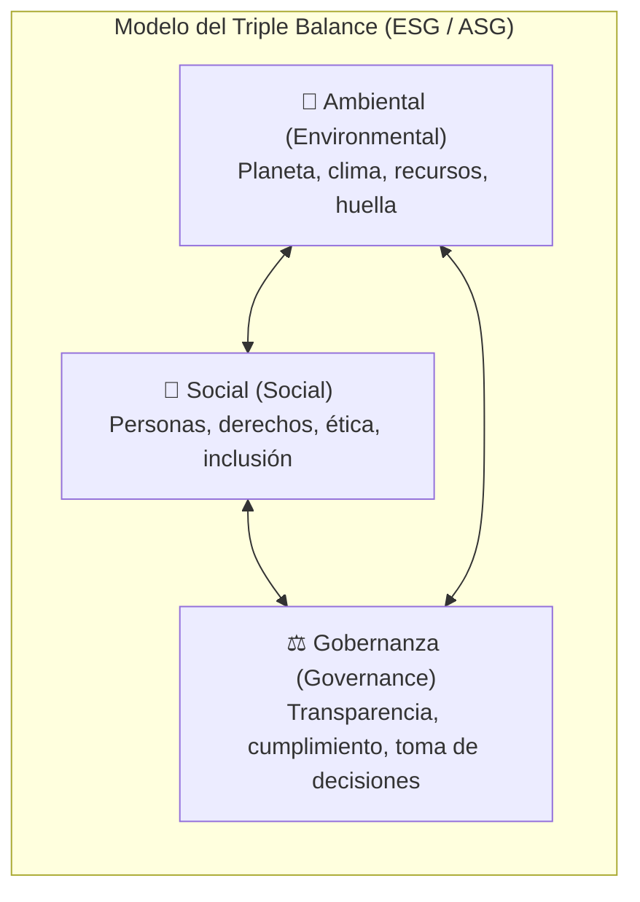
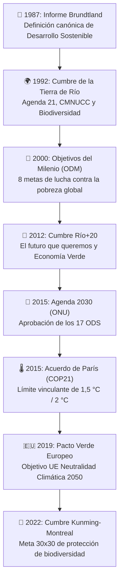
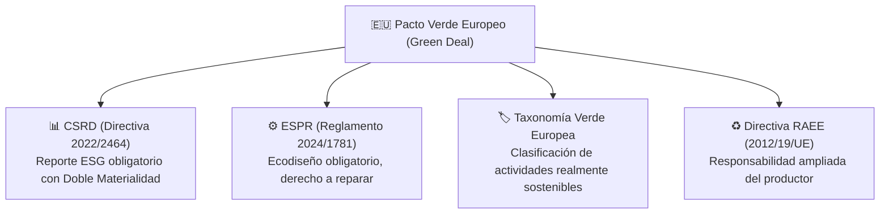
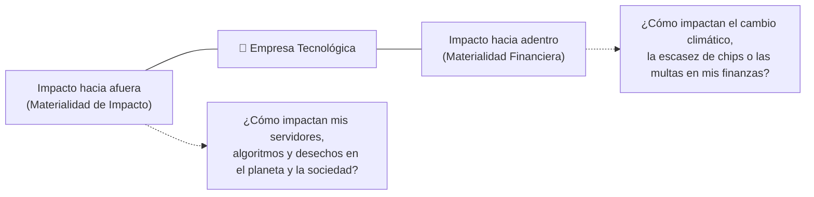
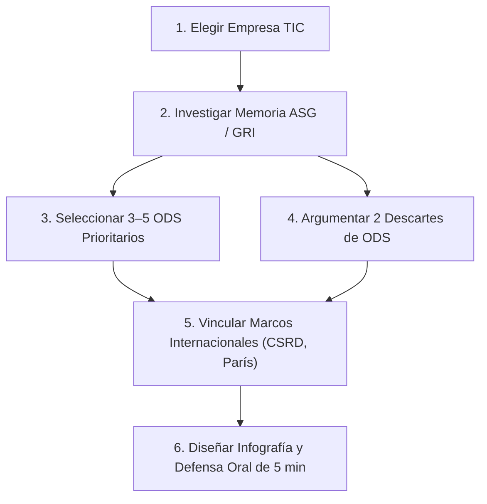

# 01 · Fundamentos de sostenibilidad y marcos internacionales

<span class="badge badge-ra">RA1 · Criterios a, b, c</span>
<span class="badge badge-tic">Sector Informática & TIC</span>
<span class="badge badge-cloud">Cloud & Data Centers</span>
<span class="badge badge-e">Marcos Globales & ODS</span>

**Resultados de aprendizaje:** ==RA1== (criterios a, b, c) · ==RA2== (introducción contextual)  
**Duración orientativa:** 4 horas lectivas

!!! note "Objetivo de la unidad"
    Capacitar al futuro profesional de Informática y Comunicaciones para describir con rigor el concepto de sostenibilidad, identificar los grandes marcos y tratados internacionales (desde el Informe Brundtland hasta el Pacto Verde Europeo) y priorizar de forma crítica los Objetivos de Desarrollo Sostenible (ODS) de la Agenda 2030 directamente vinculados al sector TIC.

<div class="stat-grid">
  <div class="stat-card">
    <div class="stat-number">1,5 °C</div>
    <div class="stat-label">Límite crítico París (COP21)</div>
  </div>
  <div class="stat-card">
    <div class="stat-number">6 / 9</div>
    <div class="stat-label">Límites planetarios superados</div>
  </div>
  <div class="stat-card">
    <div class="stat-number">2050</div>
    <div class="stat-label">Neutralidad climática (Net Zero)</div>
  </div>
  <div class="stat-card">
    <div class="stat-number">-55 %</div>
    <div class="stat-label">Objetivo emisiones 2030 (Fit for 55)</div>
  </div>
</div>

---

## 1. ¿Qué es la sostenibilidad?

### 1.1 Definición clásica (Informe Brundtland, 1987)

El concepto contemporáneo de sostenibilidad se formalizó internacionalmente en el informe *"Our Common Future"* (Nuestro Futuro Común), elaborado por la Comisión Mundial sobre Medio Ambiente y Desarrollo de la ONU, presidida por Gro Harlem Brundtland:

???+ quote "Definición canónica: Informe Brundtland (ONU, 1987)"
    > **Desarrollo sostenible:** *«Aquel que satisface las necesidades del presente sin comprometer la capacidad de las generaciones futuras para satisfacer sus propias necesidades».*

Esta definición universal introduce dos principios rectores que articulan todo el módulo:

Desarrollo sostenible
:   Proceso de cambio y evolución en el que la explotación de los recursos, la dirección de las inversiones y la orientación del desarrollo tecnológico están en armonía y mejoran el potencial actual y futuro.

Límites planetarios
:   Fronteras ecológicas seguras dentro de las cuales la humanidad puede operar, reconociendo que los recursos naturales (agua, minerales, energía fósil) y la capacidad de absorción de residuos de la Tierra son finitos.

---

### 1.2 La triple dimensión (Triple Balance o Pilares ASG / ESG)

La sostenibilidad no es un concepto exclusivamente ambiental. Se sustenta en el equilibrio indisociable de tres dimensiones interdependientes:



Explora a continuación la aplicación directa de cada pilar en la industria informática:

=== "🌿 Dimensión Ambiental (E - Environmental)"
    Examina el impacto directo e indirecto de las operaciones tecnológicas sobre los ecosistemas.

    * **Consumo eléctrico:** Suministro energético masivo de servidores, centros de datos y redes de telecomunicaciones.
    * **Emisiones GEI:** Huella de carbono derivada de los Alcances 1, 2 y 3 (fabricación y transporte de hardware).
    * **Huella hídrica:** Millones de litros de agua evaporada empleados para refrigerar racks de alta densidad (e.g. IA).
    * **Residuos electrónicos (RAEE):** Gestión de chatarra electrónica, baterías de litio y fin de vida útil de terminales.

=== "👥 Dimensión Social (S - Social)"
    Analiza la relación de la empresa tecnológica con las personas, empleados, usuarios y comunidades locales.

    * **Cadena de suministro:** Extracción de minerales críticos (cobalto, coltán, tierras raras) y condiciones laborales.
    * **Brecha digital y accesibilidad:** Garantizar que los servicios web y apps no excluyan a personas con discapacidad (WCAG).
    * **Salud laboral y ergonomía:** Teletrabajo sostenible, desconexión digital y salud mental de equipos de desarrollo.
    * **Ética de la Inteligencia Artificial:** Prevención de sesgos algorítmicos discriminatorios y respeto a la privacidad.

=== "⚖️ Dimensión de Gobernanza (G - Governance)"
    Evalúa cómo se estructura la dirección, el cumplimiento normativo y la integridad corporativa.

    * **Ciberseguridad y privacidad:** Cumplimiento riguroso del RGPD y directivas de ciberresiliencia (NIS2).
    * **Transparencia en el reporte:** Divulgación veraz de memorias de sostenibilidad según la directiva europea CSRD.
    * **Prevención de Greenwashing:** Prohibición de afirmaciones ambientales engañosas sin respaldo técnico medible.
    * **Comités de ética tecnológica:** Protocolos sobre uso de datos de clientes, propiedad intelectual y derechos de autor.

!!! tip "Clave para el perfil técnico de DAW / DAM"
    En el sector del desarrollo de software e infraestructuras, la dimensión de **Gobernanza (G)** y la **Social (S)** son tan críticas como la ambiental: un software con consumo energético cero pero con sesgos algorítmicos que vulneren derechos fundamentales o que filtre contraseñas de usuarios no es un producto sostenible.

---

### 1.3 Glosario de términos clave

Sostenibilidad
:   Capacidad de un sistema ecológico, económico o social de mantenerse y autorregularse a lo largo del tiempo sin degradar sus bases operativas.

Transición ecológica
:   Camino planificado, regulatorio y temporal para transformar el modelo socioeconómico actual basado en combustibles fósiles hacia uno descarbonizado, circular y justo.

Economía verde
:   Modelo productivo que busca el progreso humano y la equidad social al tiempo que reduce significativamente los riesgos ambientales y las escaseces ecológicas (PNUMA).

Greenwashing (Ecolavado)
:   Práctica desleal de relaciones públicas en la que una empresa transmite una imagen engañosa de responsabilidad ecológica sin acometer transformaciones reales ni auditadas.

---

## 2. Cronología de los marcos internacionales

El criterio ==RA1.b== exige identificar con precisión la evolución de los tratados, cumbres y directivas internacionales.



### 2.1 Principales cumbres y acuerdos globales

| Año | Cumbre / Instrumento | Hito principal | Conexión con el Sector TIC |
|:---:|:---|:---|:---|
| **1992** | **Cumbre de la Tierra (Río de Janeiro)** | Nace la *Agenda 21* y las convenciones marco sobre Cambio Climático (CMNUCC) y Biodiversidad. | Inicio de la monitorización ambiental de infraestructuras globales. |
| **2000** | **Cumbre del Milenio (ONU)** | Creación de los 8 *Objetivos de Desarrollo del Milenio (ODM)* con vigencia hasta 2015. | Inclusión por primera vez de la brecha digital y acceso a telefonía. |
| **2012** | **Cumbre Río+20** | Informe *«El futuro que queremos»* que establece la **Economía Verde** como pilar global. | Reconocimiento de las TIC como palanca para la eficiencia energética. |
| **2015** | **Acuerdo de París (COP21)** | Compromiso vinculante de limitar el calentamiento por debajo de **2 °C**, aspirando a **1,5 °C**. Cada país aporta sus NDC. | Compromiso de grandes tecnológicas con PPA (Power Purchase Agreements) 100% renovables. |
| **2015** | **Cumbre de Nueva York** | Aprobación unánime de la **Agenda 2030** con sus **17 ODS** y 169 metas universales. | Eje vertebrador del diagnóstico ASG en empresas tecnológicas. |
| **2022** | **Kunming-Montreal (COP15 Biodiversidad)** | Marco Global de Biodiversidad con la meta **30x30** (proteger el 30% de tierra y océanos). | Presión sobre la minería submarina y terrestre de litio, cobalto y tierras raras. |

---

### 2.2 El marco normativo de la Unión Europea (Pacto Verde)

El **Pacto Verde Europeo (European Green Deal, 2019)** es la estrategia comunitaria para lograr que Europa sea el primer continente climáticamente neutro en 2050, reduciendo las emisiones netas en al menos un **55 % en 2030** respecto a 1990 (paquete *Fit for 55*).



!!! warning "Cambio de paradigma: De la voluntariedad a la obligación legal"
    La sostenibilidad ha dejado de ser una simple declaración de intenciones o un apartado de marketing de Responsabilidad Social Corporativa (RSC). La directiva europea **CSRD** y el **Reglamento ESPR de Ecodiseño** imponen obligaciones civiles y de auditoría financiera a las empresas de desarrollo e infraestructura tecnológica.

---

## 3. La Agenda 2030 y los 17 ODS en el Sector TIC

Aprobada en septiembre de 2015 por los 193 Estados miembros de la ONU, la Agenda 2030 propone **17 Objetivos de Desarrollo Sostenible (ODS)** y 169 metas para erradicar la pobreza, proteger el planeta y asegurar la prosperidad global bajo el lema: *«No dejar a nadie atrás»*.

### 3.1 Los ODS prioritarios para un profesional informático

No todos los ODS impactan con la misma intensidad en un proyecto de software o de infraestructura. En el módulo 1708 priorizamos los siguientes 10 objetivos:

| ODS | Nombre del Objetivo | Relevancia crítica en el sector TIC |
|:---:|:---|:---|
| **ODS 7** | ⚡ **Energía asequible y limpia** | Suministro 100% renovable para centros de procesamiento de datos (CPD), servidores cloud e infraestructuras de computación cuántica e IA. |
| **ODS 9** | 🚀 **Industria, innovación e infraestructura** | Despliegue de redes de fibra y 5G eficientes, green cloud, arquitecturas de software sostenibles e inversión en I+D verde. |
| **ODS 12** | 🔄 **Producción y consumo responsables** | Fabricación modular de dispositivos, lucha contra la obsolescencia programada, ecodiseño de hardware y reutilización de RAEE. |
| **ODS 13** | 🌍 **Acción por el clima** | Descarbonización de la cadena de valor (Alcance 1, 2 y 3), reducción de la huella de CO₂ por consulta o transacción web. |
| **ODS 6** | 💧 **Agua limpia y saneamiento** | Minimización de la huella hídrica (métrica WUE) en la refrigeración evaporativa de macro-datacenters en zonas de estrés hídrico. |
| **ODS 5** | ⚖️ **Igualdad de género** | Erradicación de la brecha de género en vocaciones STEM (ciencia y tecnología) y en puestos de liderazgo y desarrollo de software. |
| **ODS 8** | 💼 **Trabajo decente y crecimiento** | Condiciones éticas y libres de explotación en la extracción de minerales y ensamblaje de componentes electrónicos. |
| **ODS 10** | 🤝 **Reducción de las desigualdades** | Erradicación de la brecha digital de acceso y uso, precios asequibles e interfaces accesibles para personas mayores y vulnerables. |
| **ODS 16** | 🛡️ **Paz, justicia e instituciones sólidas** | Ética de los algoritmos de IA, privacidad por diseño (RGPD), transparencia gubernamental y ciberseguridad ciudadana. |
| **ODS 17** | 🌐 **Alianzas para lograr los objetivos** | Estándares de código abierto (Green Software Foundation), consorcios de neutralidad climática e interoperabilidad. |

!!! example "Caso real en la industria: El reto del agua en la IA generativa (ODS 6 y ODS 13)"
    Entrenar un modelo de lenguaje de gran tamaño (LLM) como GPT-4 o Gemini requiere millones de litros de agua en torres de refrigeración de centros de datos. Investigadores de la Universidad de California estiman que generar entre 20 y 50 consultas complejas a un modelo de IA consume indirectamente cerca de medio litro de agua potable. Por este motivo, gigantes tecnológicos como Google y Microsoft han establecido metas de **reposición hídrica neta positiva** para 2030.

---

## 4. Conceptos complementarios indispensables

### 4.1 Principio de Doble Materialidad (CSRD)

La directiva CSRD exige que las empresas informáticas analicen el impacto en dos direcciones complementarias:



Materialidad de Impacto (Inside-Out)
:   Mide los efectos positivos o negativos, reales o potenciales, que la actividad de la empresa informática causa en el medio ambiente y en las personas (ej.: emisiones de CO₂ o sesgo en sus filtros de IA).

Materialidad Financiera (Outside-In)
:   Mide cómo los factores ambientales, sociales o regulatorios externos generan riesgos u oportunidades económicas que afectan a los flujos de caja, valor de las acciones o acceso al crédito de la empresa TIC (ej.: impuestos al carbono o crisis de semiconductores).

---

### 4.2 Los tres alcances de la huella de carbono (GHG Protocol)

* **Alcance 1 (Emisiones directas):** Generadas por fuentes que son propiedad o están controladas por la empresa (ej.: generadores diésel de emergencia en un data center o vehículos de soporte).
* **Alcance 2 (Emisiones indirectas por energía):** Derivadas del consumo de electricidad, calor o vapor comprados a la red para alimentar servidores y oficinas.
* **Alcance 3 (Cadena de valor completa):** Todas las demás emisiones indirectas (extracción de materias primas para fabricar portátiles, transporte logístico, uso del software por los clientes y tratamiento de residuos al final de su vida útil). En el sector TIC, el **Alcance 3 representa habitualmente entre el 70 % y el 85 %** de la huella total.

---

## 5. Síntesis para el examen técnico

```
╔════════════════════════════════════════════════════════════════════════════╗
║                   RESUMEN CLAVE: UNIDAD 01 - SOSTENIBILIDAD                ║
╠════════════════════════════════════════════════════════════════════════════╣
║ 1. DESARROLLO SOSTENIBLE (Brundtland, 1987): Necesidades presentes sin     ║
║    comprometer las futuras.                                                ║
║ 2. TRIPLE BALANCE (ASG / ESG): Ambiental (E) + Social (S) + Gobernanza (G).║
║    En TIC, Gobernanza (ética IA, ciberseguridad) es un pilar crítico.      ║
║ 3. HITOS HISTÓRICOS: Río 1992 (Agenda 21) -> París 2015 (<1.5°C/2°C) ->    ║
║    Agenda 2030 (17 ODS) -> Pacto Verde Europeo 2019.                       ║
║ 4. REGULACIÓN UE CLAVE: CSRD (Reporte obligatorio), ESPR (Ecodiseño),     ║
║    Taxonomía Verde (Finanzas sostenibles), Directiva RAEE (Residuos TIC).  ║
║ 5. ODS CLAVE EN TIC: 7 (Energía), 9 (Infraestructura), 12 (Economía       ║
║    Circular), 13 (Clima), 6 (Agua), 16 (Gobernanza/Ética).                ║
║ 6. DOBLE MATERIALIDAD: De la empresa al planeta (Impacto) y del entorno   ║
║    a la cuenta de resultados de la empresa (Financiera).                   ║
╚════════════════════════════════════════════════════════════════════════════╝
```

---

## 6. Cuestionario interactivo de autoevaluación

??? question "¿Cuál es la diferencia sustancial entre 'Sostenibilidad' y 'Desarrollo Sostenible'?"
    ???+ success "Respuesta técnica"
        La **sostenibilidad** es una propiedad o estado de equilibrio en el que un sistema se mantiene en el tiempo sin degradar sus recursos. El **desarrollo sostenible** es el proceso dinámico, guiado por políticas públicas y decisiones de ingeniería, orientado a alcanzar ese estado de equilibrio.

??? question "¿Por qué la directiva CSRD de la Unión Europea es tan disruptiva para las consultoras y empresas de desarrollo de software?"
    ???+ success "Respuesta técnica"
        Porque convierte los informes ASG en una obligación legal con validez mercantil equiparable a las cuentas financieras anuales. Exige auditar mediante el principio de **doble materialidad** tanto el impacto de la actividad digital en el planeta como los riesgos financieros climáticos sobre el negocio, erradicando el greenwashing.

??? question "¿En qué consisten los 3 Alcances de emisiones de CO₂ y cuál suele ser el más voluminoso en empresas de software?"
    ???+ success "Respuesta técnica"
        * **Alcance 1:** Emisiones directas de fuentes propias (generadores diésel de CPD).
        * **Alcance 2:** Emisiones indirectas por electricidad comprada de la red.
        * **Alcance 3:** Emisiones indirectas de toda la cadena de valor (fabricación de hardware, uso del software por usuarios finales y reciclaje).  
        En el sector tecnológico, el **Alcance 3** es con diferencia el mayor (suele superar el 75-80% del total).

---

## 7. Actividad práctica guiada · «Ruta ODS de una empresa TIC»

| Parámetro | Detalle operativo |
|---|---|
| **Modalidad** | Parejas de trabajo (máximo 3 alumnos). |
| **Tiempo de ejecución** | 1 sesión lectiva de investigación (50 min) + 1 sesión de defensa (5 min por pareja). |
| **Criterios asociados** | ==RA1.b==, ==RA1.c== (arranque del Proyecto Integrador T1). |
| **Entregables** | Lámina/Infografía digital «Ruta ODS» + Hoja de justificación y fuentes. |

### Enunciado del reto

Seleccionad una de las organizaciones tecnológicas del [Banco de Casos de Estudio](09-casos-empresas-sector-informatico.md) (ej.: *Microsoft, HP, Google, Dell, Indra/Minsait, Amazon Web Services o una startup nacional*) y construid su **Hoja de Ruta ODS**:

1. **Selección fundamentada:** Escoged entre **3 y 5 ODS prioritarios**, vinculando cada uno a un aspecto ASG con datos numéricos verificables de su último informe de sostenibilidad.
2. **Justificación de descartes:** Explicad formalmente por qué descartáis al menos 2 ODS que a priori parecían relevantes pero no forman parte del núcleo material de la actividad de la empresa.
3. **Marcos regulatorios:** Identificad qué dos normativas o acuerdos internacionales (ej. Acuerdo de París, CSRD, Directiva RAEE) condicionan directamente a la empresa elegida.



### Rúbrica de corrección analítica (10 Puntos)

* **Rigor y datos verificables (35% - 3,5 pts):** Los ODS elegidos se sustentan en cifras reales (PUE, MWh de renovables, % de reciclaje) y no en declaraciones genéricas de marketing.
* **Coherencia en los descartes (25% - 2,5 pts):** Justificación sólida de por qué determinados ODS no resultan prioritarios para el modelo de negocio tecnológico analizado.
* **Marcos internacionales y normativa (20% - 2,0 pts):** Correcta vinculación con la Agenda 2030, el Acuerdo de París y la directiva europea CSRD o taxonomía verde.
* **Calidad de la infografía y defensa oral (20% - 2,0 pts):** Claridad expositiva, diseño visual limpio, capacidad de síntesis y respeto estricto del tiempo asignado (5 min).
