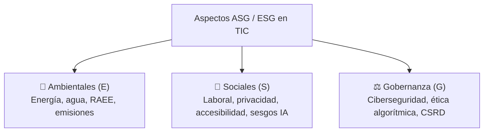
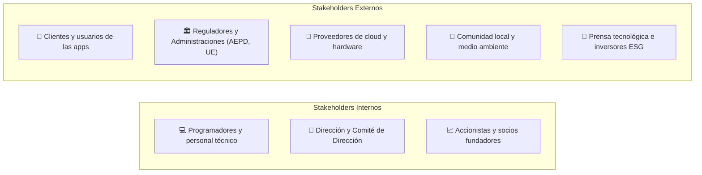
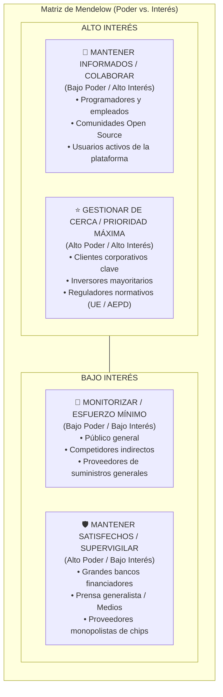
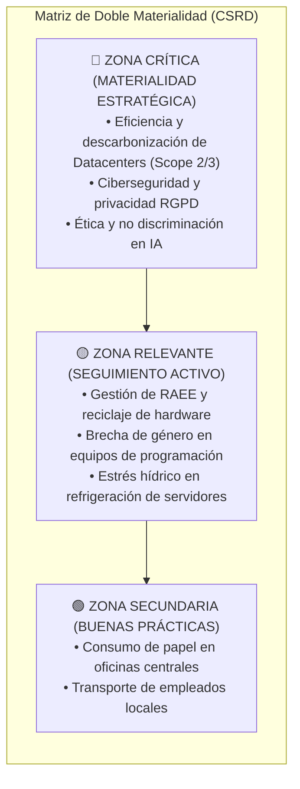
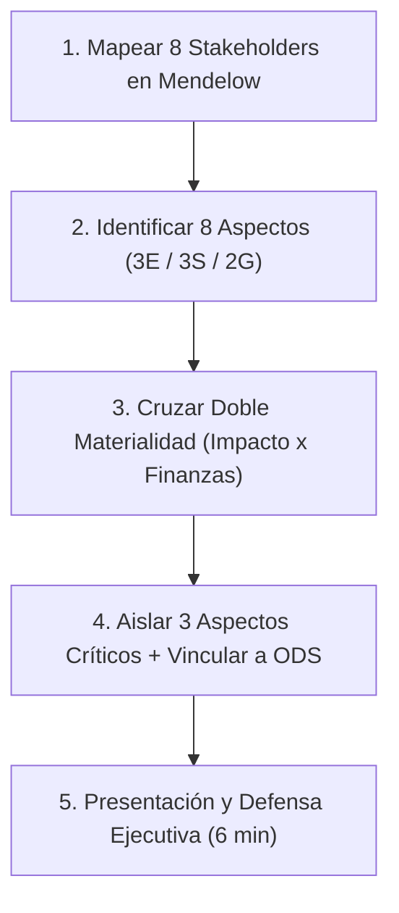

# 02 · Aspectos ASG y grupos de interés

<span class="badge badge-ra">RA1 (b, d) · RA6 (a, b)</span>
<span class="badge badge-e">Ambiental</span>
<span class="badge badge-s">Social</span>
<span class="badge badge-g">Gobernanza</span>
<span class="badge badge-tic">Matriz Mendelow & Doble Materialidad</span>

**Resultados de aprendizaje:** ==RA1== (criterios b, d) · Apoyo a ==RA6== (criterios a, b)  
**Duración orientativa:** 4 horas lectivas

!!! note "Objetivo de la unidad"
    Capacitar al estudiante para identificar los factores Ambientales, Sociales y de Gobernanza (**ASG / ESG**) específicos del sector tecnológico, mapear y priorizar a los grupos de interés (*stakeholders*) mediante la **Matriz de Mendelow**, y evaluar los riesgos (físicos, regulatorios, de transición) y oportunidades que determinan la viabilidad y reputación de una empresa de software o infraestructura.

<div class="stat-grid">
  <div class="stat-card">
    <div class="stat-number">CSRD</div>
    <div class="stat-label">Directiva reporte obligatorio UE</div>
  </div>
  <div class="stat-card">
    <div class="stat-number">4 Cuadr.</div>
    <div class="stat-label">Matriz Mendelow (Poder / Interés)</div>
  </div>
  <div class="stat-card">
    <div class="stat-number">2 Ejes</div>
    <div class="stat-label">Doble materialidad (Impacto + Financiera)</div>
  </div>
  <div class="stat-card">
    <div class="stat-number">ESRS</div>
    <div class="stat-label">Estándares europeos de reporte ASG</div>
  </div>
</div>

---

## 1. ¿Qué es un aspecto ASG en el sector tecnológico?

Aspecto ASG (Cuestión material)
:   Cualquier factor ambiental, social o de gobierno corporativo vinculado a los productos, servicios, código o infraestructuras de una empresa que genera un impacto positivo o negativo en el entorno o que altera significativamente su capacidad para generar valor económico.



Explora a continuación los aspectos materiales característicos del sector informático:

=== "🌿 Aspectos Ambientales (E - Environmental)"
    | Aspecto Material | Realidad concreta en empresas TIC | Indicador técnico de control |
    |:---|:---|:---|
    | **Emisiones GEI (Scope 1, 2, 3)** | Huella de carbono de servidores propios, electricidad de la red y ciclo de vida de los equipos. | Toneladas de $CO_2$ equivalente ($tCO_2e$). |
    | **Consumo energético** | Carga computacional continua 24/7 en centros de procesamiento de datos (CPD). | PUE (*Power Usage Effectiveness*), kWh/rack. |
    | **Estrés hídrico** | Agua evaporada para enfriar procesadores y servidores de alta densidad. | WUE (*Water Usage Effectiveness*), $m^3$ de agua. |
    | **Residuos electrónicos (RAEE)** | Obsolescencia acelerada de portátiles, servidores y terminales móviles corporativos. | Kg de RAEE por empleado, % reciclaje/reutilización. |
    | **Minerales críticos** | Uso intensivo de litio, cobalto, cobre y tierras raras en placas y baterías. | % materiales reciclados certificados en hardware. |

=== "👥 Aspectos Sociales (S - Social)"
    | Aspecto Material | Realidad concreta en empresas TIC | Indicador técnico de control |
    |:---|:---|:---|
    | **Condiciones laborales en origen** | Extracción minera de minerales de conflicto y ensamblaje de componentes en Asia. | Auditorías de cadena de suministro (RBA / SA8000). |
    | **Privacidad y derechos de usuarios** | Custodia de bases de datos de clientes, metadatos y cumplimiento del RGPD. | Incidentes de fuga de datos, multas de la AEPD. |
    | **Ética y sesgos en IA** | Algoritmos discriminatorios de contratación, reconocimiento facial o scoring de crédito. | Auditorías de imparcialidad algorítmica (*Fairness*). |
    | **Brecha digital y accesibilidad web** | Garantizar acceso universal a servicios digitales públicos y privados. | % cumplimiento de WCAG 2.2 nivel AA en interfaces. |
    | **Salud mental y desconexión digital** | Presión por sprints ágiles, síndrome de *burnout* y ergonomía en teletrabajo. | Encuestas de clima laboral, índice de rotación (*turnover*). |

=== "⚖️ Aspectos de Gobernanza (G - Governance)"
    | Aspecto Material | Realidad concreta en empresas TIC | Indicador técnico de control |
    |:---|:---|:---|
    | **Ciberseguridad y resiliencia (NIS2)** | Protección frente a ransomware, espionaje corporativo y ataques de denegación (DDoS). | Tiempo medio de detección y resolución (MTTD/MTTR). |
    | **Transparencia y reporte (CSRD)** | Publicación de memorias auditadas con el estándar ESRS / GRI. | Calificación crediticia ESG (MSCI, Sustainalytics). |
    | **Propiedad intelectual y Open Source** | Cumplimiento de licencias (GPL, Apache, MIT) y respeto a derechos de autor en IA. | Auditorías de código abierto y dependencias (SCA). |
    | **Retribución vinculada a KPIs ASG** | Bonificaciones de directivos y jefes de proyecto ligadas a métricas de descarbonización. | % de la retribución variable ligada a objetivos verdes. |

!!! tip "La singularidad del sector tecnológico"
    A diferencia de la industria pesada o el transporte, en las empresas de software e infraestructuras los aspectos **G (Gobernanza)** y **S (Social)** tienen un peso determinante: una vulnerabilidad crítica de ciberseguridad o un escándalo de manipulación de datos puede quebrar a una tecnológica en cuestión de días.

---

## 2. Grupos de interés (*Stakeholders*) en el ecosistema TIC

Grupo de interés (Stakeholder)
:   Cualquier individuo, colectivo o entidad que puede afectar o verse afectado directa o indirectamente por las decisiones, operaciones, software o servicios de una empresa.

### 2.1 Mapeo de grupos internos y externos



---

### 2.2 Matriz de priorización de Mendelow (Poder vs. Interés)

La **Matriz de Mendelow** es la herramienta estratégica empleada para clasificar y definir el tipo de relación y comunicación que la empresa debe mantener con cada grupo de interés:



| Cuadrante | Nivel de Poder / Interés | Estrategia de gestión | Ejemplo representativo en TIC |
|:---|:---:|:---|:---|
| **Gestionar de cerca** | Alto Poder / Alto Interés | Involucrar activamente en la toma de decisiones, reuniones periódicas y comités conjuntos. | El Director de Seguridad (CISO), clientes enterprise y la Agencia de Protección de Datos. |
| **Mantener informados** | Bajo Poder / Alto Interés | Consultar regularmente, habilitar canales de feedback continuo y boletines transparentes. | Los desarrolladores junior, usuarios finales de la app y colectivos de software libre. |
| **Mantener satisfechos** | Alto Poder / Bajo Interés | Responder estrictamente a sus requisitos legales y financieros sin saturarles de información. | Entidades bancarias de crédito, prensa financiera y proveedores clave de hardware. |
| **Monitorizar** | Bajo Poder / Bajo Interés | Seguimiento pasivo con inversión mínima de tiempo; comunicar mediante la web corporativa. | Usuarios ocasionales de la web o proveedores de material no crítico. |

---

## 3. Matriz de doble materialidad

No todas las cuestiones ASG tienen la misma trascendencia. La directiva europea **CSRD** y las normas **ESRS** exigen cruzar en una matriz de doble eje la perspectiva de impacto y la perspectiva financiera:



!!! example "Diferencias materiales entre modelos de negocio TIC"
    * **Fabricante de hardware (ej.: HP, Lenovo):** Sus aspectos críticos se concentran en el diseño circular, la reciclabilidad del plástico, la eliminación de soldaduras con plomo (RoHS) y la trazabilidad de los minerales de conflicto en África (S).
    * **Proveedor Cloud / Datacenters (ej.: AWS, Microsoft Azure):** Su prioridad absoluta es la métrica de consumo eléctrico (PUE), los contratos PPA de energía renovable 24/7 y la huella hídrica de refrigeración (E).
    * **Consultora de desarrollo de software (ej.: Indra, Globant):** Su materialidad se centra en la atracción y retención del talento técnico (S), el ecodiseño de código (*Green Coding*), la ciberseguridad y la gobernanza de proyectos (G).

---

## 4. Gestión de riesgos y oportunidades ASG

De conformidad con el estándar **TCFD** (*Task Force on Climate-related Financial Disclosures*) y la norma **ISO 31000**, los factores de sostenibilidad conllevan amenazas directas y palancas de rentabilidad:

### 4.1 Tipología de riesgos ASG

Riesgo físico agudo
:   Daños graves derivados de eventos climáticos extremos inmediatos (ej.: una ola de calor sin precedentes o inundación que colapsa los generadores de un data center).

Riesgo físico crónico
:   Pérdidas derivadas de cambios climáticos progresivos a largo plazo (ej.: aumento continuado de temperaturas medias que encarece en un 25% la factura de aire acondicionado de los CPD).

Riesgo de transición
:   Costes derivados del ajuste del mercado hacia una economía descarbonizada (ej.: descalificación de servidores obsoletos por normativas de ecodiseño o pérdida de clientes por no certificar emisiones).

Riesgo legal y regulatorio
:   Sanciones económicas y suspensiones de actividad por incumplimiento de normativas ambientales o de derechos digitales (ej.: sanciones de hasta el 4% de la facturación global por infracción del RGPD).

Riesgo reputacional
:   Destrucción de la imagen pública corporativa provocada por acusaciones fundamentadas de greenwashing, explotación en factorías de chips o sesgos racistas en algoritmos comerciales.

---

### 4.2 Matriz de riesgos y oportunidades aplicadas al software e infraestructura

| Aspecto Material | Tipo de Riesgo | Impacto potencial | Oportunidad estratégica | Acción de mitigación tecnológica |
|:---|:---|:---:|:---|:---|
| **Electricidad de servidores** | De transición / Mercado | Alto | **Reducción de costes operativos** con contratos PPA renovables y optimización de código. | Migrar cargas de trabajo a regiones cloud con factor de emisión cero e implementar auto-escalado nocturno. |
| **Residuos de hardware (RAEE)** | Legal (Directiva RAEE) | Medio | **Nuevas líneas de negocio DaaS** (*Device-as-a-Service*) y reventa de componentes reacondicionados. | Establecer programas corporativos de recogida, borrado seguro de datos (Blancco) y donación a centros educativos. |
| **Sesgos en algoritmos de IA** | Reputacional / Legal | Crítico | **Posicionamiento de marca en "IA Ética y Explicable"**, ganando licitaciones públicas de la UE. | Implementar pruebas de sesgo con bibliotecas como *Fairlearn* o *AIF360* antes del despliegue en producción. |
| **Vulnerabilidad de datos (RGPD)** | Legal / Regulatorio | Crítico | **Atracción de clientes corporativos** que exigen soberanía de datos y certificaciones de ciberresiliencia. | Cifrado de extremo a extremo, auditorías de penetración regulares y formación obligatoria del equipo en ciberseguridad. |

---

## 5. Síntesis para el examen técnico

```
╔════════════════════════════════════════════════════════════════════════════╗
║                   RESUMEN CLAVE: UNIDAD 02 - ASPECTOS ASG                  ║
╠════════════════════════════════════════════════════════════════════════════╣
║ 1. ASPECTO ASG: Factor E (clima, agua, RAEE), S (privacidad, ética IA) o   ║
║    G (ciberseguridad, transparencia) con impacto en personas o finanzas.   ║
║ 2. STAKEHOLDERS: Internos (empleados, socios) y Externos (clientes, AEPD,  ║
║    proveedores, sociedad).                                                 ║
║ 3. MATRIZ DE MENDELOW:                                                     ║
║    • Alto Poder + Alto Interés -> GESTIONAR DE CERCA (Clientes clave, UE). ║
║    • Bajo Poder + Alto Interés -> MANTENER INFORMADOS (Programadores).     ║
║    • Alto Poder + Bajo Interés -> MANTENER SATISFECHOS (Bancos, prensa).   ║
║ 4. DOBLE MATERIALIDAD: Lo que la empresa afecta al mundo (Impacto) y lo    ║
║    que el mundo afecta a la rentabilidad de la empresa (Financiera).       ║
║ 5. RIESGOS: Físicos (olas de calor en CPD), Transición (obsolescencia),    ║
║    Legales (sanciones RGPD/CSRD) y Reputacionales (greenwashing).          ║
║ 6. OPORTUNIDADES: Ahorro energético en nube, atracción de talento y DaaS.  ║
╚════════════════════════════════════════════════════════════════════════════╝
```

---

## 6. Cuestionario interactivo de autoevaluación

??? question "¿Por qué la ciberseguridad y la privacidad de datos se consideran pilares de sostenibilidad?"
    ???+ success "Respuesta técnica"
        Porque forman parte esencial de la **dimensión Social (S)** —protección del derecho fundamental a la intimidad y seguridad de los usuarios— y de la **dimensión de Gobernanza (G)** —resiliencia operativa y cumplimiento de normativas como el RGPD y NIS2—. Sin gobernanza de datos no puede haber un ecosistema digital sostenible.

??? question "¿Dónde ubicarías a los desarrolladores de software de la empresa en la Matriz de Mendelow y qué trato estratégico requieren?"
    ???+ success "Respuesta técnica"
        En el cuadrante de **Alto Interés y Bajo/Medio Poder** (*Mantener informados / Colaborar*). Aunque individualmente no tienen el poder financiero de un inversor, son los que ejecutan el código y adoptan las prácticas de Green Coding; si no están informados y motivados, cualquier plan de sostenibilidad corporativo fracasará.

??? question "¿Qué diferencia a un riesgo climático físico de un riesgo de transición en un data center?"
    ???+ success "Respuesta técnica"
        El **riesgo físico** es el daño material directo ocasionado por la climatología (ej.: una riada que inutiliza los generadores diésel de respaldo del centro de datos). El **riesgo de transición** proviene del cambio de modelo socioeconómico (ej.: la entrada en vigor de una tasa al carbono que encarece súbitamente el precio del kWh eléctrico consumido por el data center).

---

## 7. Actividad práctica guiada · «Tablero de materialidad y stakeholders TIC»

| Parámetro | Detalle operativo |
|---|---|
| **Modalidad** | Equipos de 2 o 3 alumnos. |
| **Tiempo de ejecución** | 1 sesión de trabajo (50 min) + 1 sesión de exposiciones ágiles (6 min por equipo). |
| **Criterios asociados** | ==RA1.b==, ==RA1.d==, base de ==RA6.a==. |
| **Entregables** | Tablero visual integrado (Mendelow + Lista ASG + Matriz de Materialidad). |

### Enunciado del reto

Para la empresa tecnológica asignada en el [Banco de Casos](09-casos-empresas-sector-informatico.md):

1. **Mapa de Grupos de Interés:** Situad al menos **8 stakeholders** concretos en la Matriz de Mendelow, explicando para cada uno su nivel de poder e interés y su expectativa prioritaria.
2. **Inventario ASG:** Definid **8 aspectos materiales específicos** de la empresa (mínimo 3 Ambientales, 3 Sociales y 2 de Gobernanza).
3. **Zona Crítica de Materialidad:** Construid la matriz de doble materialidad ubicando exactamente **3 aspectos clave en la zona crítica**, vinculándolos con el stakeholder que los exige y el ODS al que dan respuesta.



### Rúbrica de corrección analítica (10 Puntos)

* **Rigor en la Matriz de Mendelow (30% - 3,0 pts):** Los 8 stakeholders están ubicados con lógica empresarial justificada y sus expectativas son realistas para el sector TIC.
* **Calidad y especificidad del inventario ASG (25% - 2,5 pts):** Los temas seleccionados corresponden al modelo de negocio de la empresa y no son generalidades vacías.
* **Coherencia de la Doble Materialidad (25% - 2,5 pts):** La justificación de los 3 aspectos en la zona crítica cruza con solvencia el impacto externo con el riesgo financiero.
* **Capacidad expositiva y defensa (20% - 2,0 pts):** Explicación clara en 6 minutos, diseño visual comprensible y respuesta solvente a las preguntas de los compañeros.
