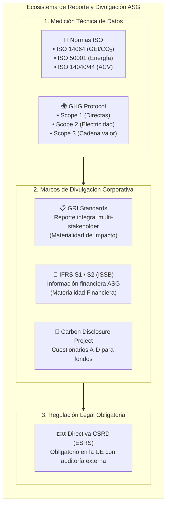
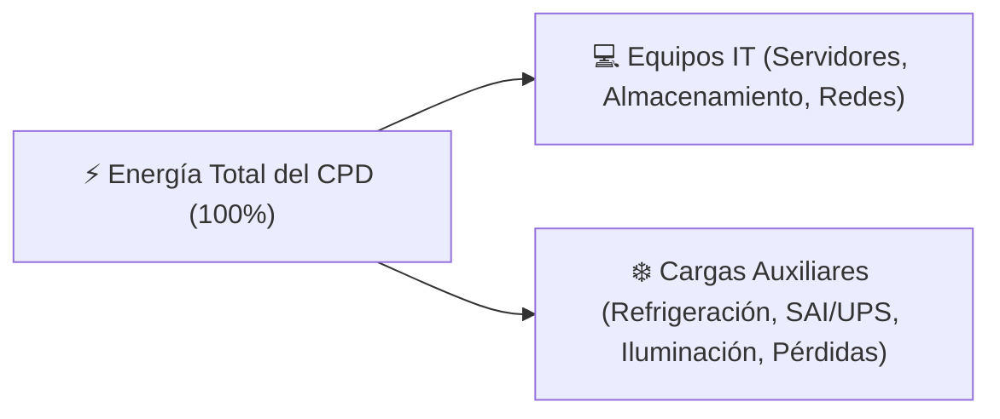
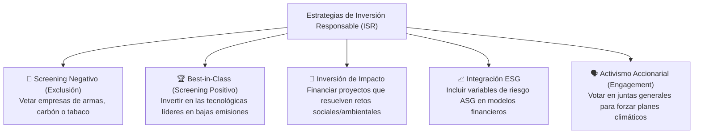
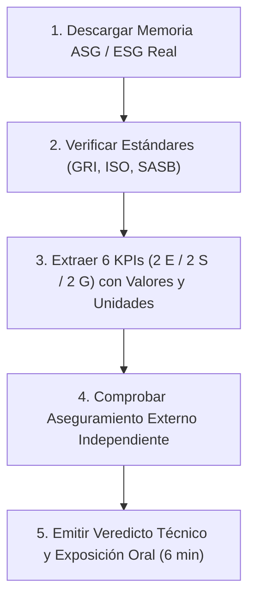

# 03 · Estándares, métricas e inversión socialmente responsable

<span class="badge badge-ra">RA1 (e, f) · RA6 (c, d)</span>
<span class="badge badge-kpi">PUE / WUE / SCI</span>
<span class="badge badge-cloud">Normas ISO & GHG</span>
<span class="badge badge-tic">GRI Standards & ISR</span>

**Resultados de aprendizaje:** ==RA1== (criterios e, f) · Soporte a ==RA6== (criterios c, d)  
**Duración orientativa:** 4 horas lectivas

!!! note "Objetivo de la unidad"
    Dominar los principales estándares y marcos de medición del desempeño en sostenibilidad (normas ISO, GRI, IFRS/ISSB y CDP), calcular e interpretar las métricas técnicas exclusivas del sector informático (**PUE**, **WUE**, **SCI**), y comprender el funcionamiento de la **Inversión Socialmente Responsable (ISR)** y el rol de las agencias de rating ESG en la financiación tecnológica.

<div class="stat-grid">
  <div class="stat-card">
    <div class="stat-number">1,1 – 1,2</div>
    <div class="stat-label">PUE benchmark en hyperscalers</div>
  </div>
  <div class="stat-card">
    <div class="stat-number">1,6 – 1,8</div>
    <div class="stat-label">PUE medio en centros de datos tradicionales</div>
  </div>
  <div class="stat-card">
    <div class="stat-number">ISO 14064</div>
    <div class="stat-label">Estándar cuantificación de GEI</div>
  </div>
  <div class="stat-card">
    <div class="stat-number">GRI 300</div>
    <div class="stat-label">Métricas ambientales corporativas</div>
  </div>
</div>

---

## 1. El mapa de los estándares y marcos de reporte ASG

El criterio ==RA1.e== exige identificar los marcos normativos y estándares técnicos que garantizan la rendición de cuentas corporativa.



Compara los cuatro grandes marcos internacionales de evaluación:

=== "📋 GRI Standards (Global Reporting Initiative)"
    * **Propósito:** El estándar internacional más adoptado para memorias de sostenibilidad globales.
    * **Público objetivo:** Múltiples grupos de interés (empleados, clientes, comunidades locales, gobiernos).
    * **Enfoque de materialidad:** **Materialidad de Impacto** (*Inside-Out*): cómo la empresa afecta a la sociedad y al medio ambiente.
    * **Estructura modular:** Estándares Universales (GRI 1, 2, 3) y Estándares Temáticos: GRI 300 (Ambiental: emisiones, energía, agua), GRI 400 (Social: empleo, privacidad), GRI 200 (Económico/Gobernanza).

=== "📏 Normas ISO & GHG Protocol"
    * **Propósito:** Proporcionar metodologías científicas y verificables para medir magnitudes físicas.
    * **Normas clave en TIC:**
        * **ISO 14064-1 / GHG Protocol:** Cuantificación rigurosa de emisiones de Gases de Efecto Invernadero (Alcances 1, 2 y 3).
        * **ISO 50001:** Gestión y eficiencia del consumo energético en data centers y oficinas.
        * **ISO 27001:** Sistemas de gestión de seguridad de la información (vinculado al pilar G).
    * **Certificación:** Auditoría externa por terceras partes independientes (AENOR, TÜV, SGS).

=== "💼 IFRS S1 y S2 (ISSB / SASB)"
    * **Propósito:** Estándares contables globales de sostenibilidad promovidos por la Fundación IFRS.
    * **Público objetivo:** Inversores institucionales, bancos y mercados de valores.
    * **Enfoque de materialidad:** **Materialidad Financiera** (*Outside-In*): cómo los riesgos climáticos afectan a los flujos de caja y a la valoración bursátil.
    * **Contenido:**
        * **IFRS S1:** Requisitos generales de divulgación financiera relacionada con la sostenibilidad.
        * **IFRS S2:** Divulgación específica sobre riesgos climáticos (totalmente alineada con el marco TCFD).

=== "🌱 CDP (Carbon Disclosure Project)"
    * **Propósito:** Sistema voluntario de puntuación de transparencia ambiental para empresas cotizadas.
    * **Cuestionarios temáticos:** Cambio Climático, Seguridad Hídrica y Bosques.
    * **Calificación pública:** Escala de notas desde la **A (Liderazgo)** hasta la **D- (Divulgación deficiente)**.
    * **Relevancia en TIC:** Los grandes fondos de inversión (BlackRock, Vanguard) exigen a proveedores cloud como Google o Amazon mantener puntuaciones de nivel A en el CDP.

---

## 2. Métricas técnicas e indicadores clave en el sector informático

El criterio ==RA1.e== y ==RA6.d== exige determinar los KPIs numéricos exactos empleados en auditorías TIC:

### 2.1 El indicador rey de los centros de datos: PUE (*Power Usage Effectiveness*)

Power Usage Effectiveness (PUE)
:   Métrica estándar desarrollada por el consorcio *The Green Grid* que cuantifica la eficiencia energética de una infraestructura de centro de procesamiento de datos (CPD).

$$\mathbf{PUE} = \frac{\text{Energía Total consumida por el Centro de Datos (kWh)}}{\text{Energía consumida exclusivamente por el Equipamiento IT (kWh)}}$$



* **PUE = 1,0:** Valor teórico perfecto (el 100% de la electricidad se destina al cómputo de los servidores; cero pérdidas en aire acondicionado o transformadores).
* **PUE típico en CPD tradicionales:** Entre **1,5 y 2,0** (por cada kWh útil de cómputo, se gasta otro kWh en enfriamiento).
* **PUE en Hyperscalers modernos (Google, Azure, AWS):** Entre **1,10 y 1,18** (gracias a refrigeración líquida directa al chip y modelos predictivos de IA).

!!! example "Cálculo práctico de examen: Auditoría energética de un CPD"
    Un centro de datos consume mensualmente $1.400.000\text{ kWh}$ de la red eléctrica. Los analizadores de red en los racks de servidores registran un consumo directo de $1.000.000\text{ kWh}$.
    
    $$\mathbf{PUE} = \frac{1.400.000\text{ kWh}}{1.000.000\text{ kWh}} = \mathbf{1,40}$$
    
    *Interpretación técnica:* Por cada kilovatio hora que consumen los servidores, se desperdician $0,4\text{ kWh}$ adicionales en ventiladores, enfriadoras y sistemas de alimentación ininterrumpida (SAI).

---

### 2.2 Otras métricas críticas de hardware y software

WUE (Water Usage Effectiveness)
:   Ratio de eficiencia en el uso del agua para refrigeración de data centers.
    $$\mathbf{WUE} = \frac{\text{Litros anuales de agua consumida}}{\text{Consumo de energía IT (kWh)}}$$

CUE (Carbon Usage Effectiveness)
:   Emisiones de $CO_2$ por unidad de consumo informático.
    $$\mathbf{CUE} = \frac{\text{Emisiones totales de } CO_2\text{e (kg)}}{\text{Consumo de energía IT (kWh)}}$$

SCI (Software Carbon Intensity)
:   Estándar de la *Green Software Foundation* (especificación ISO/IEC 21031) para calcular la huella de una aplicación de software.
    $$\mathbf{SCI} = \frac{(E \times I) + M}{R}$$
    Donde:
    * **$E$:** Energía consumida por el software (kWh).
    * **$I$:** Intensidad de carbono de la red eléctrica local ($gCO_2e/\text{kWh}$).
    * **$M$:** Carbono embebido del hardware asignado a la ejecución ($gCO_2e$).
    * **$R$:** Unidad funcional del software (por usuario, por consulta a la API, por minuto de vídeo reproducido).

---

### 2.3 Cuadro de mando integral de KPIs ASG para una empresa tecnológica

| Dimensión | Nombre del KPI | Unidad de Medida | Estándar de Referencia | Benchmark de Excelencia |
|:---:|:---|:---:|:---|:---|
| **E** | **PUE medio anual** | Ratio adimensional | The Green Grid / ISO 30134 | $\le 1,15$ |
| **E** | **% Energía renovable certificada** | % sobre consumo total | GRI 302-1 / CDP | $100\%$ mediante PPA |
| **E** | **Emisiones Alcance 1 y 2** | Toneladas $CO_2e$ | GHG Protocol / ISO 14064 | Cero neto (*Net Zero*) |
| **E** | **Tasa de reciclaje de RAEE** | % peso de hardware retirado | GRI 306-4 / Directiva RAEE | $\ge 95\%$ valorizado |
| **S** | **Brecha salarial de género ajustada** | % diferencia salarial | GRI 405-2 / CSRD | $< 2\%$ |
| **S** | **Mujeres en puestos de desarrollo/IT** | % sobre plantilla técnica | GRI 405-1 | $\ge 40\%$ |
| **S** | **Incidentes de fuga de datos (RGPD)** | Número de incidentes/año | RGPD / ISO 27001 | $0$ incidentes críticos |
| **G** | **Retribución ejecutiva ligada a ASG** | % del bonus variable | ESRS G1 / IFRS S1 | $\ge 20\%$ |
| **G** | **Proveedores cloud auditados en ESG** | % compras homologadas | GRI 308-1 / CSDDD | $\ge 90\%$ |

---

## 3. Inversión Socialmente Responsable (ISR / ESG Investing)

El criterio ==RA1.f== exige describir cómo el capital financiero fomenta la transformación sostenible a través de los mercados de inversión.

Inversión Socialmente Responsable (ISR)
:   Estrategia de inversión que incorpora formalmente criterios ambientales, sociales y de gobernanza (ASG) en las decisiones de asignación de capital, combinando la rentabilidad económica con un impacto ético medible a largo plazo.

### 3.1 Estrategias de selección de inversiones sostenibles



---

### 3.2 Los actores clave del ecosistema financiero sostenible

* **Inversores Institucionales:** Fondos de pensiones soberanos (ej.: Fondo Soberano de Noruega) y grandes gestoras (BlackRock) que exigen a las empresas tecnológicas descarbonizar sus data centers bajo amenaza de desinvertir.
* **Agencias de Rating ESG:** Entidades especializadas que evalúan a las empresas y les asignan una calificación pública:
    * **MSCI ESG Ratings:** Escala desde **AAA** (líder) hasta **CCC** (rezagado).
    * **Sustainalytics (Morningstar):** Puntuación de riesgo ESG numérico (0–10 riesgo inapreciable, >40 riesgo severo).
    * **EcoVadis:** Calificación para homologación de proveedores TIC mediante medallas (Platino, Oro, Plata, Bronce).
* **Índices Bursátiles de Sostenibilidad:** Índices de referencia como el **DJSI (Dow Jones Sustainability Index)** o el **FTSE4Good**, que agrupan exclusivamente a las compañías con mejores prácticas ASG globales.

!!! warning "El impacto directo sobre una empresa tecnológica"
    Una caída de calificación en el rating de MSCI (ej. de AA a BB tras una fuga de datos o un escándalo de obsolescencia programada) provoca automáticamente la expulsión de la empresa de los fondos cotizados (ETF sostenibles), desplomando el valor de sus acciones y encareciendo los tipos de interés de sus préstamos bancarios.

---

## 4. Marco regulatorio europeo de rendición de cuentas

| Regulación Comunitaria | Obligación Legal Concreta | Empresas afectadas | Plazo de aplicación |
|:---|:---|:---|:---:|
| **Directiva CSRD** (UE 2022/2464) | Publicación obligatoria del Informe de Sostenibilidad aplicando los estándares **ESRS** y principio de **Doble Materialidad**, con auditoría externa obligatoria. | Grandes empresas, cotizadas y pymes cotizadas de la UE. | 2024–2028 (gradual) |
| **Taxonomía Verde Europea** | Sistema de etiquetado técnico que define qué actividades son ambientalmente sostenibles (ej. requisitos de PUE para considerar verde un data center). | Todas las empresas bajo CSRD e instituciones financieras. | En vigor pleno |
| **Reglamento SFDR** (UE 2019/2088) | Transparencia sobre productos financieros: clasifica los fondos de inversión en Artículo 6 (no ESG), Artículo 8 (promueven ESG) y Artículo 9 (impacto sostenible puro). | Gestoras de fondos y entidades bancarias. | En vigor pleno |

---

## 5. Síntesis para el examen técnico

```
╔════════════════════════════════════════════════════════════════════════════╗
║                   RESUMEN CLAVE: UNIDAD 03 - ESTÁNDARES Y MÉTRICAS         ║
╠════════════════════════════════════════════════════════════════════════════╣
║ 1. GRI: Estándar global de memorias ASG (Materialidad de impacto).         ║
║ 2. ISO 14064 / GHG Protocol: Cuantificación rigurosa de emisiones tCO₂e.   ║
║ 3. IFRS S1/S2 (ISSB): Divulgación a inversores (Materialidad financiera).  ║
║ 4. CDP: Puntuación A-D sobre riesgo climático y agua para el capital.     ║
║ 5. MÉTRICAS CLAVE EN DATACENTERS:                                         ║
║    • PUE = Energía Total / Energía IT (Objetivo: acercarse a 1.0).        ║
║    • WUE = Litros de agua / Consumo IT (kWh).                             ║
║    • SCI (Green Software) = [(E * I) + M] / R (Huella por transacción).   ║
║ 6. ISR (Inversión Responsable): Estrategias Best-in-Class, exclusión,      ║
║    integración y activismo accionarial. Rating de agencias: MSCI, EcoVadis.║
║ 7. CSRD / ESRS: Obligación legal comunitaria de reporte con auditoría.    ║
╚════════════════════════════════════════════════════════════════════════════╝
```

---

## 6. Cuestionario interactivo de autoevaluación

??? question "Si un centro de datos tiene un PUE de 1,15 y consume 2.300.000 kWh totales al mes, ¿cuánta energía llega efectivamente a los servidores?"
    ???+ success "Respuesta técnica"
        Despejando de la fórmula: $\text{Energía IT} = \frac{\text{Energía Total}}{\text{PUE}} = \frac{2.300.000\text{ kWh}}{1,15} = \mathbf{2.000.000\text{ kWh}}$.  
        Los $300.000\text{ kWh}$ restantes se consumen en sistemas auxiliares de climatización e iluminación.

??? question "¿Qué diferencia fundamental separa al estándar GRI del estándar IFRS S1/S2 del ISSB?"
    ???+ success "Respuesta técnica"
        El **GRI** se enfoca en la **materialidad de impacto** (hacia múltiples stakeholders: sociedad, trabajadores, clientes), informando de cómo la empresa altera el entorno. El **IFRS S1/S2** se enfoca en la **materialidad financiera** (hacia inversores y accionistas), informando de cómo los riesgos ESG comprometen la rentabilidad y el valor económico del negocio.

??? question "¿En qué consiste la estrategia de inversión responsable 'Best-in-Class' y cómo se aplica al sector tecnológico?"
    ???+ success "Respuesta técnica"
        Consiste en no excluir al sector tecnológico, sino seleccionar e invertir únicamente en aquellas empresas de software o telecomunicaciones que obtienen las calificaciones ESG más altas de su categoría (por ejemplo, premiando a los proveedores cloud con menor PUE y mayor paridad de género).

---

## 7. Actividad práctica guiada · «Auditoría de métricas a una memoria ASG real»

| Parámetro | Detalle operativo |
|---|---|
| **Modalidad** | Equipos de 2 alumnos. |
| **Tiempo de ejecución** | 1 sesión de inspección de memorias (50 min) + exposición y debate (6 min por equipo). |
| **Criterios asociados** | ==RA1.e==, ==RA1.f==, preparación de ==RA6.d==. |
| **Entregable** | Ficha-auditoría con inventario de estándares, tabla de 6 KPIs verificados y veredicto anti-greenwashing. |

### Enunciado del reto

Acceded a la memoria anual de sostenibilidad (Non-Financial Report / CSRD Report) de una compañía tecnológica real (ej. *Telefónica, Microsoft, Google, HP, Amadeus o Indra*):

1. **Rastreo de Estándares:** Localizad la tabla de contenidos e identificad qué estándares internacionales declaran utilizar (GRI, ISO, SASB, CDP, TCFD).
2. **Extracción de 6 KPIs Verificables:** Extraed con valor numérico, unidad de medida y página exacta del informe:
    * 2 Indicadores Ambientales (ej. PUE, emisiones Scope 1-2 en $tCO_2e$, consumo en MWh).
    * 2 Indicadores Sociales (ej. % mujeres en desarrollo de software, horas de formación, brecha salarial).
    * 2 Indicadores de Gobernanza (ej. incidentes de ciberseguridad, proveedores auditados, % bonus ligado a ESG).
3. **Chequeo de Rigor y Veredicto:** Comprobad si el informe cuenta con **carta de aseguramiento externo emitida por una auditora independiente** (KPMG, PwC, Deloitte, EY) y emitid un veredicto justificado sobre la transparencia de la empresa.



### Rúbrica de corrección analítica (10 Puntos)

* **Precisión en los KPIs extraídos (35% - 3,5 pts):** Los 6 KPIs contienen valores numéricos reales, unidades de medida normalizadas y cita exacta de la página de la memoria.
* **Comprensión de los estándares (25% - 2,5 pts):** Explicación clara de para qué sirve cada estándar identificado en el informe (GRI vs ISO vs SASB).
* **Análisis de aseguramiento y CSRD (20% - 2,0 pts):** Localización de la carta del auditor externo y verificación de la doble materialidad.
* **Capacidad crítica y veredicto (20% - 2,0 pts):** Conclusiones argumentadas diferenciando logros reales de posibles indicios de greenwashing corporativo.
