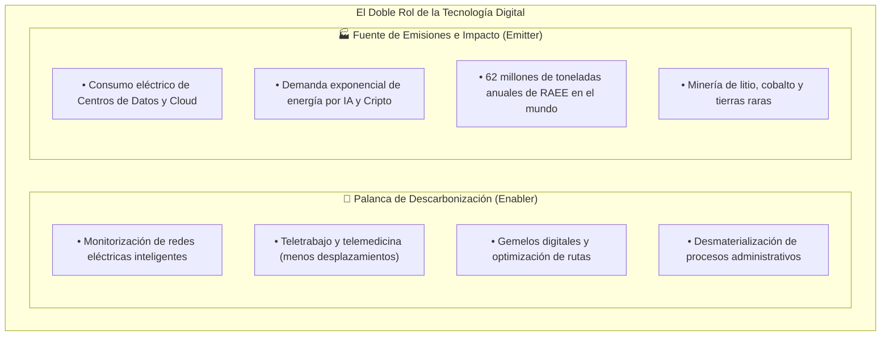
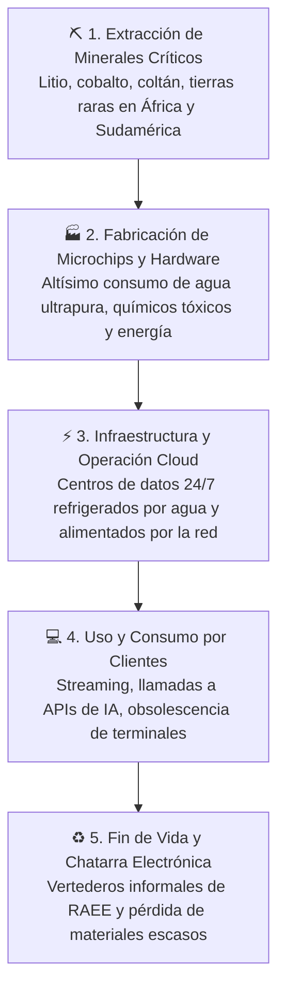
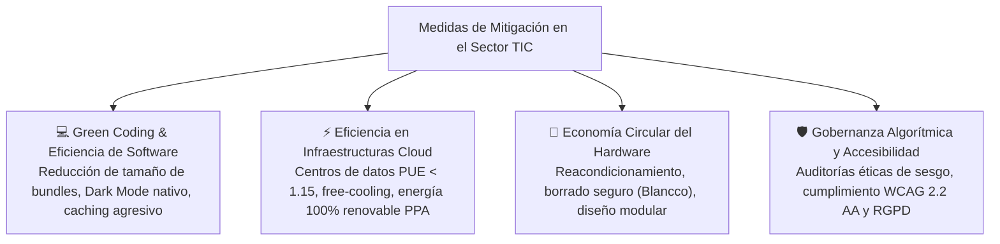
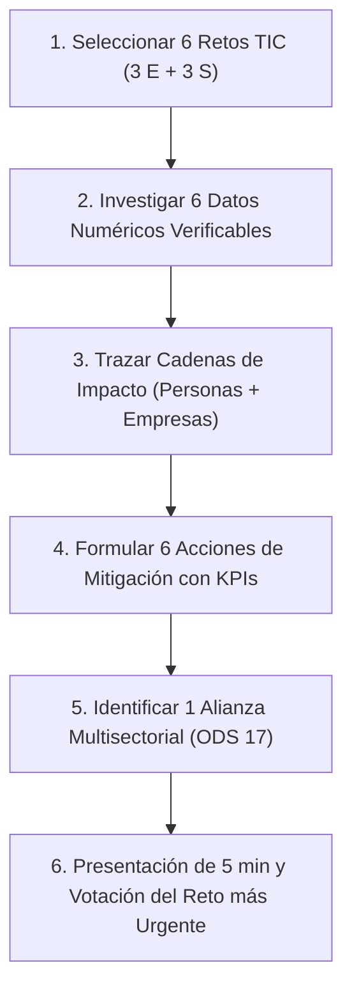

# 04 · Retos ambientales y sociales del sector informático

<span class="badge badge-ra">RA2 · Criterios a–e</span>
<span class="badge badge-alerta">Retos Críticos TIC</span>
<span class="badge badge-cloud">Centros de Datos & IA</span>
<span class="badge badge-hardware">RAEE & Minerales Críticos</span>

**Resultado de aprendizaje:** ==RA2== (criterios a, b, c, d, e)  
**Duración orientativa:** 4 horas lectivas

!!! note "Objetivo de la unidad"
    Desmontar el mito de la «inmaterialidad» de lo digital analizando la huella física real de internet, centros de datos, Inteligencia Artificial y dispositivos. Caracterizar los impactos ambientales (energía, agua, RAEE, minerales críticos) y sociales (brecha digital, condiciones laborales, sesgos de la IA), formulando medidas de mitigación técnica y alianzas estratégicas transversales (ODS 17).

<div class="stat-grid">
  <div class="stat-card">
    <div class="stat-number">2% – 4%</div>
    <div class="stat-label">Emisiones mundiales de GEI por TIC</div>
  </div>
  <div class="stat-card">
    <div class="stat-number">62 Mt</div>
    <div class="stat-label">Residuos electrónicos (RAEE) al año</div>
  </div>
  <div class="stat-card">
    <div class="stat-number">~200-400 TWh</div>
    <div class="stat-label">Consumo eléctrico mundial de data centers</div>
  </div>
  <div class="stat-card">
    <div class="stat-number">&lt; 23%</div>
    <div class="stat-label">Tasa mundial de reciclaje formal de RAEE</div>
  </div>
</div>

---

## 1. La paradoja digital: ¿Solución ecológica o fuente de impacto?

El criterio ==RA2.b== exige relacionar los retos ecológicos y sociales con el desarrollo de la economía digital.

Efecto de Doble Filo de las TIC (Enabler vs. Emitter)
:   Las tecnologías de la información son simultáneamente **palanca de descarbonización** (reducen hasta un 15-20% de las emisiones de otros sectores mediante teletrabajo, optimización logística y gemelos digitales) y **fuente de impacto masivo** (representan entre el 2% y el 4% de las emisiones mundiales de GEI, superando a la aviación civil comercial).



---

## 2. El coste invisible de lo digital: Cadena de impacto integral

El ciclo de vida de un sistema informático abarca desde la mina hasta el vertedero:



Explora a continuación los grandes retos clasificados por pilares:

=== "⚡ Retos Ambientales (E - Environmental)"
    * **Explosión energética de la IA generativa:** Entrenar un modelo fundacional consume cientos de MWh; una sola respuesta generada por IA consume hasta 10 veces más electricidad que una búsqueda web tradicional en texto plano.
    * **Estrés hídrico y refrigeración:** Los centros de datos evaporan miles de millones de litros de agua en torres de enfriamiento, en muchos casos en regiones agrícolas sometidas a sequías recurrentes.
    * **Tsunami de chatarra electrónica (RAEE):** En 2024 se alcanzaron 62 millones de toneladas de basura electrónica a nivel global; solo el 22% se recolecta y recicla formalmente según la ONU.
    * **Obsolescencia forzada por software:** Requisitos de hardware artificiales en sistemas operativos (ej.: Windows 11 dejando obsoletos millones de ordenadores perfectamente funcionales por falta de chip TPM 2.0).

=== "👥 Retos Sociales (S - Social)"
    * **Violaciones de derechos humanos en origen:** Condiciones extremas y trabajo infantil en minas artesanales de cobalto en la República Democrática del Congo (RDC).
    * **Exclusión y Brecha Digital:** Millones de personas mayores o con escasos recursos quedan al margen de trámites bancarios, médicos o administrativos por digitalización forzosa no accesible.
    * **Sesgos y discriminación algorítmica:** Algoritmos de selección de personal o de concesión de hipotecas entrenados con datos históricos que perpetúan la discriminación por razón de género, etnia o código postal.
    * **Condiciones en factorías de ensamblaje:** Jornadas maratonianas y estrés extremo en macro-fábricas asiáticas de montaje de teléfonos y placas base.

=== "⚖️ Retos de Gobernanza y Ética (G - Governance)"
    * **Concentración monopolística del Cloud:** Más del 65% de la infraestructura cloud global está concentrada en solo tres gigantes (AWS, Azure, Google Cloud), creando un riesgo sistémico de soberanía digital.
    * **Falta de transparencia algorítmica:** Modelos de «caja negra» opacos donde ni los propios desarrolladores pueden explicar con certeza por qué el modelo tomó una decisión crítica que afecta a un ciudadano.
    * **Greenwashing corporativo:** Anuncios rimbombantes de "emisiones netas cero" sustentados en la compra masiva de créditos de carbono no auditados en lugar de reducir el consumo real de energía.

---

## 3. Matriz de impactos sobre personas y sectores productivos

El criterio ==RA2.c== exige analizar cómo los retos se traducen en perjuicios concretos sobre los seres humanos y la economía:

| Reto Tecnológico | Impacto directo sobre las personas | Impacto directo sobre sectores productivos |
|:---|:---|:---|
| **Consumo eléctrico e IA** | Subida de las tarifas eléctricas residenciales por tensión en la red; emisiones que agravan enfermedades respiratorias. | Riesgo de apagones industriales, aumento del coste operativo del hosting y exigencias de auditoría energética. |
| **Consumo de agua en CPD** | Restricciones de riego y consumo de agua potable en municipios vecinos a los macro-datacenters. | Conflictos sociales, denegación de licencias de obra a tecnológicas y riesgo de paralización por sequía. |
| **Residuos RAEE** | Contaminación por plomo y mercurio en comunidades vulnerables cercanas a vertederos ilegales (ej. Agbogbloshie, Ghana). | Pérdida de metales preciosos valorados en 60.000 M$/año; encarecimiento de materias primas secundarias. |
| **Minerales de conflicto** | Explotación, trabajo forzado y financiación de grupos armados en zonas mineras desreguladas. | Cuellos de botella en cadenas de suministro de chips y riesgo de sanciones bajo la directiva europea CSDDD. |
| **Brecha digital** | Pérdida de acceso a citas sanitarias, empleo y banca para colectivos vulnerables y de tercera edad. | Pérdida de cuota de mercado, abandono de carritos en plataformas e-commerce y sanciones por inaccesibilidad web. |

---

## 4. Medidas y acciones técnicas de mitigación

El criterio ==RA2.d== exige diseñar respuestas técnicas tangibles desde la ingeniería informática:



!!! tip "Buenas prácticas para desarrolladores web (DAW / DAM)"
    1. **Minimizar la transferencia de datos:** Cada gigabyte transferido por internet consume aproximadamente $0,06\text{ kWh}$. Optimizar imágenes con formatos modernos (AVIF, WebP) y purgar CSS innecesario ahorra energía en millones de dispositivos cliente.
    2. **Algoritmos eficientes:** Pasar de una complejidad temporal cuadrática $O(n^2)$ a una logarítmica $O(n \log n)$ en una consulta que procesa millones de filas reduce el uso de CPU de minutos a milisegundos, liberando capacidad y reduciendo calor en el servidor.
    3. **Diseño oscuro para pantallas OLED:** Los píxeles negros en paneles OLED están físicamente apagados, ahorrando hasta un 30% de batería en terminales móviles.

---

## 5. Alianzas estratégicas y trabajo transversal (ODS 17)

Ninguna empresa de software puede resolver los retos de la sostenibilidad de forma aislada. El criterio ==RA2.e== enfatiza la cooperación multisectorial:

* **Iniciativas sectoriales de software abierto:** La **Green Software Foundation** (GSF), consorcio sin ánimo de lucro fundado por Microsoft, GitHub, Accenture y Thoughtworks, crea estándares abiertos (como la especificación SCI) para medir y reducir las emisiones del código.
* **Alianzas público-privadas:** Colaboración entre universidades, centros de formación profesional y empresas tecnológicas para reciclar hardware descatalogado convirtiéndolo en aulas informáticas comunitarias.
* **Transversalidad interna corporativa:** Integración de la sostenibilidad en los comités de arquitectura de software, compras tecnológicas, seguridad y recursos humanos.

---

## 6. Síntesis para el examen técnico

```
╔════════════════════════════════════════════════════════════════════════════╗
║                   RESUMEN CLAVE: UNIDAD 04 - RETOS DEL SECTOR TIC          ║
╠════════════════════════════════════════════════════════════════════════════╣
║ 1. PARADOJA DIGITAL: El sector TIC emite el 2-4% del CO₂ mundial, pero     ║
║    puede habilitar un ahorro del 15% en otros sectores (efecto Enabler).   ║
║ 2. RETOS AMBIENTALES: Electricidad e IA (Scope 2/3), agua en CPD (WUE),    ║
║    chatarra RAEE (62 Mt/año), minería de tierras raras y obsolescencia.   ║
║ 3. RETOS SOCIALES: Brecha digital, minerales de conflicto (RDC), sesgos    ║
║    discriminatorios en IA, ciberseguridad, salud mental y tecnoestrés.     ║
║ 4. MITIGACIÓN TÉCNICA: Green Coding (código eficiente), CPD con PUE < 1.15,║
║    contratos PPA renovables, modularidad de hardware y borrado seguro.     ║
║ 5. ODS 17 (ALIANZAS): Consorcios de código abierto (Green Software        ║
║    Foundation) y cooperación público-privada frente a la brecha digital.   ║
╚════════════════════════════════════════════════════════════════════════════╝
```

---

## 7. Cuestionario interactivo de autoevaluación

??? question "¿Por qué se afirma que la Inteligencia Artificial generativa ha multiplicado los retos ambientales del sector TIC?"
    ???+ success "Respuesta técnica"
        Porque la IA requiere clústeres de cómputo basados en GPUs de altísima potencia que operan con consumos eléctricos astronómicos y densidades térmicas que exigen millones de litros de agua para refrigeración. Además, el ciclo de vida de los chips de IA es extraordinariamente corto, acelerando la generación de RAEE de gama alta.

??? question "¿Cómo afecta la brecha digital a la consecución del ODS 10 (Reducción de las desigualdades)?"
    ???+ success "Respuesta técnica"
        Al digitalizar servicios esenciales (banca, sanidad, trámites tributarios) sin ofrecer alternativas accesibles o interfaces intuitivas, se excluye activamente a colectivos vulnerables (ancianos, familias sin banda ancha o personas con discapacidad), agrandando la brecha económica y social.

??? question "¿En qué consiste la 'obsolescencia por software' y cómo se combate desde la regulación?"
    ???+ success "Respuesta técnica"
        Consiste en dejar de proporcionar actualizaciones de seguridad o soporte a dispositivos cuyo hardware sigue en perfecto estado, obligando al consumidor a comprar un nuevo equipo. La UE lo combate mediante el **Reglamento de Ecodiseño (ESPR)** y la normativa de **Derecho a Reparar**, exigiendo un mínimo de 5 a 7 años de actualizaciones obligatorias de software y disponibilidad de repuestos.

---

## 8. Actividad práctica guiada · «El coste invisible de lo digital»

| Parámetro | Detalle operativo |
|---|---|
| **Modalidad** | Equipos de 2 o 3 alumnos. |
| **Tiempo de ejecución** | 1 sesión de investigación y diseño (50 min) + 1 sesión de presentaciones breves y votación (5 min por equipo). |
| **Criterios asociados** | ==RA2.a==, ==RA2.b==, ==RA2.c==, ==RA2.d==, ==RA2.e==. |
| **Entregable** | Infografía técnica digital estructurada en 6 retos (3 E y 3 S) con datos numéricos de fuentes fiables. |

### Enunciado del reto

Diseñad una infografía técnica titulada **«El coste invisible de lo digital»** que desmonte los mitos de inmaterialidad de internet:

1. **6 Retos Tecnológicos:** Seleccionad **3 retos ambientales** (ej. consumo de agua en centros de datos, emisiones de la IA, gestión de baterías de litio) y **3 retos sociales** (ej. sesgos en algoritmos de crédito, explotación en minas de cobalto, brecha digital de mayores).
2. **Datos Cuantitativos:** Cada reto debe incorporar al menos una cifra estadística contrastada con cita a su fuente oficial (informes de la ONU, Agencia Internacional de la Energía, Eurostat o memorias corporativas).
3. **Cadenas de Impacto y Solución:** Para cada reto, trazad el impacto sobre las personas y sectores productivos, proponiendo **1 acción técnica de mitigación** evaluable mediante un KPI concreto.
4. **Alianza ODS 17:** Incluid al pie una iniciativa de colaboración multisectorial que ayude a erradicar uno de los problemas identificados.



### Rúbrica de corrección analítica (10 Puntos)

* **Equilibrio y relevancia de retos (25% - 2,5 pts):** Cobertura rigurosa de 3 retos ambientales y 3 retos sociales del ámbito informático.
* **Calidad de datos y rigor de fuentes (25% - 2,5 pts):** Todas las cifras estadísticas están fundamentadas con fuentes institucionales o técnicas reales.
* **Lógica de la cadena de impacto y mitigación (25% - 2,5 pts):** Conexión lógica entre el reto, su afección social/económica y la solución propuesta con su KPI.
* **Diseño gráfico, alianza ODS 17 y exposición (25% - 2,5 pts):** Infografía legible, alianza transversal bien argumentada y defensa ágil en 5 minutos.
