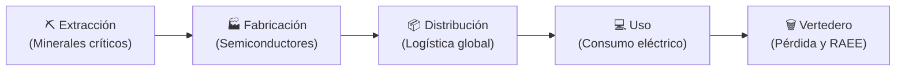
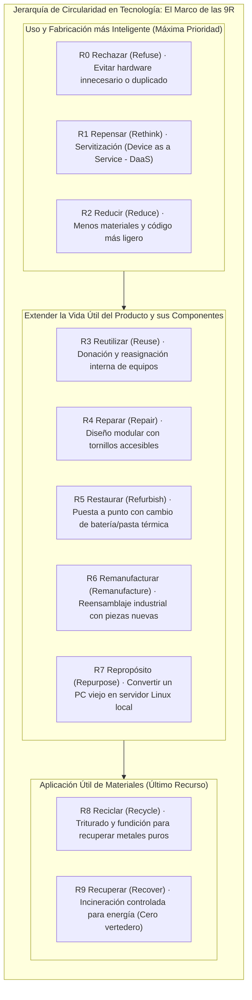
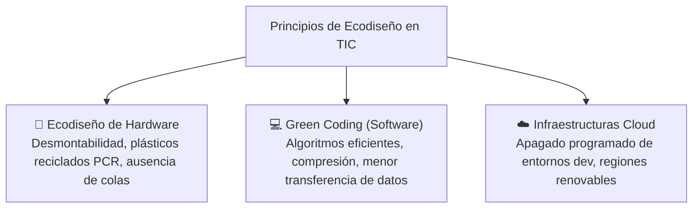
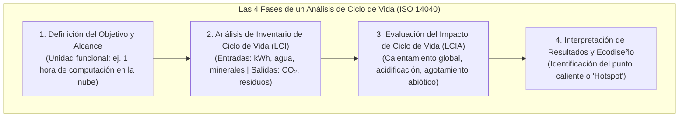
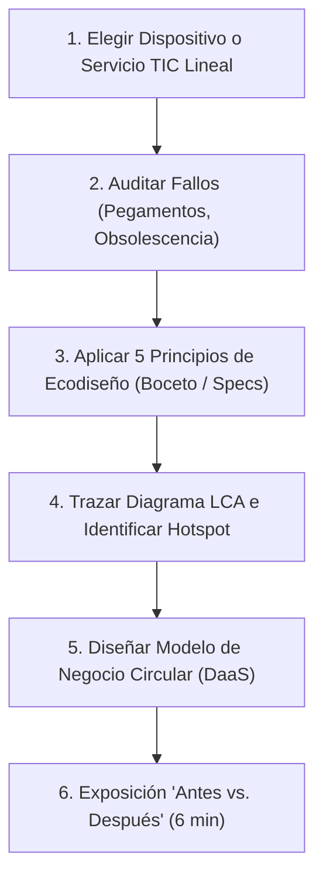

# 05 · Economía circular, verde y ecodiseño en tecnología

<span class="badge badge-ra">RA4 · Criterios a–f</span>
<span class="badge badge-tic">Economía Circular 9R</span>
<span class="badge badge-software">Green Coding</span>
<span class="badge badge-hardware">Ecodiseño Hardware (ESPR)</span>

**Resultado de aprendizaje:** ==RA4== (criterios a, b, c, d, e, f) · Apoyo a ==RA5==  
**Duración orientativa:** 5 horas lectivas

!!! note "Objetivo de la unidad"
    Capacitar al estudiante para identificar los límites del modelo lineal de producción electrónica («extraer-fabricar-usar-tirar»), aplicar las estrategias circulares del **marco de las 9R**, formular modelos de servitización (**Device-as-a-Service**), ejecutar auditorías de **ecodiseño de hardware y software** y evaluar los impactos integrales mediante el **Análisis de Ciclo de Vida (LCA / ACV)** según la norma ISO 14040.

<div class="stat-grid">
  <div class="stat-card">
    <div class="stat-number">75% – 80%</div>
    <div class="stat-label">Huella embebida en manufactura de portátiles</div>
  </div>
  <div class="stat-card">
    <div class="stat-number">9R</div>
    <div class="stat-label">Estrategias de jerarquía circular</div>
  </div>
  <div class="stat-card">
    <div class="stat-number">ISO 14040</div>
    <div class="stat-label">Análisis de Ciclo de Vida (LCA)</div>
  </div>
  <div class="stat-card">
    <div class="stat-number">10 / 10</div>
    <div class="stat-label">Índice reparabilidad europeo (Fairphone)</div>
  </div>
</div>

---

## 1. El colapso del modelo lineal en la industria electrónica

El criterio ==RA4.a== exige caracterizar las deficiencias intrínsecas del modelo productivo tradicional.

Modelo Lineal («Take-Make-Dispose»)
:   Flujo económico extractivo y unidireccional que asume falsamente la disponibilidad infinita de materias primas y la capacidad ilimitada de la Tierra para absorber residuos.



### 1.1 Consecuencias críticas en el sector tecnológico

* **Agotamiento de reservas geológicas:** Metales vitales para la electrónica (antimonio, galio, indio, plata y coltán) presentan una vida útil extractiva estimada de menos de 40 a 60 años al ritmo actual de consumo.
* **Intensidad de carbono embebida:** Hasta el **75-80% de la huella de carbono de un portátil o smartphone** se genera antes de que el usuario lo encienda por primera vez (durante la minería, refinado y fabricación de obleas de silicio en sala blanca).
* **Obsolescencia acelerada artificial:** Retirada de soporte de software, pegado irreversible de componentes con resina y falta de esquemas técnicos que fuerzan la sustitución de hardware funcional cada 2 o 3 años.

---

## 2. Los principios de la Economía Circular y el marco de las 9R

El criterio ==RA4.b== introduce las bases de la economía restaurativa y regenerativa postulada por la Fundación Ellen MacArthur:



### 2.1 Modelos de negocio circulares en el sector TIC

| Modelo Circular | Enfoque de Negocio | Ventaja Empresarial | Ejemplo en la Industria |
|:---|:---|:---|:---|
| **Dispositivo como Servicio (DaaS)** | La empresa no vende el PC; cobra una suscripción mensual que incluye hardware, mantenimiento, sustitución y reciclaje final. | Ingresos recurrentes estables y control total del activo al final de su vida útil. | HP Device as a Service, Dell APEX PC-as-a-Service. |
| **Plataformas de Reacondicionado** | Adquisición de flotas informáticas corporativas tras 3 años de uso, diagnóstico, limpieza, ampliación de RAM/SSD y reventa con 2 años de garantía. | Márgenes comerciales elevados y reducción del 70% de emisiones frente a equipos nuevos. | Back Market, Amazon Renewed, Refurbed. |
| **Diseño Modular y Reparabilidad** | Creación de dispositivos con módulos independientes fácilmente intercambiables por el propio usuario sin herramientas especiales. | Fidelización del cliente mediante venta de repuestos y actualizaciones modulares. | Fairphone (móvil modular con índice de reparabilidad 10/10), Framework Laptop. |

---

## 3. Principios de Ecodiseño (Norma ISO 14006 / Reglamento ESPR UE)

El criterio ==RA4.d== exige aplicar principios de ecodiseño integrando la variable ambiental **desde la fase de concepción**:



Compara los criterios operativos entre hardware y desarrollo de software:

=== "🔧 Ecodiseño de Hardware"
    * **Desmontabilidad y tornillería estándar:** Prohibición de pegamentos térmicos industriales; uso de tornillos estándar Phillips o Torx y clips mecánicos reversibles.
    * **Monocapacidad de materiales:** Empleo de plásticos reciclados posconsumo (PCR) libres de pinturas que dificulten el reciclaje químico.
    * **Eliminación de sustancias peligrosas:** Cumplimiento estricto de las directivas **RoHS** (restricción de plomo, mercurio y cadmio) y **REACH**.
    * **Disponibilidad de repuestos:** Cumplimiento del **Derecho a Reparar de la UE**, garantizando pantallas, teclados y baterías durante un mínimo de 7 años tras el cese de fabricación.

=== "💻 Ecodiseño de Software (Green Coding)"
    * **Optimización algorítmica:** Reducir la complejidad computacional en procesos repetitivos de servidor (Big O).
    * **Almacenamiento en caché agresivo:** Evitar recalcular consultas pesadas en base de datos mediante capas Redis o Memcached.
    * **Dark Mode nativo por CSS:** En pantallas OLED, los píxeles negros apagan físicamente el diodo emisor de luz, ahorrando hasta un 30% de energía.
    * **Poda de dependencias (Tree Shaking):** Eliminar librerías sobredimensionadas; importar únicamente las funciones estrictamente utilizadas.

    | Lenguaje / Entorno | Ratio de Consumo Energético | Paradigma y Compilación | Recomendación en Arquitectura Sostenible |
    |:---|:---:|:---|:---|
    | **C** | **1,00×** (Línea base) | Compilado a código máquina nativo. | Drivers, microcontroladores y motores críticos. |
    | **Rust** | **1,03×** | Compilado nativo con seguridad de memoria. | Servicios de red de alto rendimiento y APIs críticas. |
    | **C++** | **1,34×** | Compilado nativo orientado a objetos. | Motores gráficos, IA local y procesamiento masivo. |
    | **Java** | **1,98×** | Compilado a Bytecode en máquina virtual (JVM). | Microservicios empresariales con JVM optimizada. |
    | **Go (Golang)** | **3,23×** | Compilado concurrente con recolección de basura. | Orquestadores, contenedores y microservicios cloud. |
    | **JavaScript (Node.js)** | **4,45×** | Interpretado JIT con bucle de eventos asíncrono. | APIs web escalables y microservicios I/O bound. |
    | **PHP** | **29,30×** | Interpretado por script en cada petición web. | Renderizado web monolítico tradicional. |
    | **Python** | **75,88×** | Interpretado dinámico con alto overhead de CPU. | Prototipado y scripting (usar C-bindings para IA intensiva). |
    <br/>
    *(Fuente: Estudio de referencia de Pereira et al., Universidad de Minho / ACM Green Software).*

=== "☁️ Ecodiseño de Arquitecturas Cloud"
    * **Apagado automatizado:** Apagar automáticamente los clústeres de pruebas y staging durante fines de semana y noches mediante scripts serverless.
    * **Selección de regiones por factor de emisión:** Desplegar servidores en zonas geográficas con matrices eléctricas basadas en hidroeléctrica o eólica (ej.: Suecia o Francia vs. Polonia o Alemania).
    * **Contenedores de alta densidad:** Reemplazar máquinas virtuales dedicadas con sobreaprovisionamiento por contenedores Docker orquestados con Kubernetes para maximizar la ocupación de la CPU.

---

## 4. Análisis del Ciclo de Vida (LCA / ACV - ISO 14040/14044)

El criterio ==RA4.e== exige evaluar el impacto global a lo largo de todas las etapas vitales para evitar la **transferencia de cargas ambientales** (e.g. reducir emisiones en uso a costa de generar una contaminación brutal en la extracción):



### 4.1 Enfoques metodológicos: ¿Cuna a la Tumba o Cuna a la Cuna?

* **Cradle-to-Grave (De la cuna a la tumba):** Modelo lineal que rastrea el producto desde la extracción de minerales hasta su depósito final como residuo en vertedero.
* **Cradle-to-Cradle (De la cuna a la cuna - C2C):** Modelo circular donde el fin de vida de un dispositivo se diseña específicamente para ser la materia prima biológica o técnica de la siguiente generación de productos, alcanzando el residuo cero.

| Dispositivo / Servicio TIC | Etapa de Impacto Dominante (*Hotspot*) | Causa Técnica | Estrategia de Mitigación |
|:---|:---:|:---|:---|
| **Smartphone / Portátil** | **Fabricación (65% – 80%)** | Salas blancas ultra-puras y fabricación de procesadores de 3 nm. | Alargar la vida útil de 2 a 5 años (reparabilidad y actualizaciones). |
| **Servidor de Centro de Datos** | **Fase de Uso (70% – 85%)** | Operación ininterrumpida 24/7/365 con alta carga de trabajo. | Mejorar el PUE del data center y optimizar la eficiencia del código. |
| **Servicio de Streaming / Cloud** | **Uso y Redes de Acceso (60% – 75%)** | Consumo continuo de routers, antenas 4G/5G y pantallas cliente. | Algoritmos de compresión de vídeo más eficientes (AV1) y limitación de autoplay. |

---

## 5. Síntesis para el examen técnico

```
╔════════════════════════════════════════════════════════════════════════════╗
║                   RESUMEN CLAVE: UNIDAD 05 - ECONOMÍA CIRCULAR             ║
╠════════════════════════════════════════════════════════════════════════════╣
║ 1. MODELO LINEAL: Extraer -> Producir -> Usar -> Tirar. Insostenible por   ║
║    finitud de tierras raras y generación descontrolada de RAEE.            ║
║ 2. PRINCIPIOS CIRCULARES: Eliminar residuos desde el diseño, mantener      ║
║    materiales en uso y regenerar ecosistemas.                              ║
║ 3. MARCO DE LAS 9R: Rechazar, Repensar, Reducir, Reutilizar, Reparar,      ║
║    Restaurar, Remanufacturar, Repropósito, Reciclar y Recuperar.           ║
║ 4. MODELOS DE NEGOCIO: DaaS (Device as a Service), Reacondicionado y       ║
║    modularidad (Fairphone / Framework).                                    ║
║ 5. ECODISEÑO:                                                              ║
║    • Hardware: Sin pegamentos, tornillos estándar, plástico PCR, RoHS.     ║
║    • Software (Green Coding): Menor consumo de CPU, Dark Mode, caché.      ║
║ 6. ACV / LCA (ISO 14040): Cuna a la tumba vs Cuna a la cuna (C2C).         ║
║    • Hotspot en dispositivos móviles: FABRICACIÓN (Alcance 3).             ║
║    • Hotspot en servidores y cloud: USO ENERGÉTICO (Alcance 2).            ║
╚════════════════════════════════════════════════════════════════════════════╝
```

---

## 6. Cuestionario interactivo de autoevaluación

??? question "¿Por qué desde el punto de vista ambiental es preferible reparar un portátil (R4) que reciclarlo (R8)?"
    ???+ success "Respuesta técnica"
        Porque el **reciclaje tritura y funde los materiales**, destruyendo todo el inmenso valor energético, humano y económico invertido en la fabricación previa de los componentes de precisión (chips, placas multicapa). La **reparación conserva la integridad funcional** del producto con una inversión mínima de nuevos recursos, evitando fabricar un equipo nuevo desde cero.

??? question "¿Por qué la mayor parte de la huella de carbono de un teléfono móvil se concentra en su fabricación y no en cargarlo todos los días?"
    ???+ success "Respuesta técnica"
        Porque fabricar un microchip de unos pocos gramos requiere calentar hornos a más de $1.000^\circ\text{C}$, emplear miles de litros de agua ultra-pura y purificar gases de alta pureza en salas blancas esterilizadas. La energía acumulada en esa manufactura equivale al consumo eléctrico que el usuario gastará cargando la batería del móvil durante más de 30 o 40 años seguidos.

??? question "¿Qué diferencia a un modelo de negocio tradicional de venta de ordenadores de un modelo 'Device-as-a-Service' (DaaS)?"
    ???+ success "Respuesta técnica"
        En el modelo tradicional, el fabricante se desentiende del equipo tras la venta (y se beneficia de que se rompa rápido para vender otro). En el modelo **DaaS**, la propiedad sigue siendo del fabricante o proveedor de servicios; por tanto, al fabricante le interesa económicamente diseñar equipos que **no se rompan**, que sean fácilmente reparables y cuyos componentes puedan reacondicionarse para el siguiente cliente.

---

## 7. Actividad práctica guiada · «De lineal a circular: Rediseño ecodiseñado»

| Parámetro | Detalle operativo |
|---|---|
| **Modalidad** | Equipos de 2 alumnos. |
| **Tiempo de ejecución** | 1 sesión de taller de ecodiseño (50 min) + 1 sesión de exposiciones «pitch» (6 min por equipo). |
| **Criterios asociados** | ==RA4.b==, ==RA4.c==, ==RA4.d==, ==RA4.e==, ==RA4.f==. |
| **Entregable** | Panel visual comparativo «Antes vs. Después» + Memoria técnica de ecodiseño + Diagrama de Ciclo de Vida LCA. |

### Enunciado del reto

Seleccionad un dispositivo o servicio digital ordinario (ej.: *un portátil corporativo genérico, un router Wi-Fi doméstico, unos auriculares inalámbricos TWS o una aplicación web intensiva de streaming*) y ejecutad su **transformación circular**:

1. **Diagnóstico del Modelo Lineal:** Describid sus puntos débiles actuales (piezas pegadas con pegamento, baterías no reemplazables, falta de esquemas técnicos, consumo en standby).
2. **Aplicación de 5 Principios de Ecodiseño:** Diseñad la versión renovada aplicando al menos 5 criterios técnicos de ecodiseño (§3).
3. **Mapeo del Ciclo de Vida (LCA):** Dibujad el diagrama de ciclo de vida del producto identificando su fase crítica (*hotspot*) y cuantificando la reducción porcentual esperada de impacto.
4. **Propuesta de Modelo de Negocio Circular:** Plantead cómo comercializar la solución mediante una estrategia circular (DaaS, reacondicionado garantizado o alquiler por uso).



### Rúbrica de corrección analítica (10 Puntos)

* **Rigor y profundidad del ecodiseño (30% - 3,0 pts):** Los 5 principios aplicados son específicos, viables y van acompañados de soluciones mecánicas o de arquitectura software claras.
* **Calidad del Análisis de Ciclo de Vida (25% - 2,5 pts):** Correcta identificación del hotspot de emisiones y coherencia en las medidas aplicadas para atacarlo.
* **Solvencia del modelo de negocio circular (25% - 2,5 pts):** La propuesta comercial (DaaS, reacondicionamiento) demuestra viabilidad económica para la empresa y beneficio para el usuario.
* **Claridad visual y defensa oral (20% - 2,0 pts):** Panel comparativo bien organizado, exposición convincente en formato antes/después y respeto del tiempo (6 min).
