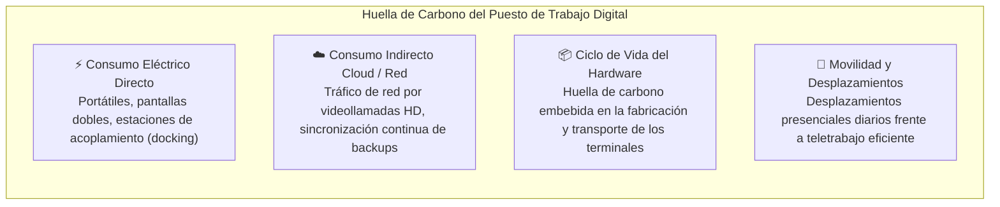
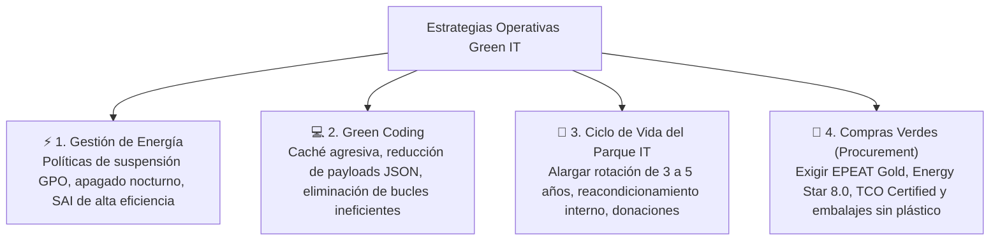
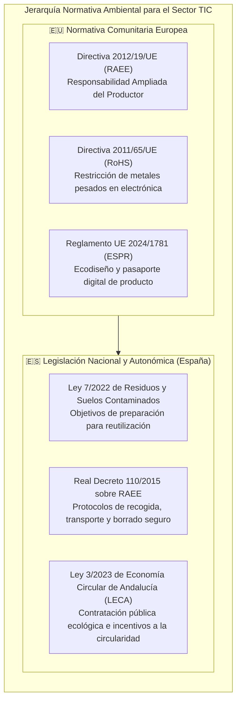
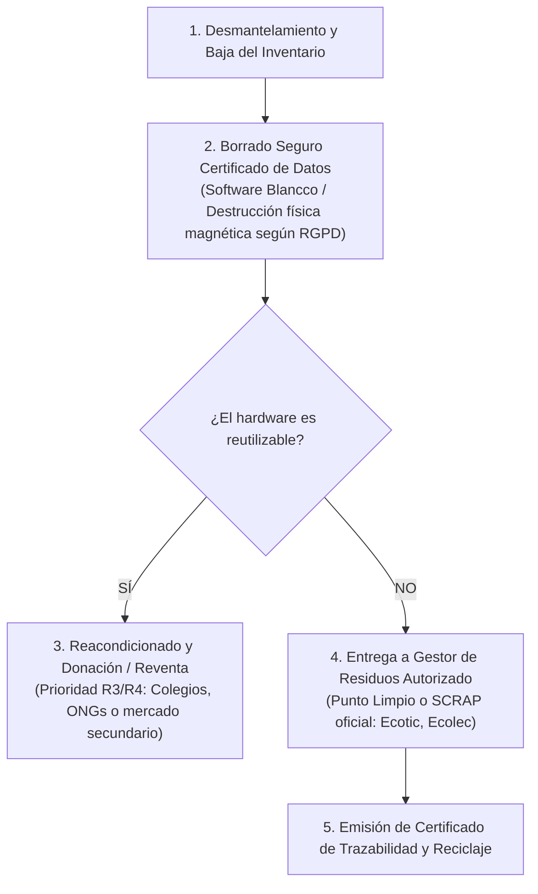
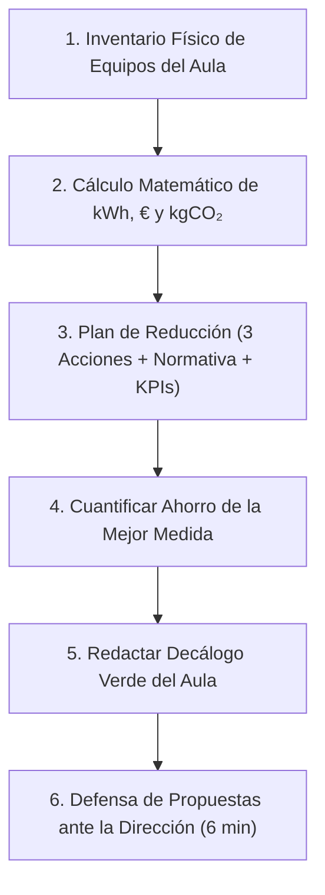

# 06 · Actividades sostenibles en TI y normativa ambiental

<span class="badge badge-ra">RA5 · Criterios a–i</span>
<span class="badge badge-tic">Green IT Operativo</span>
<span class="badge badge-hardware">Gestión RAEE (RD 110/2015)</span>
<span class="badge badge-kpi">Auditoría Energética Puesto</span>

**Resultado de aprendizaje:** ==RA5== (criterios a, b, c, d, e, f, g, h, i)  
**Duración orientativa:** 4 horas lectivas

!!! note "Objetivo de la unidad"
    Capacitar al futuro técnico informático para ejecutar operaciones sostenibles en su entorno profesional y personal cotidiano: auditar y cuantificar el consumo eléctrico de puestos de trabajo y servidores, aplicar pautas de **Green IT** y compras verdes, gestionar el ciclo de vida y desecho seguro de hardware según el **RD 110/2015 de RAEE**, y cumplir la legislación ambiental española (Ley 7/2022, LECA andaluza) y comunitaria.

<div class="stat-grid">
  <div class="stat-card">
    <div class="stat-number">120 W</div>
    <div class="stat-label">Potencia media por puesto de programación</div>
  </div>
  <div class="stat-card">
    <div class="stat-number">0,26</div>
    <div class="stat-label">kgCO₂e/kWh (Mix eléctrico peninsular)</div>
  </div>
  <div class="stat-card">
    <div class="stat-number">RD 110/2015</div>
    <div class="stat-label">Regulación estatal de RAEE</div>
  </div>
  <div class="stat-card">
    <div class="stat-number">Ley 7/2022</div>
    <div class="stat-label">Residuos y economía circular</div>
  </div>
</div>

---

## 1. El rol operativo del profesional de TI (RA4 frente a RA5)

Para enfocar con claridad el aprendizaje, distinguimos el rol de diseño frente al rol operativo:

| Dimensión | RA4 · Ecodiseño de Producto/Servicio | RA5 · Operaciones y Actividades Sostenibles |
|:---|:---|:---|
| **Misión** | **Proponer y concebir** arquitecturas, productos o servicios digitales bajo criterios circulares. | **Ejecutar y operar** con rigor ecológico el puesto de trabajo, los servidores y el ciclo de vida diario de los activos. |
| **Entregables** | Ficha técnica de ecodiseño, diagrama de ciclo de vida (LCA), modelo de negocio circular (DaaS). | Auditoría de consumo del aula/oficina, inventario de emisiones, protocolo RAEE y plan de minimización. |

---

## 2. Auditoría de impacto personal y del puesto informático

El criterio ==RA5.d== exige cuantificar la huella real generada en el desempeño del trabajo técnico:



### 2.1 Fórmula de cálculo de consumo de un aula u oficina técnica

Para dimensionar el gasto energético y las emisiones asociadas al equipamiento:

$$\mathbf{Consumo\ Anual\ (kWh)} = N_{\text{equipos}} \times P_{\text{media}}\text{ (W)} \times \frac{H_{\text{uso/día}} \times D_{\text{días/año}}}{1.000}$$

$$\mathbf{Emisiones\ Anuales\ (kgCO_2e)} = \mathbf{Consumo\ (kWh)} \times FE_{\text{red}}\text{ (Factor de Emisión del Mix Eléctrico Nacional)}$$

!!! example "Ejemplo práctico de aula: 25 puestos de programación (DAW/DAM)"
    * **Datos:** 25 ordenadores con monitor de 24 pulgadas ($P_{\text{media}} = 120\text{ W}$ en carga). Uso: 6 horas/día durante 175 días lectivos al año. Factor de emisión eléctrico peninsular de España: $\approx 0,26\text{ kgCO}_2\text{e/kWh}$.
    
    $$\text{Consumo} = 25 \times 120\text{ W} \times \frac{6\text{ h} \times 175\text{ d}}{1.000} = \mathbf{3.150\text{ kWh/año}}$$
    
    $$\text{Coste Económico Estimado (a 0,18 €/kWh)} = 3.150\text{ kWh} \times 0,18\text{ €} = \mathbf{567\text{ €/año}}$$
    
    $$\text{Emisiones de CO₂} = 3.150\text{ kWh} \times 0,26\text{ kgCO}_2\text{e/kWh} = \mathbf{819\text{ kgCO}_2\text{e/año}}$$

---

## 3. Catálogo de estrategias operativas Green IT

El criterio ==RA5.f== estructura las medidas aplicables en el día a día laboral:



Explora las medidas concretas por área de actuación:

=== "🖥️ Puesto de Trabajo y Hardware"
    * **Políticas activas de energía (GPO / MDM):** Forzar el apagado de pantallas tras 5 minutos de inactividad e hibernación completa tras 15 minutos; desconexión nocturna programada.
    * **Periféricos compartidos:** Reducir impresoras personales sustituyéndolas por impresoras departamentales multifunción con cuotas de impresión controladas.
    * **Regletas con corte inteligente:** Utilizar regletas maestras que corten la corriente de monitores y altavoces cuando se apaga la torre principal, erradicando el consumo fantasma (*vampire power*).

=== "💻 Desarrollo y Software (Green Coding)"
    * **Optimización de consultas SQL:** Indexación adecuada que evite lecturas secuenciales completas de disco (*Full Table Scans*) en bases de datos con millones de registros.
    * **Minimización de peticiones HTTP:** Agrupar llamadas a microservicios y comprimir respuestas con algoritmos modernos como **Brotli** o **Gzip**.
    * **Limpieza de "zombie data":** Eliminar entornos de staging abandonados, ramas de Git huérfanas en repositorios cloud y tablas temporales no purgadas.

=== "🛒 Compras Públicas y Corporativas Verdes"
    * **Certificaciones internacionales obligatorias:** Exigir en pliegos de compra sellos como **Energy Star**, **EPEAT Gold** y **TCO Certified Generation 9**.
    * **Criterios de reparabilidad:** Exigir un Índice de Reparabilidad mínimo de 8 sobre 10 y disponibilidad contractual de piezas de repuesto durante 5 años.

---

## 4. Marco normativo ambiental aplicable en España y la Unión Europea

El criterio ==RA5.i== exige conocer y aplicar las leyes vigentes que regulan el uso y desecho de tecnología:



### 4.1 Protocolo oficial de gestión del fin de vida de equipos (RAEE)

¿Qué debe hacer legalmente un departamento de soporte o un técnico de sistemas cuando un lote de ordenadores o servidores queda obsoleto?



Responsabilidad Ampliada del Productor (RAP)
:   Principio legal en virtud del cual los fabricantes e importadores de equipos electrónicos están obligados a financiar y organizar la recogida, tratamiento y valorización de los residuos (RAEE) generados por los productos que introducen en el mercado.

---

## 5. Plantilla de Plan Operativo de Reducción de Impacto

El criterio ==RA5.e== y ==RA5.h== exige diseñar tablas de medidas correctivas con responsables y plazos:

| Impacto Ambiental Detectado | Medida Técnica Correctora | Normativa Vinculada | KPI de Verificación | Responsable | Plazo de Ejecución |
|:---|:---|:---|:---|:---:|:---:|
| **Consumo fantasma en aulas de servidores** | Instalación de regletas inteligentes programables por reloj horario. | ISO 50001 / Etiquetado UE | Reducción de $150\text{ kWh/mes}$ | Técnico de Sistemas | 1 mes |
| **Desecho de portátiles con disco duro intacto** | Implantación de protocolo de borrado certificado NIST 800-88 y donación. | RD 110/2015 RAEE y RGPD | % equipos reacondicionados ($\ge 70\%$) | Responsable de IT | 3 meses |
| **Alto PUE en sala de servidores propia** | Reorganización física en pasillos frío/calor y elevación del termostato a $24^\circ\text{C}$. | Taxonomía Verde Europea | PUE reducido de 1,65 a 1,30 | Administrador de Redes | 6 meses |

---

## 6. Síntesis para el examen técnico

```
╔════════════════════════════════════════════════════════════════════════════╗
║                   RESUMEN CLAVE: UNIDAD 06 - ACTIVIDADES EN TI             ║
╠════════════════════════════════════════════════════════════════════════════╣
║ 1. RA5 = OPERACIONES REALES: Medición de consumos, buenas prácticas en el  ║
║    puesto de trabajo, software verde y cumplimiento de la ley ambiental.  ║
║ 2. CÁLCULO DE ENERGÍA: N° equipos x Potencia (W) x Horas uso / 1000.      ║
║    Multiplicar por factor de emisión (0,26 kgCO₂e/kWh en España).          ║
║ 3. GESTIÓN RAEE (RD 110/2015): Borrado seguro certificado (RGPD) ->        ║
║    Reacondicionamiento prioritario -> Entrega a gestor autorizado (SCRAP). ║
║ 4. MARCO LEGAL ESPAÑOL: Ley 7/2022 de residuos, RD 110/2015 RAEE y Ley     ║
║    3/2023 de Economía Circular de Andalucía (LECA).                        ║
║ 5. COMPRAS VERDES: Sellos obligatorios EPEAT Gold, Energy Star y TCO.     ║
║ 6. GREEN IT EN CÓDIGO: Consultas SQL optimizadas, compresión y caché.      ║
╚════════════════════════════════════════════════════════════════════════════╝
```

---

## 7. Cuestionario interactivo de autoevaluación

??? question "¿Por qué es obligatorio realizar un borrado de datos certificado antes de entregar un ordenador a un gestor de reciclaje de RAEE?"
    ???+ success "Respuesta técnica"
        Por dos razones complementarias:
        1. **Protección de Datos y Ciberseguridad (RGPD):** Un formateo convencional deja los datos recuperables mediante herramientas forenses, lo que expondría a la empresa a fugas de información confidencial y sanciones de la AEPD.
        2. **Garantía Ambiental (RD 110/2015):** Permite clasificar el equipo como apto para su **reacondicionamiento y reutilización** de forma segura, evitando que un equipo en perfecto estado sea triturado por miedo a brechas de seguridad.

??? question "¿Qué es un SCRAP en la gestión de residuos electrónicos en España?"
    ???+ success "Respuesta técnica"
        Un **SCRAP** (*Sistema Colectivo de Responsabilidad Ampliada del Productor*, como *Ecotic* o *Ecolec*) es una entidad sin ánimo de lucro financiada por los fabricantes de electrónica para organizar, recoger y auditar el reciclaje homologado de los aparatos que llegan al fin de su vida útil, cumpliendo la Ley 7/2022.

??? question "¿Por qué elevar el termostato de la sala de servidores de 18°C a 24°C es una medida de eficiencia respaldada por la norma ASHRAE?"
    ???+ success "Respuesta técnica"
        Porque los servidores modernos toleran perfectamente temperaturas de entrada de aire de hasta $25^\circ\text{C}-27^\circ\text{C}$. Cada grado centígrado que se eleva la consigna del aire acondicionado reduce entre un **4% y un 5% el consumo eléctrico de la climatización**, desplomando el PUE del data center sin poner en riesgo la fiabilidad del hardware.

---

## 8. Actividad práctica guiada · «Auditoría verde del aula de informática»

| Parámetro | Detalle operativo |
|---|---|
| **Modalidad** | Equipos de 2 o 3 alumnos. |
| **Tiempo de ejecución** | 1 sesión de medición física e inventario (50 min) + 1 sesión de defensa técnica de medidas (6 min por equipo). |
| **Criterios asociados** | ==RA5.d==, ==RA5.e==, ==RA5.f==, ==RA5.i==. |
| **Entregable** | Informe de auditoría con cálculos matemáticos, tabla de medidas operativas y checklist de 10 mandamientos verdes para el centro. |

### Enunciado del reto

Actuando como auditores energéticos del centro educativo:

1. **Inventario Físico de Puestos:** Contabilizad todos los ordenadores, monitores, switches de red, puntos de acceso Wi-Fi y sistemas de climatización del aula de desarrollo.
2. **Cálculo de Consumo y Emisiones:** Aplicad la fórmula de cálculo del §2 para estimar el consumo anual en **kWh**, el coste económico en **€** y la huella en **$kgCO_2e$**, detallando de forma transparente todos los supuestos de cálculo.
3. **Plan Operativo de Reducción:** Diseñad una tabla con **3 acciones correctoras prioritarias**, asociando cada una a su normativa (RD 110/2015, Ley 7/2022, etiquetado energético), responsable, plazo y KPI cuantificable.
4. **Estimación del Retorno de Inversión (ROI Ecológico):** Calculad el ahorro anual (€ y $kgCO_2$) que se lograría implantando la medida más rentable (ej. apagado automático nocturno de equipos).
5. **Decálogo Verde del Alumnado:** Redactad un checklist de 10 pautas sostenibles directas para los alumnos que utilicen el aula.



### Rúbrica de corrección analítica (10 Puntos)

* **Rigor matemático en el inventario y consumo (30% - 3,0 pts):** Supuestos de potencia y horas realistas, fórmulas transparentes y cálculos numéricos sin errores.
* **Calidad de las acciones y vinculación legal (30% - 3,0 pts):** Medidas viables técnicamente, bien fundamentadas en la legislación ambiental (RAEE, Ley 7/2022) y con KPIs claros.
* **Cuantificación del ahorro anual (20% - 2,0 pts):** Estimación solvente del impacto económico y ambiental de la propuesta más eficiente.
* **Decálogo de buenas prácticas y exposición oral (20% - 2,0 pts):** Pautas útiles y aplicables para el centro educativo y defensa ejecutiva convincente en 6 minutos.
