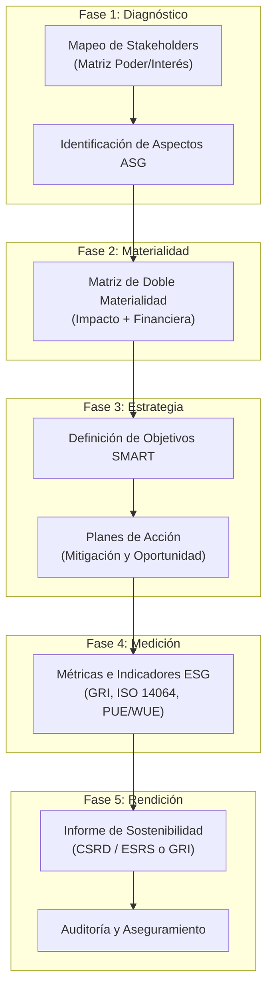
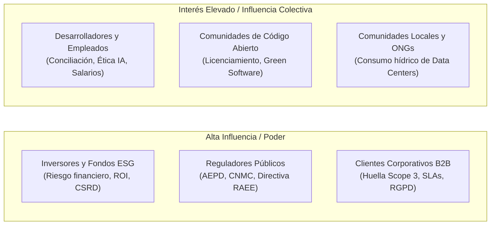

# 07 · Plan de sostenibilidad e informe de rendición de cuentas

<span class="badge badge-ra">RA6 (a–e) · Proyecto Integrador</span>
<span class="badge badge-tic">Plan Estratégico ASG</span>
<span class="badge badge-kpi">KPIs SMART</span>
<span class="badge badge-e">Memoria CSRD / GRI</span>

**Resultado de aprendizaje que cubre:** ==RA6 (criterios a–e)== · Refuerzo integrador de RA1–RA5.

!!! info "Objetivo didáctico y contextualización profesional"
    Analizar y diseñar un **plan de sostenibilidad corporativo** para una organización del sector tecnológico (desarrollo de software, infraestructura cloud o provisión de hardware). Aprender a identificar los grupos de interés prioritarios, seleccionar los aspectos ASG de mayor materialidad, estructurar metas operativas SMART, cuantificar el avance mediante métricas de estándares reconocidos (GRI, CSRD/ESRS, ISO) y redactar el **informe de sostenibilidad** con transparencia, rigor y trazabilidad frente a objeciones del consejo directivo o auditores externos.

<div class="stat-grid">
  <div class="stat-card">
    <div class="stat-number">5 Fases</div>
    <div class="stat-label">Del diagnóstico a la rendición auditada</div>
  </div>
  <div class="stat-card">
    <div class="stat-number">SMART</div>
    <div class="stat-label">Criterio metodológico para objetivos ASG</div>
  </div>
  <div class="stat-card">
    <div class="stat-number">3 Alcances</div>
    <div class="stat-label">Plan integral de descarbonización (GEI)</div>
  </div>
  <div class="stat-card">
    <div class="stat-number">CSRD / ESRS</div>
    <div class="stat-label">Marco vinculante de aseguramiento legal</div>
  </div>
</div>

---

## 1. Fundamentos y ciclo de vida del plan de sostenibilidad

Un **Plan Estratégico de Sostenibilidad** (o Estrategia ASG/ESG) es el marco director que articula cómo una compañía tecnológica alinea su viabilidad financiera con la responsabilidad ambiental y social a corto, medio y largo plazo.

Plan de sostenibilidad
: Documento estratégico vinculante que diagnostica los impactos de la empresa, formaliza compromisos cuantitativos en materias ambientales, sociales y de gobernanza (ASG), asigna recursos presupuestarios y establece mecanismos auditables de medición y mejora continua.

Doble materialidad
: Principio metodológico exigido por la directiva europea CSRD que obliga a evaluar tanto el impacto de las actividades empresariales en el planeta y la sociedad (*materialidad de impacto o temática*) como el impacto de las variables ambientales y sociales en las finanzas del negocio (*materialidad financiera*).

KPI ESG (*Key Performance Indicator*)
: Métrica cuantitativa estandarizada utilizada para evaluar el rendimiento no financiero de la entidad respecto a sus compromisos declarados y límites normativos.



!!! tip "La regla de oro del informe técnico"
    La sostenibilidad no es un departamento de márqueting: es una disciplina de **gestión de riesgos y optimización operativa**. Todo objetivo que no tenga asignado un presupuesto, un responsable directo, una línea base verificable y una métrica de estándar reconocido es una declaración vacía vulnerable a acusaciones de *greenwashing*.

---

## 2. Metodología paso a paso del plan (RA6.a–d)

### 2.1 Identificar y mapear grupos de interés (RA6.a)

El criterio ==RA6.a== exige identificar rigurosamente los principales grupos de interés de la empresa. En el ecosistema tecnológico, los stakeholders clave y sus expectativas típicas se articulan en torno a la matriz de Mendelow (Poder vs. Interés):



### 2.2 Aspectos ASG materiales y doble materialidad (RA6.b)

El criterio ==RA6.b== demanda analizar los aspectos ASG materiales en relación con la estrategia de negocio. Cada tema seleccionado debe justificarse en ambas dimensiones de la doble materialidad:

| Stakeholder prioritario | Expectativa operativa | Aspecto ASG material | Materialidad de impacto (Planeta/Sociedad) | Materialidad financiera (Riesgo/Negocio) |
|---|---|---|---|---|
| **Inversores institucionales** | Descarbonización verificable y mitigación de multas climáticas. | **Emisiones GEI (Alcances 1, 2 y 3)** | Calentamiento global, huella energética de clusters GPU/CPU. | Coste del impuesto al carbono, valoración en bolsa, coste de capital crediticio. |
| **Clientes corporativos (B2B)** | Cumplimiento estricto de RGPD, NIS2 y directivas de privacidad. | **Ciberseguridad y Privacidad de Datos** | Vulneración de derechos fundamentales, exposición de datos sensibles. | Litigios millonarios, rescisión de contratos marco, daño reputacional severo. |
| **Desarrolladores y técnicos** | Transparencia algorítmica y conciliación laboral. | **Ética en IA y Atracción de Talento** | Sesgos algorítmicos discriminatorios, impacto social de la automatización. | Fuga de ingenieros clave, rechazo comercial de productos con sesgo. |
| **Reguladores (UE / MITECO)** | Gestión responsable de fin de vida de hardware. | **Economía Circular y RAEE** | Contaminación por metales pesados en vertederos, escasez de tierras raras. | Sanciones por infracción de Ley 7/2022 y costes de gestión de residuos. |
| **Comunidades locales** | Sostenibilidad de los recursos hídricos compartidos. | **Huella Hídrica de Centros de Datos** | Agotamiento de acuíferos locales por torres de refrigeración evaporativa. | Denegación de licencias de obra o permisos de ampliación municipal. |

---

### 2.3 Formulación de acciones con objetivos SMART (RA6.c)

El criterio ==RA6.c== exige diseñar acciones concretas tanto para **mitigar impactos adversos** como para **aprovechar oportunidades de negocio verde**:

=== "Dimensión Ambiental (E)"
    - **Acción de Mitigación:** Migración de cargas de computación a regiones cloud alimentadas al 100 % por energía renovable certificada (PPA) e implantación de refrigeración líquida directa (*Direct-to-Chip*).
        - *Meta SMART:* Reducir el PUE promedio de las instalaciones de 1,52 a $\le 1,18$ para diciembre de 2026.
    - **Acción de Oportunidad:** Lanzamiento de una plataforma SaaS con monitorización en tiempo real de emisiones de Alcance 3 para clientes corporativos.
        - *Meta SMART:* Captar 40 clientes corporativos en el primer año fiscal, generando una nueva línea de ingresos recurrente.

=== "Dimensión Social (S)"
    - **Acción de Mitigación:** Auditoría continua de sesgos algorítmicos en modelos de aprendizaje automático y establecimiento de un comité ético multidisciplinar.
        - *Meta SMART:* 100 % de los pipelines de IA en producción auditados bajo el marco ético de la *EU AI Act* antes de Q3 2025.
    - **Acción de Oportunidad:** Creación de programas de mentoría técnica para fomentar la diversidad de género en puestos de arquitectura de software y DevOps.
        - *Meta SMART:* Incrementar la representación de mujeres en puestos técnicos sénior del 18 % al 35 % para 2028.

=== "Dimensión Gobernanza (G)"
    - **Acción de Mitigación:** Homologación obligatoria de proveedores de hardware y servicios cloud bajo criterios de debida diligencia de derechos humanos y minerales de conflicto (Directiva CSDDD).
        - *Meta SMART:* Exigir y verificar la certificación ISO 14001 o EcoVadis Gold al 90 % de los proveedores críticos para 2026.
    - **Acción de Oportunidad:** Vinculación del 20 % de la retribución variable del equipo directivo a la consecución de objetivos de reducción de huella de carbono.
        - *Meta SMART:* Aprobación en junta general de accionistas de la política de bonus ESG para el próximo ejercicio.

---

### 2.4 Matriz de indicadores y cuadro de mando ESG (RA6.d)

El criterio ==RA6.d== exige asociar cada acción estratégica con un indicador de desempeño alineado a marcos reconocidos:

| Dimensión | Indicador (KPI) | Estándar de reporte | Línea base (Año 0) | Meta (Año 3 / 2030) | Frecuencia | Responsable operativo |
|---|---|---|---|---|---|---|
| **E** | Emisiones totales Alcance 1 y 2 ($tCO_2e$) | GHG Protocol / ISO 14064 | $4.200\text{ }tCO_2e$ | $-60\text{ }\%$ ($1.680\text{ }t$) | Trimestral | Responsable de Infraestructura |
| **E** | PUE medio de centros de datos propios | Green Grid / GRI 302-1 | 1,48 | $\le 1,18$ | Mensual | Arquitecto de Sistemas Cloud |
| **E** | Tasa de reutilización y reciclaje de RAEE (%) | GRI 306-4 / RD 110/2015 | 42 % | $\ge 95\text{ }\%$ | Anual | Gestor de Activos IT |
| **S** | Porcentaje de mujeres en puestos técnicos (%) | GRI 405-1 / ESRS S1-9 | 16 % | $\ge 35\text{ }\%$ | Semestral | Dirección de Personas (HR) |
| **S** | Brecha salarial de género ajustada (%) | ESRS S1-16 | 11,4 % | $< 3\text{ }\%$ | Anual | Dirección Financiera |
| **G** | Empleados formados en ciberseguridad y RGPD (%) | GRI 418 / NIS2 | 58 % | 100 % certificado | Trimestral | CISO (Seguridad de la Información) |
| **G** | Proveedores de hardware auditados en ESG (%) | GRI 308 / GRI 414 | 20 % | $\ge 85\text{ }\%$ | Anual | Dirección de Compras |

---

## 3. Estructura y redacción del informe de sostenibilidad (RA6.e)

El informe de sostenibilidad es el vehículo formal de rendición de cuentas ante la sociedad, los inversores y las autoridades regulatorias.

=== "Estructura según Directiva CSRD (ESRS)"
    1. **Declaración estratégica:** Carta del Director General (CEO) avalando el compromiso corporativo.
    2. **Perfil corporativo y modelo de negocio:** Cadena de valor tecnológica, mercados y filiales.
    3. **Gobernanza de la sostenibilidad:** Composición del consejo, supervisión de riesgos climáticos y políticas retributivas ligadas a ESG.
    4. **Evaluación de Doble Materialidad:** Metodología empleada, matriz de impacto y matriz financiera.
    5. **Desempeño ESRS E1-E5 (Medio Ambiente):** Inventario de gases de efecto invernadero (Alcances 1, 2 y 3), PUE, gestión de agua, residuos electrónicos.
    6. **Desempeño ESRS S1-S4 (Personas):** Derechos de los trabajadores propios, diversidad, formación y comunidades impactadas.
    7. **Desempeño ESRS G1 (Gobernanza):** Código de conducta ética, prevención de la corrupción y ciberseguridad.
    8. **Dictamen de aseguramiento independiente:** Informe emitido por un auditor externo acreditado.

=== "Estructura según GRI Standards 2021"
    1. **Contenidos Generales (GRI 2):** Estructura organizativa, prácticas de gobierno, vinculación con stakeholders y debida diligencia.
    2. **Temas Materiales (GRI 3):** Proceso de determinación de materialidad y desglose de impactos significativos.
    3. **Estándares Temáticos Ambientales:** GRI 302 (Energía), GRI 303 (Agua), GRI 305 (Emisiones), GRI 306 (Residuos).
    4. **Estándares Temáticos Sociales:** GRI 403 (Salud y seguridad), GRI 405 (Diversidad e igualdad de oportunidades), GRI 418 (Privacidad del cliente).
    5. **Índice de contenidos GRI:** Tabla de correspondencias con números de página, estado de verificación y omisiones justificadas.

---

## 4. El protocolo Anti-Greenwashing en tecnología

Con la aprobación de la directiva europea sobre declaraciones ecológicas (*Green Claims Directive*), toda afirmación ambiental en el sector TIC debe cumplir con estándares estrictos de veracidad y comprobación:

!!! warning "Checklist de verificación anti-greenwashing"
    - [ ] **Prohibición de afirmaciones vagas:** Expresiones como *"Cloud 100% verde"* o *"Software eco-friendly"* son ilegales si no van acompañadas de la metodología exacta y del estándar empleado.
    - [ ] **Límites a la compensación de carbono:** No se puede publicitar un servicio como *"climáticamente neutro"* basándose únicamente en la compra de créditos de reforestación dudosos; la reducción de emisiones directas debe ser prioritaria.
    - [ ] **Alcance completo:** Si una empresa publicita neutralidad pero oculta las emisiones de sus centros de datos subcontratados (Alcance 3), comete publicidad engañosa por omisión de datos materiales.
    - [ ] **Acceso público a los datos primarios:** Los factores de emisión y las fórmulas de cálculo deben estar documentados en un informe público accesible.

---

## 5. Ficha resumen de la unidad

```
+----------------------------------------------------------------------------------+
|                     PLAN ESTRATÉGICO DE SOSTENIBILIDAD (RA6)                     |
+----------------------------------------------------------------------------------+
| 1. DIAGNÓSTICO: Mapeo de grupos de interés (Matriz Poder/Interés).               |
| 2. DOBLE MATERIALIDAD:                                                           |
|    - Impacto (Inside-Out): Impacto de los servidores/código en el planeta.       |
|    - Financiera (Outside-In): Riesgos climáticos y regulatorios sobre el negocio.|
| 3. ACCIONES SMART: Mitigación de riesgos + Aprovechamiento de oportunidades.     |
| 4. CUADRO DE MANDO: KPIs con línea base, meta numérica, plazo y estándar.        |
| 5. INFORME ANUAL: Estructura estandarizada (CSRD/ESRS o GRI) + Auditoría externa.|
+----------------------------------------------------------------------------------+
```

---

## 6. Autoevaluación interactiva (RA6)

??? question "Pregunta 1: ¿Por qué la doble materialidad es obligatoria bajo la CSRD?"
    **Respuesta:** Porque los inversores y la sociedad civil necesitan conocer no solo el impacto económico que el cambio climático y las regulaciones tienen sobre los activos de la empresa (*materialidad financiera*), sino también cómo los procesos productivos, la huella energética y los algoritmos de la empresa impactan en los derechos humanos y el medio ambiente (*materialidad de impacto*).

??? question "Pregunta 2: ¿Qué diferencia una acción de mitigación de una de aprovechamiento en una empresa TIC?"
    **Respuesta:** La **acción de mitigación** busca reducir o neutralizar un daño o riesgo preexistente (por ejemplo, reducir el consumo eléctrico de los racks de servidores implementando *free cooling*), mientras que la **acción de aprovechamiento** convierte la sostenibilidad en una ventaja competitiva o nueva vía de ingresos (por ejemplo, vender servicios de auditoría de *software verde* o comercializar un ERP con módulo de huella de carbono).

??? question "Pregunta 3: ¿Qué datos mínimos debe contener la ficha de un indicador ESG para ser auditable?"
    **Respuesta:** Debe contener: (1) Nombre descriptivo del KPI y unidad de medida; (2) Estándar internacional de cálculo (ej. ISO 14064, GRI 305); (3) Línea base histórica con fecha; (4) Meta cuantitativa a alcanzar y año límite; (5) Frecuencia de medición y monitorización; (6) Responsable del dato dentro de la empresa.

---

## 7. Actividad práctica de aula: «Defensa ejecutiva ante el consejo de administración»

| Parámetro | Especificación didáctica |
|---|---|
| **Modalidad** | Equipos de **3 alumnos** (roles: Director/a de Sostenibilidad, CTO y CFO). |
| **Duración** | 1 sesión de trabajo en equipo (50 min) + 1 sesión de simulación de defensas (10 min por equipo). |
| **Resultado cubierto** | ==RA6== (criterios a–e) · Integración práctica con RA1–RA5. |
| **Entregables** | Mini-informe ejecutivo (3 páginas) + Presentación de diapositivas (máximo 4 láminas). |

### Consigna y dinámica de role-play

1. **Selección del caso:** El equipo elige una compañía tecnológica del [banco de casos](09-casos-empresas-sector-informatico.md) (ej. Microsoft, HP, Indra o una startup de IA).
2. **Construcción del plan:**
    - Elaborar la matriz con 8 stakeholders priorizados.
    - Seleccionar 3 temas materiales justificados bajo doble materialidad.
    - Proponer 4 acciones SMART (2 ambientales, 1 social, 1 gobernanza) con sus respectivos KPIs alineados a estándares.
3. **Simulación de la junta directiva:**
    - Cada equipo dispone de **7 minutos** para presentar su propuesta al consejo (formado por el docente y compañeros de clase que asumirán el papel de accionistas exigentes).
    - Los evaluadores plantearán 3 objeciones clave:
        1. *¿Cuál es el retorno de inversión (ROI) estimado de esta medida ambiental?*
        2. *¿Cómo garantizamos que este dato no sea considerado greenwashing por los auditores?*
        3. *¿Qué impacto operativo tendrá la medida en el rendimiento de los sistemas en producción?*
    - El equipo dispone de **3 minutos** para defender con rigor técnico sus decisiones.

### Rúbrica de evaluación de la actividad

| Criterio evaluado | Nivel 1: Insuficiente (<5) | Nivel 2: Suficiente (5–6,9) | Nivel 3: Notable (7–8,9) | Nivel 4: Excelente (9–10) | Ponderación |
|---|---|---|---|---|---|
| **Stakeholders y materialidad** | Mapeo incompleto (<5) y justificación superficial. | 6–7 stakeholders; materialidad descrita sin distinguir dimensiones. | $\ge 8$ stakeholders; doble materialidad bien diferenciada. | Mapa exhaustivo; análisis cuantitativo de riesgos financieros y de impacto. | 25 % |
| **Acciones y objetivos SMART** | Medidas abstractas sin metas concretas ni fechas. | Acciones descritas pero con metas cualitativas o poco viables. | 4 acciones estructuradas con metas numéricas y plazos definidos. | Acciones innovadoras en TIC, perfectamente balanceadas (E/S/G) y costeables. | 25 % |
| **Cuadro de mando y KPIs** | KPIs inventados sin unidades ni estándares formales. | Indicadores con unidad pero sin estándar de reporte claro. | KPIs alineados a GRI/ISO con línea base y meta definidas. | Cuadro de mando profesional con responsables asignados y fuentes trazables. | 20 % |
| **Defensa técnica y solvencia** | Respuestas evasivas o sin respaldo en datos técnicos. | Responde con dudas a las objeciones del consejo directivo. | Defensa clara y articulada frente a preguntas financieras y técnicas. | Argumentación brillante, solvencia ante el tribunal y roles bien coordinados. | 20 % |
| **Calidad formal del informe** | Documento descuidado con erratas o formato inadecuado. | Formato aceptable pero con carencias de estilo ejecutivo. | Informe limpio, estructurado y con redacción profesional. | Acabado corporativo impecable, diseño sobrio, tablas y diagramas claros. | 10 % |
