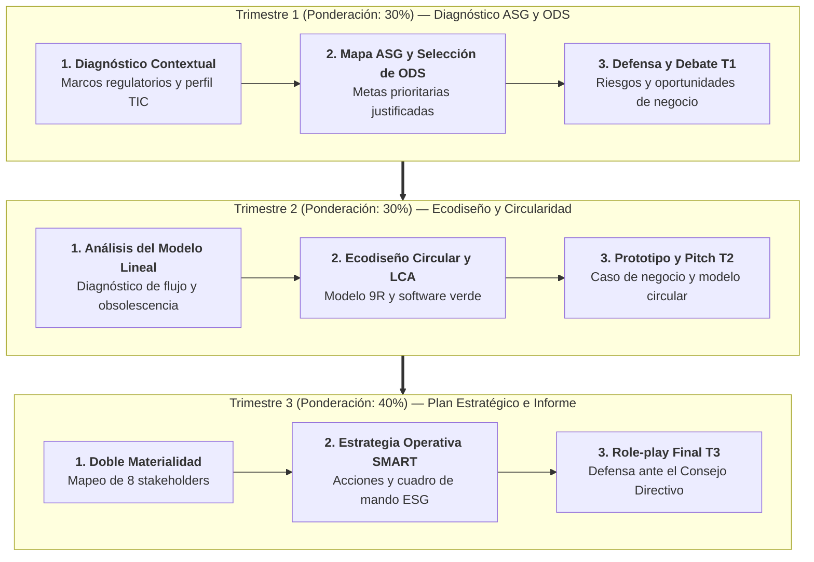
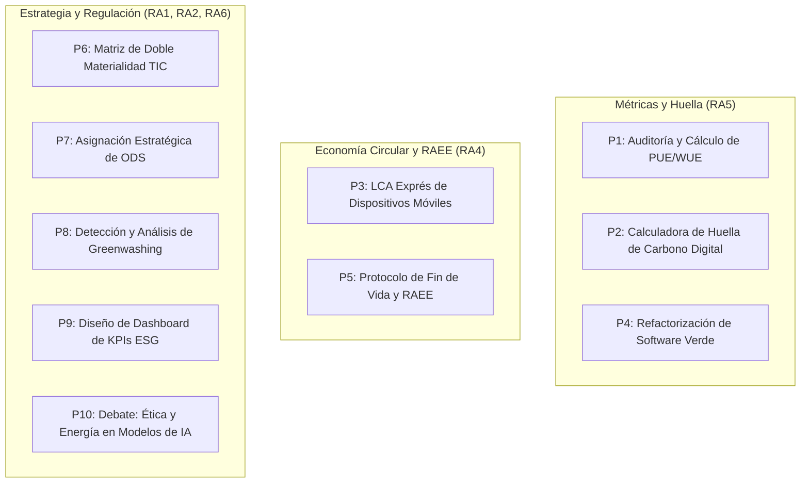

# 08 · Prácticas, proyectos y banco de casos TIC

Evaluación Continua · RA1 a RA6
Proyectos T1 · T2 · T3
10 Prácticas Técnicas (P1–P10)
Rúbricas Analíticas Oficiales

**Resultados de aprendizaje que cubre:** ==Todos los resultados de aprendizaje (RA1 a RA6)==.

!!! info "Guía docente y cuaderno de trabajo para el alumnado"
    Este documento articula la **propuesta metodológica y evaluativa completa** del módulo *Sostenibilidad aplicada al sistema productivo (1708)* para ciclos formativos de la familia de **Informática y Comunicaciones** (DAM, DAW, ASIR). Se vertebra en **tres proyectos trimestrales colaborativos** (T1, T2, T3), un catálogo de **diez prácticas individuales de aula** (P1 a P10), un **banco de empresas del sector tecnológico** con consignas diferenciadas y las **rúbricas analíticas oficiales** basadas en el Anexo VIII del Real Decreto 659/2023.

  

    
3 Proy.

    
Proyectos trimestrales colaborativos

  

  

    
10 Práct.

    
Casos y prácticas individuales de aula

  

  

    
100 %

    
Trazabilidad curricular oficial

  

  

    
6 RAs

    
Evaluación competencial integral

  

---

## 1. Cronograma y arquitectura evaluativa

El proceso de enseñanza-aprendizaje está diseñado de forma incremental: el alumnado parte del diagnóstico contextual de una empresa tecnológica real, diseña un servicio o producto ecodiseñado y culmina elaborando un plan estratégico corporativo con su respectivo informe de rendición de cuentas.

| Componente | Especificación metodológica | Ponderación sugerida |
|---|---|:---:|
| **Proyecto Trimestre 1 (T1)** | Diagnóstico ASG, vinculación con ODS y análisis de riesgos/oportunidades (Parejas). | **30 %** |
| **Proyecto Trimestre 2 (T2)** | Rediseño circular y ecodiseño de un producto o servicio tecnológico (Parejas). | **30 %** |
| **Proyecto Trimestre 3 (T3)** | Plan estratégico de sostenibilidad e informe formal bajo estándares (Parejas/Tríos). | **40 %** |
| **Evaluación Continua (P1–P10)** | Prácticas técnicas individuales de resolución en aula o laboratorio. | Ponderable (10–20 %) |

---

## 2. TRIMESTRE 1 — Mapa ASG y Diagnóstico de Sostenibilidad (RA1, RA2)

=== "Enunciado y Fases de Trabajo"
    > **Consigna oficial:**
    > *"Elegid una empresa real del ecosistema tecnológico (hardware, software, cloud, consultoría o telecomunicaciones) y elaborad un **diagnóstico integral de sostenibilidad**: analizad los marcos regulatorios aplicables, construid un **mapa de aspectos ASG** ($\ge 3$ ambientales, $\ge 3$ sociales y $\ge 2$ de gobernanza) vinculados a los **ODS prioritarios**, cartografiad a los **grupos de interés** y valorad los **riesgos y oportunidades financieras y operativas** a los que se enfrenta la organización."*

    #### Fases de ejecución:
    1. **Selección y perfil corporativo:** Elegir la empresa del [Banco de Casos](#6-banco-de-casos-de-empresas-del-sector-tic) y revisar su memoria corporativa más reciente.
    2. **Marco normativo y estándares:** Identificar qué acuerdos internacionales y normativas le aplican (Acuerdo de París, CSRD, Directiva RAEE, RGPD).
    3. **Matriz de aspectos ASG y ODS:** Seleccionar los aspectos críticos justificando su relación causal con el modelo de negocio tecnológico.
    4. **Mapeo de grupos de interés:** Ubicar al menos a 8 stakeholders en la matriz de Mendelow (Poder vs. Interés).
    5. **Matriz de riesgos y oportunidades:** Clasificar riesgos físicos, de transición, regulatorios y reputacionales.

=== "Checklist de Entregables"
    - [ ] **Informe técnico escrito (6–8 páginas en formato PDF):**
        - Resumen ejecutivo y perfil de la entidad tecnológica.
        - Marco de gobernanza y acuerdos climáticos aplicables.
        - Tabla categorizada ASG vinculada a metas concretas de los ODS.
        - Matriz de grupos de interés con expectativas documentadas.
        - Análisis de riesgos y oportunidades de negocio.
    - [ ] **Presentación oral de defensa (10–12 minutos):**
        - Soporte digital (máximo 8 diapositivas con datos cuantitativos y fuentes citadas).
        - Debate y turno de preguntas de 5 minutos con el resto de la clase.

=== "Rúbrica de Calificación T1"
    | Criterio evaluado | Insuficiente (<5) | Suficiente (5–6,9) | Notable (7–8,9) | Sobresaliente (9–10) | Peso |
    |---|---|---|---|---|:---:|
    | **Mapa ASG (RA1.b)** | Menos de 6 aspectos o definiciones genéricas sin vínculo con TIC. | 6–8 aspectos correctos pero poco diferenciados por áreas. | $\ge 8$ aspectos claramente clasificados en E, S y G con pertinencia técnica. | Aspectos rigurosos, personalizados al modelo de negocio de la empresa elegida. | 20 % |
    | **Vinculación con ODS (RA1.c)** | ODS asignados al azar sin justificación. | ODS identificados pero con argumentos genéricos. | Selección coherente y justificada a nivel de metas concretas de la Agenda 2030. | Justificación profunda vinculando métricas TIC con el impacto en los ODS. | 15 % |
    | **Riesgos y oportunidades (RA1.d)** | Ausentes o confundidos con debilidades internas. | Identifica algunos riesgos pero no propone oportunidades. | Matriz completa diferenciando riesgos físicos, de transición y de mercado. | Análisis financiero y operativo riguroso con ejemplos del sector informático. | 20 % |
    | **Grupos de interés (RA6.a)** | Menos de 5 o mal ubicados en la matriz. | 5–7 stakeholders posicionados sin profundizar en expectativas. | $\ge 8$ stakeholders bien clasificados en la matriz Poder/Interés. | Mapeo exhaustivo con expectativas y canales de diálogo contrastados. | 15 % |
    | **Marcos y estándares (RA1.e)** | Omite estándares o cita siglas erróneas. | Cita estándares (ISO, GRI) sin explicar su aplicación práctica. | Integra correctamente ISO 14064, GRI y marcos europeos (CSRD/Taxonomía). | Dominio técnico de los estándares y métricas específicas de computación. | 15 % |
    | **Rigor y fuentes sectoriales** | Sin referencias o fuentes no fiables de Internet. | Cita páginas web secundarias sin datos cuantitativos. | Utiliza informes oficiales y memorias de sostenibilidad corporativas. | Contraste crítico de datos primarios con informes de terceros (CDP, auditorías). | 15 % |

---

## 3. TRIMESTRE 2 — Ecodiseño y Transformación Circular en TIC (RA4, RA5)

=== "Enunciado y Fases de Trabajo"
    > **Consigna oficial:**
    > *"Diseñad una **solución tecnológica responsable** (dispositivo hardware, infraestructura de red, servicio cloud o aplicativo de software) aplicando los principios de la **economía circular**, el **ecodiseño** y el **análisis del ciclo de vida (LCA)**. Contrastad el diseño propuesto con la alternativa tradicional del mercado, cuantificando mejoras ambientales y justificando la viabilidad técnica y normativa."*

    #### Fases de ejecución:
    1. **Diagnóstico del producto/servicio convencional:** Mapear el flujo lineal tradicional (extracción, refinado, manufactura, logística, uso energético y desecho como residuo RAEE).
    2. **Estrategia de ecodiseño (9R):** Aplicar medidas de *Repensar*, *Reducir*, *Reparar*, *Reacondicionar* y *Reciclar* en la arquitectura técnica.
    3. **Análisis de Ciclo de Vida (LCA simplificado):** Identificar la fase de mayor huella de carbono (*hotspot ambiental*) y proponer la optimización.
    4. **Software Verde / Eficiencia Energética:** Si es software o cloud, justificar algoritmos eficientes, compresión, regiones verdes y optimización de base de datos.
    5. **Modelo de negocio circular:** Formular una propuesta de monetización sostenible (Device-as-a-Service, reacondicionamiento certificado o renting).

=== "Checklist de Entregables"
    - [ ] **Dossier de ecodiseño e ingeniería circular (8–10 páginas):**
        - Diagrama comparativo: Flujo Lineal vs. Ciclo Cerrado Circular.
        - Ficha de Análisis de Ciclo de Vida (LCA) por fases según ISO 14040.
        - Matriz cuantitativa de ahorros proyectados (consumo eléctrico, $tCO_2e$, kg de residuos evitados).
        - Plan de cumplimiento de directivas ambientales (Directiva RAEE, Reglamento de Ecodiseño UE 2024/1781, RoHS).
    - [ ] **Maqueta conceptual o prototipo visual:**
        - Despiece de hardware, diagrama de arquitectura de software o mockups de plataforma circular.
    - [ ] **Pitch comercial y técnico (10 minutos):**
        - Demostración de la viabilidad económica y técnica frente a clientes corporativos.

=== "Rúbrica de Calificación T2"
    | Criterio evaluado | Insuficiente (<5) | Suficiente (5–6,9) | Notable (7–8,9) | Sobresaliente (9–10) | Peso |
    |---|---|---|---|---|:---:|
    | **Diagnóstico del modelo actual (RA4.a)** | Descripción vaga que ignora las etapas del ciclo de vida. | Describe el flujo lineal pero omite impactos en materias primas o desecho. | Análisis completo del ciclo tradicional identificando los principales focos de emisión. | Diagnóstico exhaustivo con balance de materiales críticos y huella de carbono estimada. | 15 % |
    | **Criterios de ecodiseño (RA4.b,d)** | No aplica principios claros de ecodiseño ni circularidad. | Aplica 1 o 2 medidas aisladas (ej. usar embalaje de cartón). | Aplica $\ge 3$ principios sólidos (modularidad, reparabilidad, software eficiente). | Rediseño integral que revoluciona el ciclo de vida e incorpora modelo de negocio circular (DaaS). | 25 % |
    | **Análisis de Ciclo de Vida LCA (RA4.e)** | Omite el enfoque de ciclo de vida. | Diagrama básico de etapas sin identificar la fase crítica. | Evaluación por fases (fabricación, uso, fin de vida) identificando el *hotspot*. | Análisis riguroso alineado a ISO 14040 con comparativa Cradle-to-Cradle cuantitativa. | 20 % |
    | **Métricas comparativas (RA4.c, RA5.f)** | No aporta datos ni estimaciones numéricas. | Mejoras cualitativas sin justificación matemática. | Estimación numérica de ahorro energético, reducción de $tCO_2e$ y residuos. | Cálculo técnico detallado mediante fórmulas estandarizadas (PUE, kWh, emisiones evitadas). | 20 % |
    | **Viabilidad técnica y normativa (RA5.i)** | Propuesta irrealizable que incumple normativas vigentes. | Propuesta viable pero sin referencias a la legislación ambiental. | Integra requisitos de la directiva RAEE, ecodiseño europeo y Ley 7/2022. | Hoja de ruta de homologación técnica, certificación ambiental y viabilidad presupuestaria. | 20 % |

---

## 4. TRIMESTRE 3 — Plan Estratégico de Sostenibilidad e Informe (RA6)

=== "Enunciado y Fases de Trabajo"
    > **Consigna oficial:**
    > *"Elaborad un **Plan Corporativo de Sostenibilidad** completo para una empresa tecnológica: realizad la evaluación de **doble materialidad**, formulad **acciones operativas SMART** de mitigación y aprovechamiento de oportunidades, estructurad un **cuadro de mando con KPIs estandarizados** y redactad el **informe formal de sostenibilidad** bajo directrices de reporte europeas (CSRD/ESRS o GRI). La defensa final se realizará simulando una **Junta General de Accionistas / Consejo de Dirección**."*

    #### Fases de ejecución:
    1. **Matriz de Doble Materialidad:** Cruce de materialidad de impacto (hacia fuera) y materialidad financiera (hacia dentro).
    2. **Estrategia operativa:** Diseñar 6 acciones prioritarias (2 ambientales, 2 sociales y 2 de gobernanza).
    3. **Cuadro de mando de indicadores:** Asociar a cada acción su KPI con estándar, línea base, meta numérica, periodicidad y rol responsable.
    4. **Redacción del informe corporativo:** Seguir la estructura estandarizada de reporte no financiero, incluyendo balance de brechas y metas a 2030.
    5. **Role-play de defensa ejecutiva:** Simulación con reparto de roles en el tribunal examinador.

=== "Checklist de Entregables"
    - [ ] **Informe de Sostenibilidad Corporativo (10–12 páginas):**
        - Carta del CEO avalando el compromiso estratégico.
        - Modelo de negocio y cadena de valor digital.
        - Matriz gráfica y cuantitativa de Doble Materialidad.
        - Plan director de acciones ASG con dotación de recursos.
        - Cuadro de mando integral de indicadores ESG (KPIs).
        - Reconocimiento honesto de brechas (*gap analysis*) y hoja de ruta 2030/2050.
        - Declaración de aseguramiento y metodología de cálculo.
    - [ ] **Presentación ejecutiva y defensa oral (12–15 minutos):**
        - Presentación ejecutiva orientada a inversores y miembros del consejo directivo.
        - Turno de preguntas y réplicas técnicas sobre costes, viabilidad y retorno no financiero.

=== "Rúbrica de Calificación T3"
    | Criterio evaluado | Insuficiente (<5) | Suficiente (5–6,9) | Notable (7–8,9) | Sobresaliente (9–10) | Peso |
    |---|---|---|---|---|:---:|
    | **Grupos de interés (RA6.a)** | Mapeo incompleto sin justificación de prioridades. | Identifica los principales stakeholders sin profundizar en expectativas. | $\ge 8$ stakeholders clasificados por poder e influencia con canales de escucha. | Mapeo exhaustivo con estrategia formal de relacionamiento y consulta periódica. | 15 % |
    | **Doble Materialidad (RA6.b)** | No distingue entre impactos y riesgos de negocio. | Identifica temas materiales sin desglosar ambas perspectivas. | Matriz clara diferenciando materialidad temática y materialidad financiera. | Análisis profundo que cuantifica riesgos climáticos en balance e impacto en derechos humanos. | 20 % |
    | **Plan de acciones SMART (RA6.c)** | Medidas genéricas sin responsables ni metas numéricas. | Acciones concretas pero con metas poco definidas o ambiguas. | Acciones viables en las tres dimensiones (E, S, G) con metas cuantitativas. | Programa transformador con hitos temporales, asignación presupuestaria y mitigación de riesgos. | 20 % |
    | **Cuadro de mando y KPIs (RA6.d)** | Indicadores cualitativos sin estándares de medición. | Indicadores con unidad pero sin estándar formal asignado. | KPIs alineados a ISO 14064, GRI o Green Grid con línea base y meta. | Cuadro de mando auditable con periodicidad, metodología de cálculo y responsable asignado. | 20 % |
    | **Informe corporativo (RA6.e)** | Documento inconexo que omite secciones clave de reporte. | Informe estructurado pero sin balance crítico de debilidades. | Informe con estructura profesional (GRI/ESRS) y datos transparentes. | Memoria de sostenibilidad de estándar corporativo, con análisis de brechas y rigor técnico. | 15 % |
    | **Defensa y Role-play ejecutivo** | Exposición desorganizada e incapaz de responder objeciones. | Exposición correcta pero titubeante ante preguntas sobre costes o ROI. | Defensa sólida, lenguaje técnico profesional y solvencia ante el tribunal. | Dominio escénico impecable, solvencia técnica extraordinaria y réplicas convincentes. | 10 % |

---

## 5. Catálogo de prácticas técnicas individuales (P1 a P10)

Prácticas diseñadas para desarrollarse en sesiones de clase de 50 minutos o como trabajo individual de laboratorio.

!!! note "P1 · Auditoría energética y cálculo del PUE (RA5)"
    - **Enunciado:** Un centro de datos empresarial registra un consumo eléctrico total de $1.850.000\text{ kWh}$ al año. La instrumentación en las cabinas de servidores (IT) marca un consumo neto de $1.250.000\text{ kWh}$.
    - **Tarea:** (1) Calcular el PUE; (2) Valorar el resultado frente a las medias de la industria; (3) Proponer dos medidas técnicas de optimización (ej. pasillo caliente/frío, *free cooling*) para reducir el PUE a 1,20 y calcular el ahorro de energía resultante en kWh.

!!! note "P2 · Huella de carbono digital personal y profesional (RA5.d)"
    - **Enunciado:** Utilizar una calculadora de huella de carbono pública homologada para inventariar el consumo de tu puesto de trabajo como desarrollador de software (pantallas, portátil, transferencias cloud, videollamadas y despliegues CI/CD).
    - **Tarea:** Calcular las emisiones anuales en $kgCO_2e$ y proponer un plan individual de 3 medidas operativas de reducción.

!!! note "P3 · Análisis de ciclo de vida (LCA) exprés de un smartphone (RA4.e)"
    - **Enunciado:** A partir de los informes ambientales de fabricantes líderes (Apple, Fairphone, Samsung), desglosar las emisiones de un teléfono inteligente a lo largo de sus 5 fases: extracción de minerales, ensamblaje, embalaje y transporte, uso del usuario y fin de vida.
    - **Tarea:** Representar las etapas en un gráfico de barras porcentual, identificar la fase crítica (*hotspot*) y justificar por qué prolongar la vida útil de 2 a 5 años reduce drásticamente el impacto global.

!!! note "P4 · Optimización y refactorización para Green Coding (RA5.f)"
    - **Enunciado:** Analizar un fragmento de código (búsqueda iterativa ineficiente en bases de datos o peticiones HTTP redundantes sin caché).
    - **Tarea:** Refactorizar el código aplicando principios de algoritmia verde (reducción de complejidad computacional de $O(n^2)$ a $O(n)$, caché en cliente, compresión gzip) y justificar el ahorro energético tanto en el cliente como en el servidor.

!!! note "P5 · Protocolo técnico de gestión de residuos RAEE (RA5.i)"
    - **Enunciado:** Tu departamento debe retirar 40 ordenadores de sobremesa y 3 racks de almacenamiento obsoletos.
    - **Tarea:** Diseñar un procedimiento operativo conforme a la Ley 7/2022 y al RD 110/2015: borrado seguro de datos mediante software certificado (DoD 5220.22-M o NIST 800-88), clasificación para reutilización/reacondicionado y entrega a un Sistema Colectivo de Responsabilidad Ampliada del Productor (SCRAP) con trazabilidad documental.

!!! note "P6 · Matriz de Doble Materialidad para una compañía SaaS (RA1.d, RA6.b)"
    - **Enunciado:** Elegir una empresa que comercialice un software como servicio (ej. CRM en la nube).
    - **Tarea:** Identificar 4 aspectos ASG materiales y justificar cada uno desde la perspectiva de impacto social/ambiental y desde el impacto económico en la cuenta de resultados de la empresa.

!!! note "P7 · Priorización de ODS y metas en el sector TIC (RA1.c)"
    - **Enunciado:** Analizar por qué los ODS 7 (Energía asequible y no contaminante), ODS 9 (Industria, innovación e infraestructura), ODS 12 (Producción y consumo responsables) y ODS 13 (Acción por el clima) son prioritarios en tecnología.
    - **Tarea:** Redactar un informe de 1 página vinculando dos proyectos tecnológicos reales con sus metas específicas de la ONU (ej. Meta 12.5 o Meta 7.2).

!!! note "P8 · Análisis crítico de Greenwashing en el sector tecnológico (RA1.e,f)"
    - **Enunciado:** Localizar una campaña publicitaria, eslogan o comunicado de prensa de una tecnológica que afirme neutralidad ambiental o productos "100 % verdes".
    - **Tarea:** Analizar la afirmación a la luz de la Directiva de Declaraciones Verdes de la UE: ¿Aporta datos auditados? ¿Incluye emisiones de Alcance 3? ¿Se basa en compensaciones opacas? Emitir un veredicto técnico razonado.

!!! note "P9 · Cuadro de mando y KPI Dashboard ESG (RA6.d)"
    - **Enunciado:** Diseñar una tabla de control para el departamento de IT de una multinacional con 6 indicadores clave (2 ambientales, 2 sociales, 2 gobernanza).
    - **Tarea:** Para cada indicador, especificar nombre, unidad, estándar (GRI/ISO), frecuencia de captura, fórmula matemática y umbral de alerta.

!!! note "P10 · Mesa redonda: Impacto energético y ético de la Inteligencia Artificial (RA2)"
    - **Enunciado:** Simulación de un debate en clase sobre el despliegue masivo de Grandes Modelos de Lenguaje (LLMs) y centros de datos de IA.
    - **Tarea:** La mitad del aula defiende los beneficios transformadores de la IA para la sostenibilidad (optimización de redes eléctricas, predicción climática, diseño de nuevos materiales); la otra mitad expone los impactos negativos (consumo de agua para refrigeración, demanda eléctrica desorbitada y dependencia de chips de última generación). Concluir con un manifiesto conjunto de IA sostenible.

---

## 6. Banco de casos de empresas del sector TIC

Para los proyectos trimestrales (T1 a T3), cada equipo seleccionará una organización. Las fichas detalladas se encuentran en [`09-casos-empresas-sector-informatico.md`](09-casos-empresas-sector-informatico.md).

| Empresa | Subsector TIC | Foco recomendado T1 | Foco recomendado T2 | Foco recomendado T3 |
|---|---|---|---|---|
| **HP Inc.** | Fabricación de Hardware | Economía circular de plásticos y consumibles (ODS 12). | Rediseño modular de portátiles e impresoras sin adhesivos. | Plan de recuperación de hardware y reciclaje de ciclo cerrado. |
| **Microsoft** | Cloud & Software Corporativo | Consumo energético y acuerdos PPA en Azure (ODS 7, 13). | Arquitecturas serverless y optimización de huella hídrica. | Plan de absorción de emisiones históricas (Carbon Negative 2030). |
| **Google (Alphabet)** | Servicios Digitales e IA | Energía libre de carbono 24/7 y centros de datos (ODS 7). | Optimización algorítmica de IA y streaming bajo en carbono. | Circularidad de servidores e infraestructura de computación cuántica. |
| **Dell Technologies** | Hardware e Infraestructura | Trazabilidad de materiales y minerales de conflicto. | Embalajes 100 % reciclados y equipos de fácil desmontaje. | Modelo DaaS (*Device-as-a-Service*) y logística inversa global. |
| **Indra / Minsait** | Consultoría y Software (España) | Digitalización sostenible de la Administración Pública. | Soluciones inteligentes para movilidad y *Smart Cities*. | Plan de descarbonización corporativa y diversidad técnica en España. |
| **Amazon (AWS)** | Cloud, Logística y Comercio | Huella de la nube AWS y flotas eléctricas (ODS 12, 13). | Data centers con calor residual cedido a distritos urbanos. | Plan integral bajo el marco de *The Climate Pledge* a 2040. |
| **Telefónica** | Redes y Telecomunicaciones | Eficiencia energética de la fibra óptica frente al cobre. | Reutilización de routers y routers ecodiseñados de bajo consumo. | Plan de descarbonización de la cadena de valor y finanzas ESG. |

---

## 7. Rúbrica de competencias transversales

Aplicable de manera transversal a los tres proyectos trimestrales:

| Competencia transversal | Indicadores observables en la ejecución y entrega | Nivel de dominio esperado |
|---|---|:---:|
| **Pertinencia sectorial tecnológica** | La propuesta está estrictamente anclada al ámbito del software, hardware o redes; no utiliza ejemplos genéricos ajenos a la informática. | Excelente |
| **Rigor documental y citas primarias** | Emplea memorias de sostenibilidad oficiales, estándares internacionales reconocidos y datos primarios auditados. | Excelente |
| **Capacidad de propuesta innovadora** | No se limita a describir la situación actual; formula soluciones operativas viables con métricas numéricas concretas. | Excelente |
| **Claridad comunicativa y exposición** | Expresión oral precisa, vocabulario técnico adecuado, soporte visual limpio y respeto riguroso de los tiempos asignados. | Notable |
| **Coordinación y trabajo en equipo** | Participación equilibrada de todos los miembros del equipo y capacidad de réplica coordinada ante preguntas técnicas. | Notable |

---

## 8. Trazabilidad con el currículo del Anexo VIII (RD 659/2023)

| Resultado de Aprendizaje oficial | Criterios evaluados | Evidencias directas en las actividades |
|---|---|---|
| **RA1: Aspectos ASG y marcos de sostenibilidad** | a, b, c, d, e, f | Proyecto T1 · Prácticas P6, P7 y P8. |
| **RA2: Retos ambientales y sociales en el sector** | a, b, c, d, e | Proyecto T1 · Práctica P10 (Debate IA). |
| **RA3: Criterios en el desempeño personal/profesional** | a, b, c | Práctica P2 (Huella digital personal) · Práctica P4 (Green Coding). |
| **RA4: Productos y servicios responsables (Circularidad)** | a, b, c, d, e, f | Proyecto T2 (Ecodiseño) · Práctica P3 (LCA). |
| **RA5: Actividades sostenibles y normativa ambiental** | a, b, c, d, e, f, g, h, i | Proyecto T2 · Prácticas P1 (PUE), P4 (Software verde), P5 (RAEE). |
| **RA6: Plan e informe de sostenibilidad corporativo** | a, b, c, d, e | Proyecto T3 (Plan e Informe de Sostenibilidad) · Práctica P9 (KPIs). |
