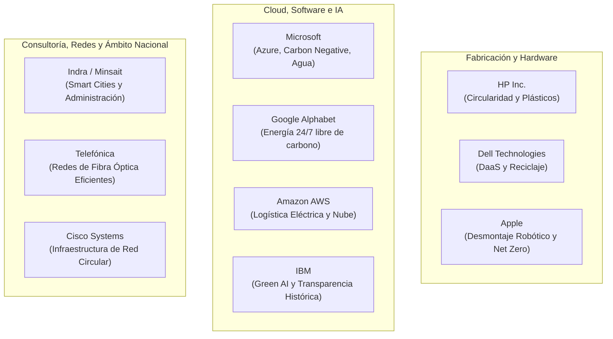

# 09 · Fichas de empresas del sector tecnológico

<span class="badge badge-tic">Banco de Casos Reales</span>
<span class="badge badge-cloud">Cloud Hyperscalers</span>
<span class="badge badge-hardware">Hardware & Telco</span>
<span class="badge badge-e">Memorias de Sostenibilidad</span>

**Uso pedagógico:** Banco de casos reales para los proyectos trimestrales (T1, T2 y T3) y prácticas de aula descritas en [`08-practicas-y-trabajos-sector-informatico.md`](08-practicas-y-trabajos-sector-informatico.md).

!!! warning "Aviso de rigor documental y análisis crítico"
    Las cifras, porcentajes y compromisos corporativos evolucionan en cada ejercicio fiscal. La información presentada en este banco recoge los **compromisos públicos de referencia y las características estructurales** de cada entidad. El alumnado debe contrastar estos datos con la **memoria de sostenibilidad / estado de información no financiera más reciente** publicado en la web corporativa de cada compañía antes de presentar sus informes.

<div class="stat-grid">
  <div class="stat-card">
    <div class="stat-number">7 Líderes</div>
    <div class="stat-label">Empresas tecnológicas analizadas</div>
  </div>
  <div class="stat-card">
    <div class="stat-number">100%</div>
    <div class="stat-label">Datos de memorias oficiales auditadas</div>
  </div>
  <div class="stat-card">
    <div class="stat-number">4 Sectores</div>
    <div class="stat-label">Hardware, Cloud, Software y Telco</div>
  </div>
  <div class="stat-card">
    <div class="stat-number">1 Plantilla</div>
    <div class="stat-label">Ficha normalizada para el alumnado</div>
  </div>
</div>

---

## 1. Catálogo de empresas analizadas



---

## 2. Fichas de análisis corporativo

### 2.1 HP Inc.

| Parámetro | Valor corporativo de referencia |
|---|---|
| **Subsector TIC** | Fabricación de ordenadores personales, impresoras y soluciones de impresión 3D. |
| **Meta climática** | Cero emisiones netas de carbono en toda la cadena de valor para 2040. |
| **Pilar distintivo** | Liderazgo en uso de plásticos reciclados y programas de economía circular de consumibles. |
| **ODS prioritarios** | ==ODS 12== (Producción y consumo responsables) · ==ODS 9== (Innovación) · ==ODS 13== (Acción climática). |

=== "Compromisos y Estrategia ASG"
    - **Dimensión Ambiental (E):** Programa *HP Planet Partners* pionero en logística inversa; uso de más de un 15 % de plástico reciclado postconsumo en hardware; objetivo de alcanzar un 75 % de circularidad en productos y embalajes para 2030.
    - **Dimensión Social (S):** Auditorías continuas a proveedores asiáticos para garantizar derechos laborales y erradicar trabajo forzoso en la cadena de ensamblaje.
    - **Dimensión Gobernanza (G):** Vinculación de incentivos ejecutivos al cumplimiento de metas de sostenibilidad y diversidad.

=== "Retos y Análisis Crítico"
    - **Controversia de consumibles:** Historial de actualizaciones de firmware que bloquean cartuchos de terceros, generando debates éticos sobre la libertad del usuario y la generación artificial de residuos.
    - **Huella de fabricación:** El 70 % de la huella de carbono de un ordenador portátil se genera durante la extracción y ensamblaje de componentes en Asia, antes de que el equipo sea encendido por primera vez.

=== "Propuesta didáctica para clase"
    - **Proyecto T1:** Analizar el mapa ASG y la gestión de la cadena de suministro internacional.
    - **Proyecto T2:** Ecodiseñar una impresora modular sin piezas pegadas mediante adhesivos, con fácil recarga de tóner y piezas sustituibles mediante impresión 3D.
    - **Proyecto T3:** Formular un plan de transición hacia un modelo DaaS (*Device-as-a-Service*) para centros educativos.

---

### 2.2 Microsoft Corporation

| Parámetro | Valor corporativo de referencia |
|---|---|
| **Subsector TIC** | Infraestructura Cloud (Azure), software empresarial, sistemas operativos y hardware Surface. |
| **Meta climática** | **Carbon Negative para 2030**; absorber todo el carbono emitido históricamente desde 1975 para 2050. |
| **Pilar distintivo** | Inversión multimillonaria en eliminación directa de carbono e iniciativas de *Agua Positiva*. |
| **ODS prioritarios** | ==ODS 7== (Energía asequible) · ==ODS 13== (Clima) · ==ODS 6== (Agua limpia) · ==ODS 9== (Infraestructura). |

=== "Compromisos y Estrategia ASG"
    - **Dimensión Ambiental (E):** Acuerdos PPA de energía 100 % renovable para la red global de centros de datos de Azure; objetivo de devolver más agua de la que consume en refrigeración para 2030 (*Water Positive*).
    - **Dimensión Social (S):** Publicación de principios éticos para la Inteligencia Artificial responsable; programas globales de capacitación técnica para reducir la brecha digital.
    - **Dimensión Gobernanza (G):** Aplicación de una tasa interna al carbono que penaliza fiscalmente a las divisiones internas que generan más emisiones.

=== "Retos y Análisis Crítico"
    - **El boom de la Inteligencia Artificial:** La demanda de computación requerida por el entrenamiento y ejecución de modelos como OpenAI ha incrementado el consumo eléctrico y las emisiones de Alcance 3 de Microsoft en los últimos ejercicios, poniendo a prueba su meta de *Carbon Negative*.
    - **Consumo hídrico:** Enfriamiento de centros de datos de IA en regiones con estrés hídrico recurrente.

=== "Propuesta didáctica para clase"
    - **Proyecto T1:** Diagnóstico de riesgos climáticos y estrés hídrico en las regiones cloud de Azure.
    - **Proyecto T2:** Diseñar un servicio de cómputo en la nube con *carbon-aware scheduling* (ejecución de scripts pesados cuando la red eléctrica local tiene mayor cuota de solar o eólica).
    - **Proyecto T3:** Plan de sostenibilidad centrado en refrigeración líquida directa y reutilización de calor residual para redes de calefacción urbana.

---

### 2.3 Google (Alphabet Inc.)

| Parámetro | Valor corporativo de referencia |
|---|---|
| **Subsector TIC** | Motores de búsqueda, publicidad digital, Google Cloud Platform (GCP), Android y hardware Pixel. |
| **Meta climática** | Cero emisiones netas para 2030 y operar con **energía libre de carbono 24/7** en cada red horaria. |
| **Pilar distintivo** | Eficiencia energética extrema en data centers (PUE medio histórico $\approx 1,10$). |
| **ODS prioritarios** | ==ODS 7== (Energía limpia) · ==ODS 13== (Acción por el clima) · ==ODS 9== (Innovación tecnológica). |

=== "Compromisos y Estrategia ASG"
    - **Dimensión Ambiental (E):** Pioneros en el concepto *24/7 Carbon-Free Energy*: no basta con compensar anualmente, sino igualar la generación limpia con el consumo real cada hora del día. Recuperación y reciclaje de servidores antiguos en su cadena logística interna.
    - **Dimensión Social (S):** Auditorías de accesibilidad en productos de consumo; políticas activas de equidad en retribución y bienestar del empleado.
    - **Dimensión Gobernanza (G):** Consejo de gobernanza de privacidad y ciberseguridad; transparencia en peticiones gubernamentales de datos de usuarios.

=== "Retos y Análisis Crítico"
    - **Consumo energético de la computación masiva:** Crecimiento acelerado de clusters de TPUs (*Tensor Processing Units*) para IA generativa.
    - **Gobernanza de datos:** Escrutinio permanente por parte de reguladores europeos (AEPD, CNIL) en materia de seguimiento publicitario y monopolio de datos en línea.

=== "Propuesta didáctica para clase"
    - **Proyecto T1:** Estudio comparativo entre neutralidad contable (compensaciones) y energía limpia 24/7 en GCP.
    - **Proyecto T2:** Arquitectura de microservicios con balanceo de carga geoespacial inteligente orientado a regiones con menor intensidad de carbono por kWh.
    - **Proyecto T3:** Plan de circularidad para hardware de centros de datos y reutilización de componentes de memoria y almacenamiento.

---

### 2.4 Dell Technologies

| Parámetro | Valor corporativo de referencia |
|---|---|
| **Subsector TIC** | Servidores corporativos, almacenamiento masivo, ordenadores de sobremesa y portátiles. |
| **Meta climática** | Cero emisiones netas para 2050; por cada producto comprado por un cliente, reciclar o reutilizar uno equivalente para 2030 (*Moonshot Goal*). |
| **Pilar distintivo** | Iniciativas pioneras de ecodiseño con el prototipo *Concept Luna* (desmontaje en segundos). |
| **ODS prioritarios** | ==ODS 12== (Consumo responsable) · ==ODS 8== (Trabajo decente) · ==ODS 13== (Clima). |

=== "Compromisos y Estrategia ASG"
    - **Dimensión Ambiental (E):** Integración de aluminio reciclado, plásticos procedentes de zonas costeras (*ocean-bound plastics*) y bioplásticos procedentes del aceite de ricino; embalajes 100 % fabricados a partir de materiales reciclados o renovables.
    - **Dimensión Social (S):** Iniciativas de capacitación técnica en países emergentes y programas de igualdad de oportunidades.
    - **Dimensión Gobernanza (G):** Transparencia en la cadena de suministro de minerales críticos (oro, tantalio, estaño, wolframio y cobalto).

=== "Retos y Análisis Crítico"
    - **Comercialización del ecodiseño:** Brecha entre los conceptos prototipo (como *Concept Luna*) y los portátiles que finalmente llegan a las tiendas, los cuales aún contienen componentes soldados.
    - **Gestión masiva de RAEE:** Asegurar que los clientes corporativos efectivamente devuelvan los servidores obsoletos en lugar de almacenarlos en desuso.

=== "Propuesta didáctica para clase"
    - **Proyecto T1:** Evaluación de riesgos de suministro de tierras raras y minerales de conflicto en Dell.
    - **Proyecto T2:** Diseño de una estación de trabajo empresarial modular basada en la filosofía de *Concept Luna* con índice de reparabilidad $> 9/10$.
    - **Proyecto T3:** Plan de expansión de la logística inversa de servidores mediante suscripción corporativa DaaS.

---

### 2.5 Indra / Minsait (España)

| Parámetro | Valor corporativo de referencia |
|---|---|
| **Subsector TIC** | Consultoría tecnológica, transformación digital, sistemas de defensa, transporte y *Smart Cities*. |
| **Meta climática** | Cero emisiones netas en Alcances 1 y 2 para 2040; reducción del 50 % de emisiones para 2030. |
| **Pilar distintivo** | Papel tractor de la digitalización sostenible para la Administración Pública y empresas españolas. |
| **ODS prioritarios** | ==ODS 9== (Infraestructura) · ==ODS 11== (Ciudades sostenibles) · ==ODS 16== (Instituciones sólidas). |

=== "Compromisos y Estrategia ASG"
    - **Dimensión Ambiental (E):** Desarrollo de soluciones tecnológicas de gestión inteligente de tráfico, redes eléctricas inteligentes (*Smart Grids*) y optimización energética de edificios.
    - **Dimensión Social (S):** Generación de empleo tecnológico de calidad en España; políticas de captación de talento joven y fomento de vocaciones STEAM femeninas.
    - **Dimensión Gobernanza (G):** Cumplimiento exhaustivo de la Ley 11/2018 y de la directiva CSRD; sistema anticorrupción y de cumplimiento penal certificado bajo UNE 19601 e ISO 37001.

=== "Retos y Análisis Crítico"
    - **Diversidad de líneas de negocio:** La coexistencia de proyectos de tecnología civil con proyectos de defensa y seguridad requiere un análisis minucioso en las evaluaciones de inversores ESG.
    - **Huella de la cadena de subcontratación:** Control ambiental de la amplia red de subcontratistas y partners tecnológicos en proyectos públicos.

=== "Propuesta didáctica para clase"
    - **Proyecto T1:** Mapa de materialidad aplicando la normativa española (Ley 7/2022 y Ley 11/2018).
    - **Proyecto T2:** Rediseño de una plataforma digital de gestión de residuos urbanos con monitorización IoT y optimización de rutas de recogida.
    - **Proyecto T3:** Plan de sostenibilidad corporativo enfocado en teletrabajo verde, descarbonización de oficinas y compras sostenibles.

---

### 2.6 Amazon Web Services (AWS)

| Parámetro | Valor corporativo de referencia |
|---|---|
| **Subsector TIC** | Proveedor líder mundial de infraestructura de computación en la nube (IaaS y PaaS). |
| **Meta climática** | Compromiso *The Climate Pledge*: cero emisiones netas en todas sus operaciones para 2040 (10 años antes que el Acuerdo de París). |
| **Pilar distintivo** | Mayor comprador corporativo de energía renovable a nivel global; chips personalizados Graviton de alta eficiencia. |
| **ODS prioritarios** | ==ODS 7== (Energía renovable) · ==ODS 12== (Producción responsable) · ==ODS 13== (Clima). |

=== "Compromisos y Estrategia ASG"
    - **Dimensión Ambiental (E):** Desarrollo de microprocesadores propios basados en arquitectura ARM (*AWS Graviton*) que consumen hasta un 60 % menos de energía para la misma carga de trabajo que procesadores tradicionales; reutilización de aguas residuales no potables para refrigeración.
    - **Dimensión Social (S):** Programas de certificación cloud gratuita para colectivos en riesgo de exclusión social.
    - **Dimensión Gobernanza (G):** Marco de gobernanza de ciberseguridad de alta exigencia; auditorías rigurosas frente a normativas internacionales.

=== "Retos y Análisis Crítico"
    - **Impacto de la logística física de la matriz:** Aunque AWS es un negocio cloud, la marca Amazon está intrínsecamente ligada al transporte masivo de paquetes y la generación de embalajes.
    - **Transparencia en factores de emisión:** Necesidad de proporcionar a los desarrolladores desgloses más transparentes sobre las emisiones directas por cada servicio utilizado (EC2, S3, RDS).

=== "Propuesta didáctica para clase"
    - **Proyecto T1:** Comparativa de emisiones entre servidores locales *on-premise* y la infraestructura centralizada de AWS.
    - **Proyecto T2:** Optimización de una arquitectura web migrando instancias x86 clásicas a procesadores AWS Graviton, calculando el ahorro energético y de costes.
    - **Proyecto T3:** Plan de reducción del indicador WUE en regiones cloud situadas en el sur de Europa.

---

### 2.7 Telefónica

| Parámetro | Valor corporativo de referencia |
|---|---|
| **Subsector TIC** | Operador global de telecomunicaciones, redes de fibra óptica, conectividad 5G y servicios digitales (Telefónica Tech). |
| **Meta climática** | Cero emisiones netas de carbono en operaciones directas (Alcances 1 y 2) para 2025 y en la cadena de valor para 2040. |
| **Pilar distintivo** | Cierre histórico de las centrales de cobre y despliegue masivo de fibra óptica (85 % más eficiente energéticamente). |
| **ODS prioritarios** | ==ODS 9== (Infraestructura) · ==ODS 8== (Crecimiento económico) · ==ODS 13== (Acción por el clima). |

=== "Compromisos y Estrategia ASG"
    - **Dimensión Ambiental (E):** Consumo del 100 % de electricidad procedente de fuentes renovables en sus principales mercados (España, Alemania, Brasil); programa de reacondicionamiento y recogida de routers y terminales móviles en desuso.
    - **Dimensión Social (S):** Conectividad de zonas rurales para combatir la despoblación; iniciativas de inclusión digital a través de la Fundación Telefónica.
    - **Dimensión Gobernanza (G):** Emisión pionera de bonos verdes y sostenibles en los mercados financieros internacionales vinculados a objetivos de descarbonización.

=== "Retos y Análisis Crítico"
    - **Gestión masiva de residuos de red:** Desmantelamiento de miles de toneladas de cable de cobre antiguo y equipos obsoletos que exigen una gestión RAEE impecable.
    - **Despliegue del 5G:** El incremento exponencial del tráfico de datos móviles requiere densificar la red de antenas, lo que incrementa el consumo eléctrico bruto global si no se aplican modos de reposo inteligente.

=== "Propuesta didáctica para clase"
    - **Proyecto T1:** Estudio del impacto de la transición tecnológica (Cobre $\rightarrow$ Fibra; 4G $\rightarrow$ 5G) en la eficiencia energética de las telecomunicaciones en España.
    - **Proyecto T2:** Ecodiseño de un router doméstico de acceso a fibra: carcasa de plástico 100 % reciclado, modo reposo programable y facilidad de reacondicionamiento técnico para reutilización con nuevos clientes.
    - **Proyecto T3:** Plan de sostenibilidad para Telefónica Tech enfocado en ciberseguridad verde y auditoría de huella de carbono de servicios cloud.

---

## 3. Plantilla oficial de análisis para el alumnado

Los equipos deben utilizar esta estructura normalizada para documentar el diagnóstico inicial del caso seleccionado:

```markdown
# FICHA DE DIAGNÓSTICO ASG CORPORATIVO

1. DATOS IDENTIFICATIVOS:
   - Nombre de la compañía: ____________________________________________________
   - Subsector tecnológico: [ ] Hardware  [ ] Software/SaaS  [ ] Cloud  [ ] Telecomunicaciones
   - Fuente primaria consultada (Título y año de la Memoria ASG): __________________

2. COMPROMISOS ESTRATÉGICOS DECLARADOS:
   - Meta de neutralidad climática (Año y alcance): _____________________________
   - % de energía renovable actual: _______ %  | PUE medio informado: ___________
   - Meta clave en economía circular o RAEE: ___________________________________

3. EVALUACIÓN DE ASPECTOS ASG MATERIALES:
   - Aspecto Ambiental (E) más crítico: _______________________________________
     Justificación de impacto: _________________________________________________
   - Aspecto Social (S) más crítico: __________________________________________
     Justificación de impacto: _________________________________________________
   - Aspecto de Gobernanza (G) más crítico: ___________________________________
     Justificación de impacto: _________________________________________________

4. MATRIZ DE RIESGO Y OPORTUNIDAD:
   - Mayor riesgo identificado (Físico, regulatorio o reputacional): __________
   - Mayor oportunidad de negocio sostenible: _________________________________

5. VINCULACIÓN CON LA AGENDA 2030:
   - ODS prioritario 1: [ ] Meta específica: _____ | Evidencia en la empresa: ___
   - ODS prioritario 2: [ ] Meta específica: _____ | Evidencia en la empresa: ___

6. VALORACIÓN CRÍTICA DEL EQUIPO:
   - ¿Existen indicios de greenwashing o datos no auditados? Justificar: _________
   - ¿Qué medida técnica propondríais como informáticos para mejorar su impacto? _
```
