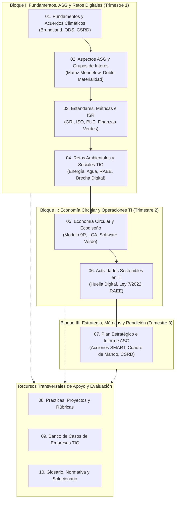

# Sostenibilidad aplicada al sistema productivo

Módulo 1708
Informática y Comunicaciones
DAW · DAM · ASIR
Green Software & ESG
Transición Ecológica Digital

## Módulo profesional · Código 1708 · Familia: Informática y Comunicaciones

!!! tip "Bienvenida y propósito formativo"
    Bienvenido al repositorio de contenidos, prácticas y proyectos del módulo profesional **1708 Sostenibilidad aplicada al sistema productivo**. Este módulo proporciona las competencias transversales y técnicas necesarias para que los futuros desarrolladores de software, administradores de sistemas y especialistas en redes lideren la **transición ecológica digital**, integrando la **eficiencia energética**, el **ecodiseño circular**, la **gobernanza ética del dato y la IA** y la **rendición de cuentas ESG** en el tejido productivo.

  

    
30 h

    
Carga lectiva modular

  

  

    
6 RA

    
Resultados de aprendizaje

  

  

    
3 ECTS

    
Equivalencia crediticia

  

  

    
10 Unid.

    
Teoría, proyectos y casos

  

| Parámetro curricular | Especificación oficial |
|---|---|
| **Código del módulo** | **1708** |
| **Carga lectiva total** | **30 horas** |
| **Equivalencia crediticia** | **3 créditos ECTS** (Ciclos de Grado Superior) |
| **Ámbito de aplicación** | Troncal transversal para ciclos de **Grado Medio y Grado Superior** |
| **Ciclos de especialización** | **DAW** (Desarrollo de Aplicaciones Web) · **DAM** (Desarrollo de Aplicaciones Multiplataforma) · **ASIR** (Administración de Sistemas Informáticos en Red) |
| **Marco regulador básico** | Real Decreto 659/2023 (Artículo 100 y Anexo VIII) · Decreto 104/2024 (Andalucía) |

---

## 1. El itinerario formativo del módulo

El plan de estudios está articulado para que el alumnado avance de forma progresiva desde los fundamentos conceptuales y normativos globales hasta la defensa práctica de un plan de sostenibilidad ante una simulación de junta directiva:

---

## 2. Mapa modular de materiales

=== "Unidades Teóricas y Metodológicas (U01 a U07)"
    | Unidad | Título temático | Resultados de Aprendizaje | Enfoque profesional TIC |
    |---|---|:---:|---|
    | [`01`](01-fundamentos-sostenibilidad.md) | **Fundamentos de sostenibilidad y marcos internacionales** | ==RA1a–c== · ==RA2== | Agenda 2030, acuerdos de París, directiva CSRD y taxonomía de la UE aplicada a centros de datos y software. |
    | [`02`](02-aspectos-ASG-y-grupos-de-interes.md) | **Aspectos ASG, grupos de interés y riesgos** | ==RA1b–d== | Mapeo de stakeholders con matriz de Mendelow, doble materialidad y gestión de riesgos climáticos y reputacionales. |
    | [`03`](03-estandares-metricas-e-inversion-responsable.md) | **Estándares, métricas e inversión responsable** | ==RA1e–f== | Estándares GRI, ISO 14064, cálculo de PUE/WUE, cuadros de mando ESG y criterios de inversión ISR. |
    | [`04`](04-retos-ambientales-y-sociales-sector-informatico.md) | **Retos ambientales y sociales del sector informático** | ==RA2== | La dualidad de las TIC (emisor vs. palanca habilitadora), huella hídrica de la IA, minerales de conflicto y brecha digital. |
    | [`05`](05-economia-circular-verde-y-ecodisenio.md) | **Economía circular, verde y ecodiseño** | ==RA4a–f== | De la economía lineal al marco de las 9R, análisis de ciclo de vida (LCA), ecodiseño de hardware y algoritmia de *Green Coding*. |
    | [`06`](06-actividades-sostenibles-en-ti.md) | **Actividades sostenibles en TI y normativa ambiental** | ==RA5a–i== | Eficiencia energética en puestos de trabajo, cálculo de huella de carbono, Ley 7/2022 y protocolo de desmantelamiento de RAEE. |
    | [`07`](07-plan-sostenibilidad-e-informe.md) | **Plan de sostenibilidad e informe de rendición** | ==RA6a–e== | Elaboración integral de un plan estratégico corporativo, definición de acciones SMART, KPIs y reporte bajo ESRS/GRI. |

=== "Proyectos Trimestrales Colaborativos (T1, T2, T3)"
    | Proyecto | Título y Enfoque | Peso sugerido | Entregable principal |
    |---|---|:---:|---|
    | **Trimestre 1 (T1)** | **Diagnóstico ASG y ODS Corporativo** | **30 %** | Informe de auditoría no financiera y mapa de grupos de interés de una multinacional tecnológica ([Ver en Unidad 08](08-practicas-y-trabajos-sector-informatico.md)). |
    | **Trimestre 2 (T2)** | **Ecodiseño y Solución Circular TIC** | **30 %** | Rediseño circular de un dispositivo, servicio cloud o software con cálculo comparativo de ciclo de vida ([Ver en Unidad 08](08-practicas-y-trabajos-sector-informatico.md)). |
    | **Trimestre 3 (T3)** | **Plan de Sostenibilidad y Role-play Ejecutivo** | **40 %** | Memoria formal de sostenibilidad y defensa oral simulando una Junta General de Accionistas ([Ver en Unidad 08](08-practicas-y-trabajos-sector-informatico.md)). |

=== "Herramientas de Apoyo y Documentación Oficial"
    - [`programacion-didactica.md`](programacion-didactica.md): **Programación didáctica oficial** completa adaptada a los ciclos de DAW/DAM en Andalucía (Ley Orgánica 3/2022 y Decreto 104/2024).
    - [`08-practicas-y-trabajos-sector-informatico.md`](08-practicas-y-trabajos-sector-informatico.md): Catálogo de 10 prácticas individuales (P1–P10), rúbricas de evaluación y trazabilidad curricular.
    - [`09-casos-empresas-sector-informatico.md`](09-casos-empresas-sector-informatico.md): Fichas de análisis corporativo de HP, Microsoft, Google, Dell, Indra/Minsait, AWS y Telefónica con datos de referencia y plantilla descargable.
    - [`10-glosario-recursos-bibliografia.md`](10-glosario-recursos-bibliografia.md): Glosario técnico bilingüe, herramientas web, legislación aplicable (BOE/DOUE) y solucionario interactivo para autoevaluación.

---

## 3. Resultados de aprendizaje oficiales (RD 659/2023)

El currículo básico del módulo se fundamenta en **6 resultados de aprendizaje**:

RA1 · Aspectos ASG y marcos internacionales
: Identifica los aspectos ambientales, sociales y de gobernanza relativos a la sostenibilidad, el concepto de desarrollo sostenible y los marcos internacionales de referencia (Agenda 2030, Acuerdos climáticos, directivas europeas e inversión responsable).

RA2 · Retos ambientales y sociales del sector
: Caracteriza los retos ambientales y sociales en el sector tecnológico, describe sus impactos directos e indirectos sobre las personas y la economía y propone acciones de mitigación.

RA3 · Criterios sostenibles en el desempeño profesional y personal
: Establece la aplicación práctica de criterios de sostenibilidad en el ejercicio profesional y personal, identificando los elementos necesarios para minimizar la huella individual.

RA4 · Propuesta de productos y servicios responsables (Ecodiseño)
: Diseña y propone productos o servicios tecnológicos aplicando los principios de la economía circular, el ecodiseño y el análisis de ciclo de vida (LCA).

RA5 · Ejecución de actividades sostenibles y normativa ambiental
: Realiza actividades técnicas en tecnologías de la información minimizando el impacto ambiental, aplicando la legislación ambiental vigente (gestión de residuos RAEE, etiquetado ecológico y eficiencia de consumos).

RA6 · Plan corporativo e informe de sostenibilidad
: Analiza y elabora un plan estratégico de sostenibilidad para una empresa del sector informático, identificando grupos de interés, evaluando la doble materialidad, fijando KPIs auditables y redactando el informe formal de rendición de cuentas.

---

## 4. Metodología docente recomendada

1. **Aprendizaje Basado en Proyectos (ABP):** El módulo no se memoriza; se aprende mediante la toma de decisiones técnicas simulando el rol de un consultor de sostenibilidad tecnológica o un arquitecto de software verde.
2. **Uso de datos primarios auditados:** En todas las actividades se fomenta que el alumnado consulte directamente las memorias de sostenibilidad anuales y los factores de emisión oficiales, rechazando eslóganes comerciales no contrastados.
3. **Perspectiva crítica anti-greenwashing:** Los futuros profesionales aprenden a identificar afirmaciones ecológicas engañosas y a exigir estándares rigurosos y metodologías de cálculo transparentes.
